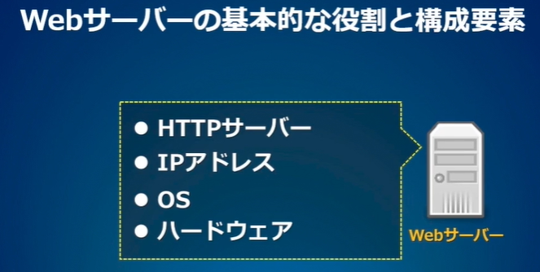
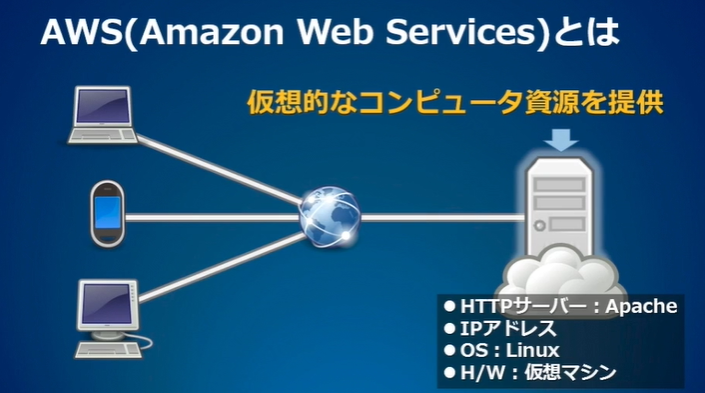
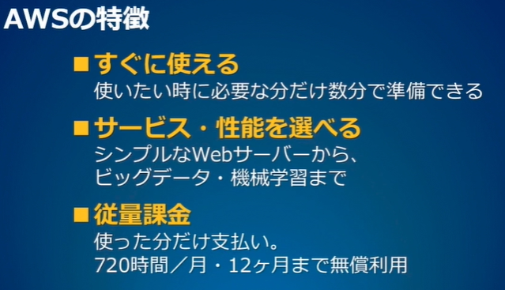
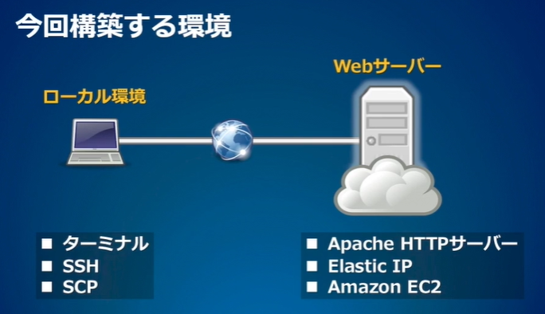

<!-- omit in toc -->
# AWS入門編1:Webサーバーを構築しよう

<!-- omit in toc -->
[目次]
- [解約時の注意](#解約時の注意)
- [01:Webサーバーを構築しよう](#01webサーバーを構築しよう)
  - [AWSによる環境構築体験](#awsによる環境構築体験)
  - [Webサーバーの基本的な役割と構成要素](#webサーバーの基本的な役割と構成要素)
  - [構築する手順](#構築する手順)
    - [参考](#参考)
- [02:AWSアカウントを作ろう](#02awsアカウントを作ろう)
  - [参考](#参考-1)
  - [AWSの無料枠](#awsの無料枠)
  - [アカウント作成に必要な情報](#アカウント作成に必要な情報)
  - [アカウント作成の手順](#アカウント作成の手順)
  - [解約方法](#解約方法)
  - [料金の確認方法](#料金の確認方法)
- [03:Linux仮想マシンを起動しよう](#03linux仮想マシンを起動しよう)
  - [Linux仮想マシンの起動手順](#linux仮想マシンの起動手順)
  - [参考](#参考-2)
- [04:パブリックIPアドレスを設定しよう](#04パブリックipアドレスを設定しよう)
  - [参考](#参考-3)
  - [作業手順](#作業手順)
- [05:リモートアクセスしよう](#05リモートアクセスしよう)
  - [ここで実行したコマンド](#ここで実行したコマンド)
  - [SSHコマンドによる接続](#sshコマンドによる接続)
  - [Mac OS X ターミナル](#mac-os-x-ターミナル)
  - [UNIXコマンド](#unixコマンド)
- [06:Webサイトを公開しよう](#06webサイトを公開しよう)
  - [ここで実行したコマンド](#ここで実行したコマンド-1)
  - [参考](#参考-4)
  - [vi](#vi)
- [07:ファイルを転送しよう](#07ファイルを転送しよう)
    - [1.名前で 1 つのファイルを検索する](#1名前で-1-つのファイルを検索する)
    - [2.おおよその名前で 1 つのファイルを検索する](#2おおよその名前で-1-つのファイルを検索する)
    - [3.すべてを検索する](#3すべてを検索する)
    - [4.内容で検索する](#4内容で検索する)
    - [5.ファイルの種類で検索する](#5ファイルの種類で検索する)
    - [6.ディレクトリのみを一覧表示する](#6ディレクトリのみを一覧表示する)
    - [7.検索結果の表示を制限する](#7検索結果の表示を制限する)
    - [8.空のファイルを見つける](#8空のファイルを見つける)
    - [9.ファイルの経過期間で検索する](#9ファイルの経過期間で検索する)
    - [10.パスを検索する](#10パスを検索する)
  - [参考](#参考-5)
  - [SCPコマンド](#scpコマンド)


<br>

---

<br>


# 解約時の注意

> [!CAUTION]
> 無料期間内でも、停止・削除したインスタンスに割り当てたパブリックIPの設定を解除しておかないと料金が発生してしまいますので、忘れずに解約しておきましょう。<br>
> http://docs.aws.amazon.com/ja_jp/awsaccountbilling/latest/aboutv2/checklistforunwantedcharges.html#checkelasticipaddresses


<br>

---

<br>

# 01:Webサーバーを構築しよう


## AWSによる環境構築体験


- ■このコースの目的
  - 簡単なWebサーバーを実際に構築することで基本的な仕組みを理解し、必要な操作を体験する
- ■対象者
  - プログラミングの初歩的な知識を身に付けた人
- ■学習の進め方
  - AWS(Amazon Web Services)の利用手順


## Webサーバーの基本的な役割と構成要素

- ● リクエストに応じてHTMLファイルや画像ファイルを送信する
- ● アクセス制御:許可されたユーザーにだけ送信する
- ● CGIプログラムを起動する










## 構築する手順

  1. AWSのアカウントを作成する
  2. Linux仮想マシンを起動する
  3. パブリックIPアドレスを設定する
  1. SSHによるリモートアクセス
  2. Apacheを起動する
  3. SCPによるファイル転送

### 参考
  - Amazon Web Services
    - https://aws.amazon.com/jp/
  - AWS 課金体系と見積り方法について | AWS
    - https://aws.amazon.com/jp/how-to-understand-pricing/
  - AWS クラウドサービス活用資料集 | AWS
    - https://aws.amazon.com/jp/aws-jp-introduction/
  - ご利用中のお客様からのよくあるご質問 | AWS
    - https://aws.amazon.com/jp/aws-jp-faq/customers/


<br>

---

<br>


# 02:AWSアカウントを作ろう


## 参考
- AWS アカウント作成の流れ
  - https://aws.amazon.com/jp/register-flow/


## AWSの無料枠

  - 12ヶ月
  - ■ 毎月750時間分のLinux仮想マシン (t2.microインスタンス)

##  アカウント作成に必要な情報

  - ■ メールアドレス
  - ■ 住所
  - ■ 通話のできる電話番号
  - ■ クレジットカード番号


## アカウント作成の手順

  1. メールアドレスを登録
  2. ログイン情報(ユーザー名とパスワード)を設定
  3. 連絡先情報(住所、電話番号)を登録
  4. クレジットカード情報を登録
  5. 電話による本人確認
  6. サポートプランの選択(無料/有償)


## 解約方法

  1. ログイン
  2. アカウント > アカウント設定
  3. アカウント設定ページの一番下に「アカウントの解約」ボタンがある


## 料金の確認方法

  1. ログイン
  2. アカウント > 請求とコスト管理


<br>

---

<br>


# 03:Linux仮想マシンを起動しよう

## Linux仮想マシンの起動手順
  1. コンソールにアクセス
  2. EC2を選択
  3. 東京リージョンを選択
  4. Linuxディストリビューションを選択
  5. インスタンスとして、t2.microを選択
  6. キーペアを保存
  7. インスタンスを作成


##  参考
- Linux 仮想マシンの起動
  - https://aws.amazon.com/jp/getting-started/launch-a-virtual-machine/
- インスタンスタイプ - Amazon EC2
  - https://aws.amazon.com/jp/ec2/instance-types/


<br>

---

<br>

# 04:パブリックIPアドレスを設定しよう


## 参考

- ドメインを取得する
  - https://aws.amazon.com/jp/getting-started/get-a-domain/


## 作業手順

  1. EC2のダッシュボードにアクセス
  2. Elastic IPのメニューを開く
  3. 新しいIPアドレスを割り当て
  4. インスタンスに関連付ける
  5. セキュリティタイプを設定


<br>

---

<br>


# 05:リモートアクセスしよう

## ここで実行したコマンド
```bash
$ pwd
$ ls
$ ls -a -l

$ mkdir .ssh

$ mv ~/Desktop/FirstKey.pem ~/.ssh
$ chmod 400 ~/.ssh/FirstKey.pem

$ ssh -i ~/.ssh/FirstKey.pem ec2-user@(パブリックIP)

$$ exit
```


※記号の意味
```bash
# コマンドをローカル環境で実行
$ (コマンド)

# コマンドをLinux仮想マシンで実行
$$ (コマンド)
```


## SSHコマンドによる接続

- Linux インスタンスへの接続 - Amazon Elastic Compute Cloud
  - https://docs.aws.amazon.com/ja_jp/AWSEC2/latest/UserGuide/AccessingInstances.html
- SSH を使用した Linux インスタンスへの接続 - Amazon Elastic Compute Cloud
  - http://docs.aws.amazon.com/ja_jp/AWSEC2/latest/UserGuide/AccessingInstancesLinux.html
- ネットワーク管理の基本Tips - ＠IT - SSHサーバにログインするには？ sshコマンド
  - http://www.atmarkit.co.jp/ait/articles/1503/23/news004.html
- 端末エミュレータ - Wikipedia
  - https://ja.wikipedia.org/wiki/%E7%AB%AF%E6%9C%AB%E3%82%A8%E3%83%9F%E3%83%A5%E3%83%AC%E3%83%BC%E3%82%BF


## Mac OS X ターミナル
- 今さら聞けない！ターミナルの使い方【初心者向け】 | 　TechAcademyマガジン
  - http://techacademy.jp/magazine/5155
- Mac OS Xターミナル(コマンドライン)の基本 | 　 [Mac OSの使い方] All About
  - http://allabout.co.jp/gm/gc/2962/


## UNIXコマンド
- 初心者でも覚えておきたい基本的なUNIXコマンド一覧20  |　TechAcademyマガジン
  - http://techacademy.jp/magazine/6406
- Linuxコマンド逆引き大全 - Linuxコマンド逆引き大全 Index | 　ITpro
  - http://itpro.nikkeibp.co.jp/article/COLUMN/20060224/230579/?rt=nocnt
- 基本的なUNIXコマンド
  - http://www.cc.kyoto-su.ac.jp/~hirai/text/unixcommand.html


<br>

---

<br>


# 06:Webサイトを公開しよう

## ここで実行したコマンド
パブリックIPアドレスなど、適時自分の環境に合わせて修正してください。

```bash
$ ssh -i ~/.ssh/FirstKey.pem ec2-user@(パブリックIP)


$$ sudo yum -y update
$$ sudo yum -y install httpd
$$ sudo service httpd start
$$ sudo chkconfig httpd on


$$ ls /var/www/html
$$ sudo vi /var/www/html/index.html
```

※記号の意味
```bash
# コマンドをローカル環境で実行
$ (コマンド)

# コマンドをLinux仮想マシンで実行
$$ (コマンド)
```

## 参考
- チュートリアル
  - Amazon Linux への LAMP ウェブサーバーのインストール
  - Amazon Elastic Compute Cloud
    - http://docs.aws.amazon.com/ja_jp/AWSEC2/latest/UserGuide/install-LAMP.html


## vi
- viの使い方/基本操作
  - http://www.envinfo.uee.kyoto-u.ac.jp/user/susaki/command/vi.html
- viエディタの使い方
  - http://net-newbie.com/linux/commands/vi.html
- 今さら聞けない高性能エディタVim入門Code部
  - https://blog.codecamp.jp/vim


<br>

---

<br>


# 07:ファイルを転送しよう

```bash
$ scp -i ~/.ssh/FirstKey.pem ec2-user@(パブリックIP):/var/www/html/index.html ~/Desktop


$ scp -i ~/.ssh/FirstKey.pem ~/Desktop/index.html ec2-user@(パブリックIP):~
$ ssh -i ~/.ssh/FirstKey.pem ec2-user@(パブリックIP)
$$ ls
$$ sudo mv ~/index.html /var/www/html
$$ exit


$ ssh -i ~/.ssh/FirstKey.pem ec2-user@(パブリックIP)


$$ sudo groupadd www
$$ sudo usermod -a -G www ec2-user
$$ exit

$$ groups

$$ sudo chown -R root:www /var/www
$$ sudo chmod 2775 /var/www
$$ find /var/www -type d -exec sudo chmod 2775 {} \;
$$ find /var/www -type f -exec sudo chmod 0664 {} \;
$$ exit

$ scp -i ~/.ssh/FirstKey.pem ~/Desktop/index.html ec2-user@(パブリックIP):/var/www/html

```


##　※　findコマンド
  - 参考
    - https://www.redhat.com/ja/blog/linux-find-command


### 1.名前で 1 つのファイルを検索する

```bash
 $ find / -name "Foo.txt" 2>/dev/null /home/seth/Documents/Foo.txt
```

### 2.おおよその名前で 1 つのファイルを検索する

```bash
 $ find / -iname "*foo*txt" 2>/dev/null /home/seth/Documents/Foo.txt /home/seth/Documents/foo.txt /home/seth/Documents/foobar.txt
```

### 3.すべてを検索する

```bash
 $ find ~/Documents -ls 3554235 0 drwxr-xr-x [...] 05:36 /home/seth/Documents/ 3554224 0 -rw-rw-r-- [...] 05:36 /home/seth/Documents/Foo 3766411 0 -rw-rw-r-- [...] 05:36 /home/seth/Documents/Foo/foo.txt 3766416 0 -rw-rw-r-- [...] 05:36 /home/seth/Documents/Foo/foobar.txt
```


### 4.内容で検索する

```bash
$ find ~/Documents/ -name "*txt" -exec grep -Hi penguin {} \; /home/seth/Documents/Foo.txt:I like penguins. /home/seth/Documents/foo.txt:Penguins are fun.
```

### 5.ファイルの種類で検索する

```bash
 $ find ~ -type f /home/seth/.bash_logout /home/seth/.bash_profile /home/seth/.bashrc /home/seth/.emacs /home/seth/.local/share/keyrings/login.keyring /home/seth/.local/share/keyrings/user.keystore /home/seth/.local/share/gnome-shell/gnome-overrides-migrated [...]
```

```bash
 $ find ~ -type f,l -name "notebook*" /home/seth/notebook.org /home/seth/Documents/notebook-alias.org
```


### 6.ディレクトリのみを一覧表示する

```bash
$ find ~/Public -type d find ~/Public/ -type d /home/seth/Public/ /home/seth/Public/example.com /home/seth/Public/example.com/www /home/seth/Public/example.com/www/img /home/seth/Public/example.com/www/font /home/seth/Public/example.com/www/style
```


### 7.検索結果の表示を制限する

```bash
 $ find ~/Public/ -maxdepth 1 -type d /home/seth/Public/ /home/seth/Public/example.com
```

### 8.空のファイルを見つける

```bash
 $ find ~ -type f -empty random.idea.txt
```


### 9.ファイルの経過期間で検索する

```bash

$ find /var/log -iname "*~" -o -iname "*log*" -mtime +30

$ find /var/log -iname "*~" -o -iname "*log*" -mtime -7 /var/log/tallylog /var/log/cups/error_log /var/log/cups/access_log /var/log/cups/page_log /var/log/anaconda/anaconda.log /var/log/anaconda/syslog /var/log/anaconda/X.log [...]

$ find /var/log -iname "*~" -o -iname "*log*" -mtime -7 -ls -rw-------  1 root root            0 Jun  9 18:20 /var/log/tallylog -rw-------  1 root lp      332 Aug 11 15:05 /var/log/cups/error_log -rw-------  1 root lp      332 Aug 11 15:05 /var/log/cups/access_log -rw-------  1 root lp      332 Aug 11 15:05 /var/log/cups/page_log -rw-------  1 root root  53733 Jun  9 18:24 /var/log/anaconda/anaconda.log -rw-------  1 root root 835513 Jun  9 18:24 /var/log/anaconda/syslog -rw-------  1 root root  21131 Jun  9 18:24 /var/log/anaconda/X.log [...]


```


### 10.パスを検索する

```bash

$ find / -type d -name 'img' -ipath "*public_html/example.com*" 2>/dev/null /home/tux/Public/public_html/example.com/font

```


## 参考

- チュートリアル Amazon Linux への LAMP ウェブサーバーのインストール
  - Amazon Elastic Compute Cloud
   - http://docs.aws.amazon.com/ja_jp/AWSEC2/latest/UserGuide/install-LAMP.html


## SCPコマンド

- Linuxコマンド集 - 【 scp 】 リモート・マシン間でファイルをコピーする | ITpro
  - http://itpro.nikkeibp.co.jp/article/COLUMN/20060227/230878/
- ネットワーク管理の基本Tips - ＠IT | 　バッチなどでファイルのやり取りを安全に実行するには？ scpコマンド
  - http://www.atmarkit.co.jp/ait/articles/1505/13/news006.html
- 【AWS】EC２上のAmazon Linux AMIへのWinscp接続 - toto_1212
  - http://toatoshi.hatenablog.com/entry/2012/11/02/185635


<br>

---

<br>


<br>

---

<br>


【EOF】


[←　README](../README.md)

