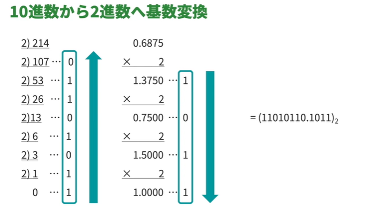
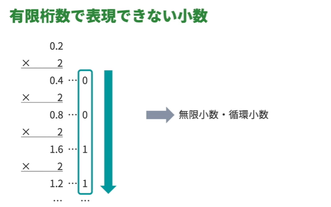
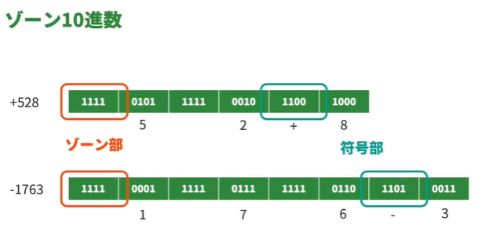
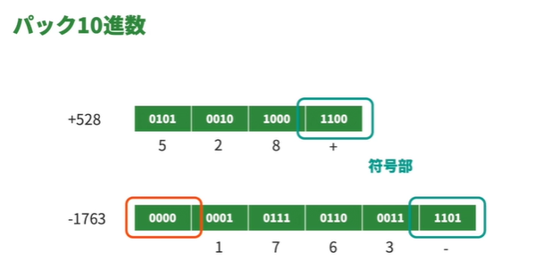
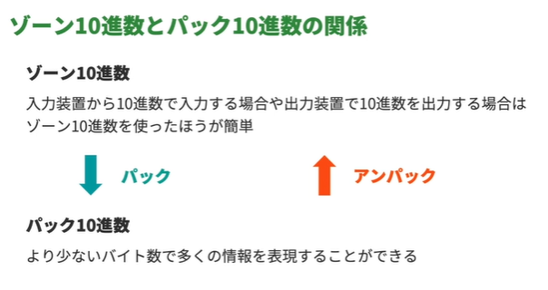
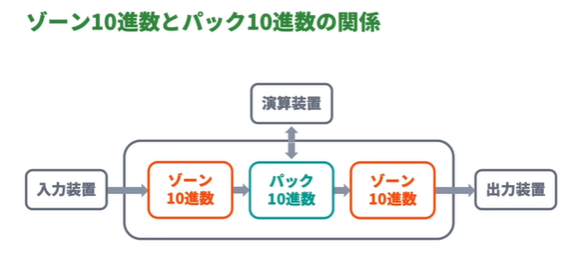

<!-- omit in toc -->
# 情報処理入門 テクノロジー編 Lesson01 ～ Lesson05

<!-- omit in toc -->
# [目次]

- [テクノロジー編01: コンピュータのデータ表現](#テクノロジー編01-コンピュータのデータ表現)
  - [01: コンピュータのデータ表現について学んでいこう](#01-コンピュータのデータ表現について学んでいこう)
    - [表現単位](#表現単位)
    - [基数](#基数)
    - [コンピュータで扱う数値の表現](#コンピュータで扱う数値の表現)
    - [コンピュータの表現できる範囲には限りがある](#コンピュータの表現できる範囲には限りがある)
    - [シフト演算](#シフト演算)
  - [02: 基本的なデータの単位と接頭辞](#02-基本的なデータの単位と接頭辞)
    - [情報の表現例](#情報の表現例)
    - [接頭辞　(キロ、メガなど)](#接頭辞キロメガなど)
    - [大きな値を表すときに使われる接頭辞](#大きな値を表すときに使われる接頭辞)
    - [小さな値を表すときに使われる接頭辞](#小さな値を表すときに使われる接頭辞)
    - [正確に区別する場合](#正確に区別する場合)
    - [接頭語の単位の正確な扱い](#接頭語の単位の正確な扱い)
  - [03: 基数](#03-基数)
    - [10進数 (0～9の数字を使い切ったら桁数を増やす)](#10進数-09の数字を使い切ったら桁数を増やす)
    - [2進数](#2進数)
    - [8進数(0～7の数字を使い切ったら桁数を増やす)](#8進数07の数字を使い切ったら桁数を増やす)
    - [2進数から8進数(2の3乗)へ](#2進数から8進数2の3乗へ)
    - [16進数](#16進数)
    - [2進数から16進数(2の4乗)へ](#2進数から16進数2の4乗へ)
  - [04: 基数変換](#04-基数変換)
    - [2進数から10進数へ基数変換](#2進数から10進数へ基数変換)
      - [(11010110.1011)2 = (214.6875)10](#1101011010112--214687510)
      - [10進数から2進数へ基数変換](#10進数から2進数へ基数変換)
      - [10進数から8進数へ基数変換](#10進数から8進数へ基数変換)
      - [有限桁数で表現できない小数](#有限桁数で表現できない小数)
  - [05: 数値表現 - その1](#05-数値表現---その1)
    - [コンピュータにおける数値の表現方法](#コンピュータにおける数値の表現方法)
    - [2進化10進コード(BCDコード)](#2進化10進コードbcdコード)
    - [ゾーン10進数](#ゾーン10進数)
    - [パック10進数](#パック10進数)
    - [ゾーン10進数とパック10進数の関係](#ゾーン10進数とパック10進数の関係)
  - [06: 数値表現 - その2](#06-数値表現---その2)
    - [コンピュータ上で小数を表現する方法](#コンピュータ上で小数を表現する方法)
  - [07: 数値表現 - その3](#07-数値表現---その3)
  - [08: 誤差](#08-誤差)
  - [09: シフト演算](#09-シフト演算)

# テクノロジー編01: コンピュータのデータ表現

## 01: コンピュータのデータ表現について学んでいこう

### 表現単位 

| 大きな数値 | 小さな数値 |
| --------- | ---------- |
| K:キロ    |  m:ミリ     |
| M:メガ    |  μ:マイクロ |
| G:ギガ    |  n:ナノ     |
| T:テラ    |  p:ピコ     |
| P:ペタ    |  ・・・     |

### 基数

- 扱える数字の種類
  - 10進数:0から9の10種類の数字を使用
  - 2進数:0と1の2種類の数字を使用
  - 10進数→2進数の値に変換することを`基数変換`とよぶ

### コンピュータで扱う数値の表現

| 整数表記  | 小数表記 | 
| --------- | ---------- |
|2進化10進コード (BCDコード) |固定小数点数 |
|ゾーン10進数 | 浮動小数点数 |
|パック10進数 | --- |

### コンピュータの表現できる範囲には限りがある

- 実際の数値と記憶される数値に差異が生じる
  - 丸め誤差
  - 情報落ち
  - 桁落ち
  - オーバーフロー
  - アンダーフロー

### シフト演算

- コンピュータ内で数値演算を行う方法
- ビットの位置を左右にずらす演算方法
- 算術シフト : 数値演算をする時に使用
- 論理シフト : ビットの位置をずらす時に使用

## 02: 基本的なデータの単位と接頭辞

電気信号は基本的に2種類の状態でしか表現できない

### 情報の表現例

- nビット → 2のn乗種類
- 1バイト=8ビット → 2の8乗=256種類

### 接頭辞　(キロ、メガなど)

- 1000 g= 1 kg
- k ・・・ 接頭辞 
- k→10の3乗  = 1 kg = 1 X 103 g

### 大きな値を表すときに使われる接頭辞

| 記号 |読み方 |10進数 | 2進数|
|------|------|------|------|
| K    | キロ | 103 | 210 |
| M    | メガ | 106 | 220 |  
| G    | ギガ | 109 | 230 | 
| T    | テラ | 1012 | 240 | 
| P    | ペタ | 1015 | 250 |

### 小さな値を表すときに使われる接頭辞

| 記号 |読み方 |10進数 | 2進数|
|------|------|------|------|
|m     | ミリ | 10-3 | 2-10 |
|μ     | マイクロ | 10-6 | 2-20 |
|n     | ナノ  | 10-9 | 2-30 |
|p     | ピコ  | 10-12| 2-40 |

### 正確に区別する場合

| 記号 |読み方 | 2進数|
|------|------|------|
|  Ki  | キビ | 210 |
|  Mi  | メビ | 220 |
|  Gi  | ギビ | 230 |
|  Ti  | テビ | 240 |
|  Pi  | ペビ | 250 |

### 接頭語の単位の正確な扱い

SI接頭辞と呼ばれるルールではkは10の3乗の1000と決められていますが、 
コンピュータの世界では慣用的に、kは2の10乗の1024を示すことが多いです。 
このため、両者を区別するために、2進接頭辞と呼ばれるKi、Mi、Gi、Ti、Pi のような接頭辞が決められています。 
2進接頭辞は、あまり見かけない表記ですが、2進データであることを明確に 表現したいときには、こちらを使いましょう。

|10進単位|数値|2進単位|数値|
|------|------|------|------|
|k| 10の3乗 |KiB |2の10乗 |
|M|10の6乗|MiB|2の20乗|
|G|10の9乗|GiB|2の30乗|
|T|10の12乗|TiB|2の40乗|
|P|10の15乗|PiB|2の50乗|

- 参考: 2進接頭辞
  - https://ja.wikipedia.org/wiki/2%E9%80%B2%E6%8E%A5%E9%A0%AD%E8%BE%9E

## 03: 基数

- 数値を表現するときに、位取りのもととなる値
  

### 10進数 (0～9の数字を使い切ったら桁数を増やす)
  - 267.8 = 2 x 102 + 6 x 101 + 7 x 100 + 8 x 10-1
  - 「10のn乗」より、nのことを`べき乗`と呼ぶ
  - 「nの2乗」より、nのことを`基数`と呼ぶ

 

### 2進数
  - (110.1)2=1x 22+ 1 x 21 + 0 x 20 + 1 x 2-1 =(6.5)10

 

### 8進数(0～7の数字を使い切ったら桁数を増やす)

(147.5)8=1x 82+4x 81+ 7 x 80 + 5 x 8-1
=(103.5)10

 

### 2進数から8進数(2の3乗)へ

※1つの数値に2の3乗で表すことができる
 

(1001010.1001)2 
↓ 
(`00`1 001 010.100 1`00`)2 
3桁ごとに区切る(3桁に満たない部分は0をあてる) 
↓ 
(112.44)8　　　3桁ごとに変換

 

### 16進数

(1B8.E)16=1x 162+11x 161+8x 160+14x 16-1
=(440.875)10

 

### 2進数から16進数(2の4乗)へ

※1つの数値に2の4乗で表すことができる
 

(1001010.1001)2 
↓ 
(`0`100 1010.1001)2 
4桁ごとに区切る(4桁に満たない部分は0をあてる) 
↓ 
(4A.9)16　　　4桁ごとに変換
  

## 04: 基数変換

- 基数を扱いやすいように変換する
   - 2進数　→　8進数·16進数
     - 規則性があるので扱いやすい
   - 2進数　→　10進数
     - 規則性がない

### 2進数から10進数へ基数変換

#### (11010110.1011)2 = (214.6875)10

- まず、`整数部`と`小数部`に分ける

|1|1|0|1|0|1|1|0|.|1|0|1|1|
|---|---|---|---|---|---|---|---|---|---|---|---|---|
|27|26|25|24|23|22|21|20|.|2-1|2-2|2-3|2-4|
|+128|+64|-|+16|-|+4|+2|-|.|+0.5|-|+0.125|+0.0625|

#### 10進数から2進数へ基数変換

#### 10進数から8進数へ基数変換

#### 有限桁数で表現できない小数

- 無限小数・循環小数にはまってしまった場合は計算機側で近似値として求める

  

## 05: 数値表現 - その1

### コンピュータにおける数値の表現方法

- 2進数
  - コンピュータ内部で計算を行うときに適している
- 10進数
  - 人間にとって馴染みがあり、わかりやすい

### 2進化10進コード(BCDコード)

- 10進数各桁を1バイトで表現する方法

`01000110100111011011110100100011`

→　コンピュータ:問題ない　人間:確認が大変

- 4桁のビットごとに分ける
- ただし、この形式では正負は考慮していない。
- 政府を考慮する場合は、`ゾーン10進数` 、 `パック10進数`

### ゾーン10進数

- 上位ビットにはゾーン部のビットが配置される
- 最下位ビットには符号部のビットが配置される

### パック10進数

- 10進数2桁を1バイトで表現する方法

- 下記「-1763」の場合、最後の4ビットを追加したのでバイト数が合わないので、先頭のビットを追加する。

### ゾーン10進数とパック10進数の関係

  

## 06: 数値表現 - その2

### コンピュータ上で小数を表現する方法

- 整数部と小数部の桁数をあらかじめ決めておく「固定小数点数」
- 表現する値に合わせて小数点の位置を変える「浮動小数点数」

  

## 07: 数値表現 - その3

  

## 08: 誤差

  

## 09: シフト演算

  

 

---

 

【EOF】

[←　README](../README.md)

