<!-- omit in toc -->
# 情報処理入門 テクノロジー編 Lesson06 ～ Lesson07

<!-- omit in toc -->
# [目次]

- [テクノロジー編06: システムの組み合わせ方法を理解しよう](#テクノロジー編06-システムの組み合わせ方法を理解しよう)
  - [01: コンピュータの処理形態を理解しよう - 集中処理](#01-コンピュータの処理形態を理解しよう---集中処理)
  - [02: コンピュータの処理形態を理解しよう - 分散処理](#02-コンピュータの処理形態を理解しよう---分散処理)
  - [03: 処理能力を高めるシステム構成を知っておこう](#03-処理能力を高めるシステム構成を知っておこう)
  - [04: いろいろなクライアント・サーバシステムを見てみよう](#04-いろいろなクライアントサーバシステムを見てみよう)
    - [クライアント・サーバの例](#クライアントサーバの例)
    - [3層クライアント・サーバ：](#3層クライアントサーバ)
    - [ストアードプロシージャー](#ストアードプロシージャー)
    - [Webシステム](#webシステム)
  - [05: 信頼性を高めるシステム構成を知っておこう](#05-信頼性を高めるシステム構成を知っておこう)
  - [06: RAIDについて知っておこう](#06-raidについて知っておこう)
  - [07: システムの信頼性設計を知っておこう](#07-システムの信頼性設計を知っておこう)
    - [信頼性設計の考え方](#信頼性設計の考え方)
    - [トラブルに対応する方針](#トラブルに対応する方針)
  - [08: 仮想化について理解しよう](#08-仮想化について理解しよう)
    - [仮想化とは](#仮想化とは)
    - [仮想化の代表的なメリット](#仮想化の代表的なメリット)
    - [ハイパーバイザー(Hypervisor)](#ハイパーバイザーhypervisor)
    - [コンテナ](#コンテナ)
    - [クラウドコンピューティング](#クラウドコンピューティング)

  

 

---

 

# テクノロジー編06: システムの組み合わせ方法を理解しよう

## 01: コンピュータの処理形態を理解しよう - 集中処理

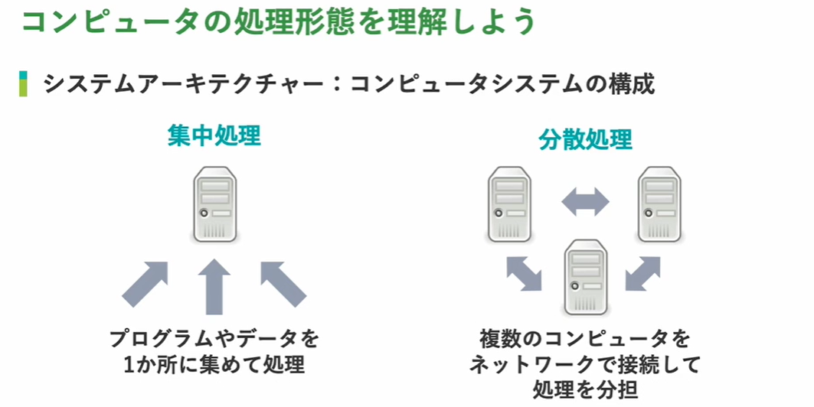

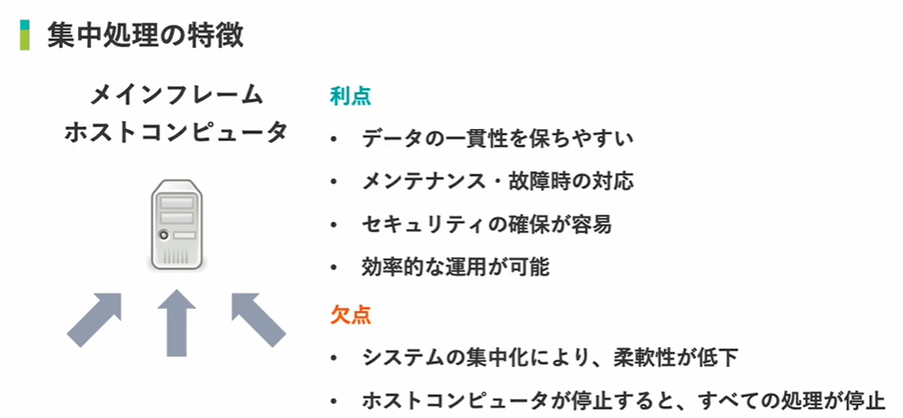

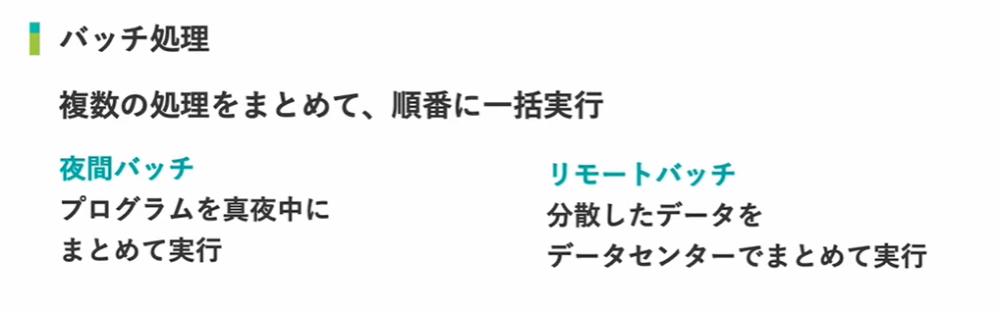

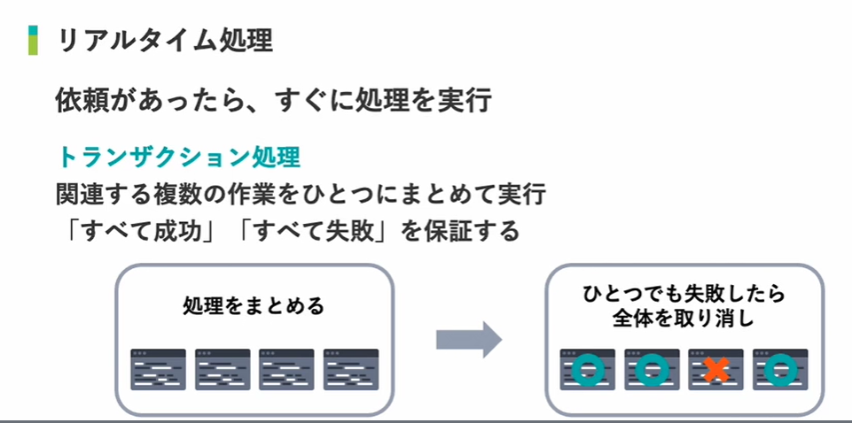

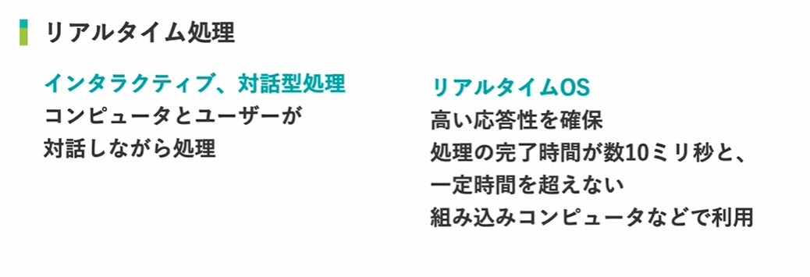

## 02: コンピュータの処理形態を理解しよう - 分散処理

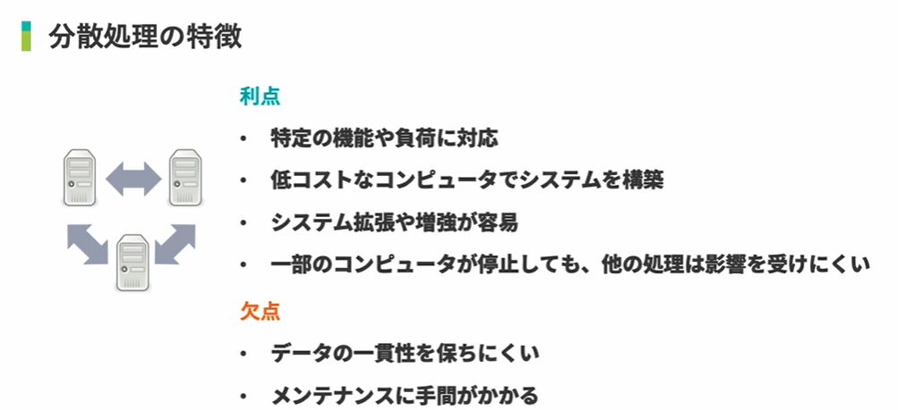

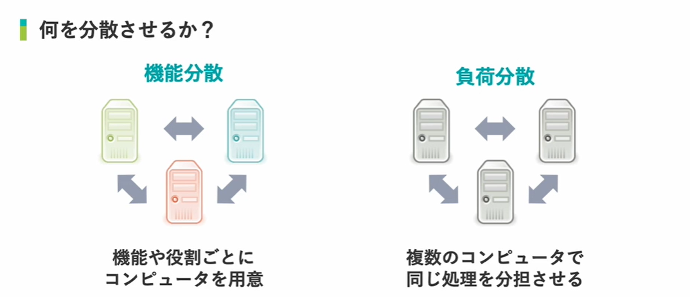

## 03: 処理能力を高めるシステム構成を知っておこう

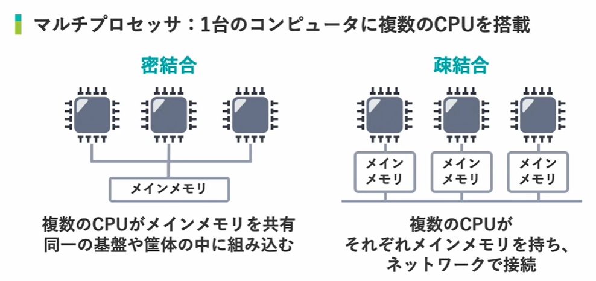

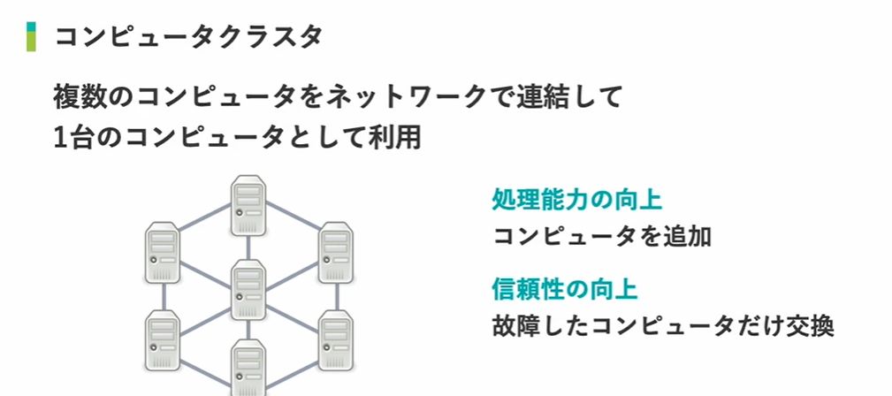

## 04: いろいろなクライアント・サーバシステムを見てみよう

### クライアント・サーバの例

- プリントサーバ：プリンタをネットワーク経由で利用させるサーバ
- ネットワークプリンタ：プリントサーバ機能を内蔵したプリンタ
- ファイルサーバ：ストレージをネットワーク経由で利用させるサーバ
- NAS(Network-Attached Storage)：増設ハードディスクにファイルサーバ機能を内蔵

### 3層クライアント・サーバ：

- アプリケーションサーバのデータベースを分離したシステム。Web技術を使わない場合も含まれる。
- ユーザーインターフェース・プレゼンテーション層：利用者に情報を表示、操作を受け付け
- ビジネスロジック・アプリケーション層：業務の処理などを行う
- データベース・データ層：実際にデータを管理する

###  ストアードプロシージャー

- よくある問合せ内容をデータベース側にあらかじめセットにして格納して、事前処理などを済ませておく方式
  - ネットワーク負荷の低減
  - 応答速度の向上
  - メンテナンス性の向上 

 ### Webシステム

- 静的なWebサイト
- LAMP(Linux、Apache、MySQL、PHP)
- Web3層システム
- 冗長化構成

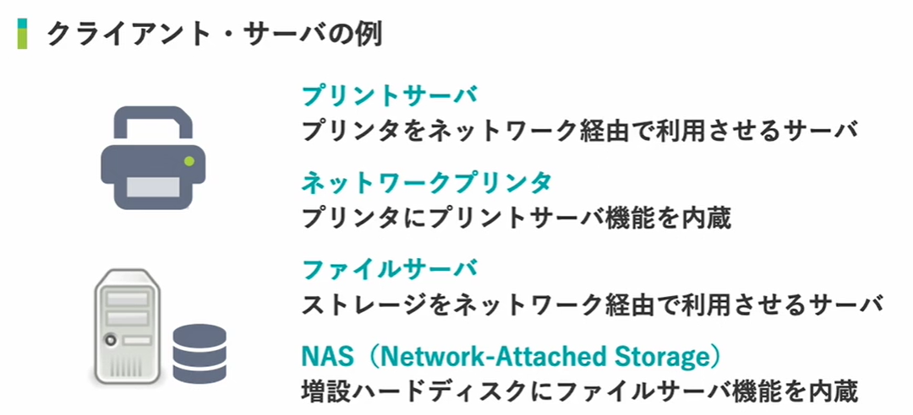

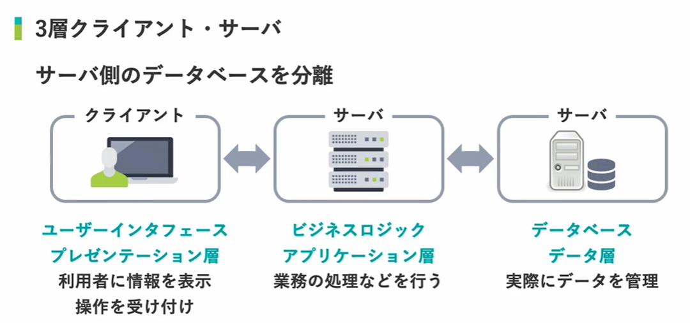

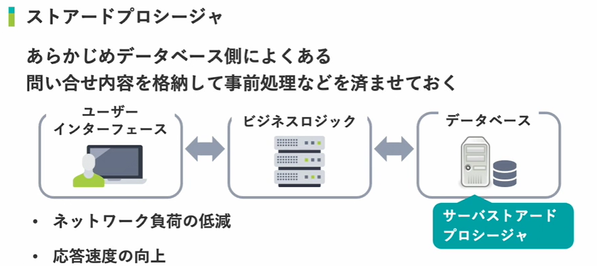

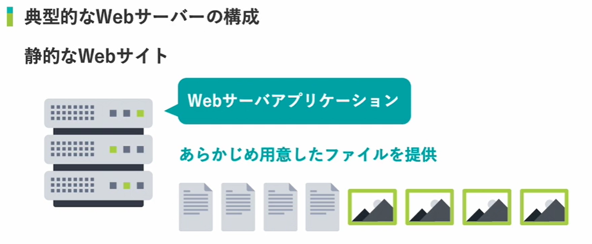

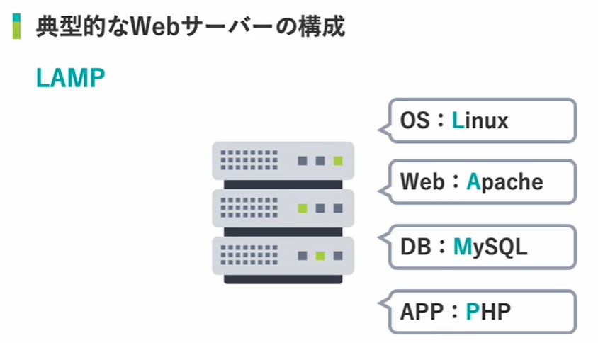

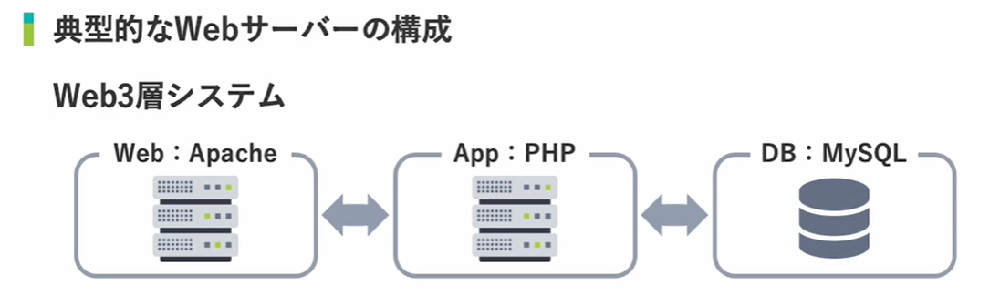

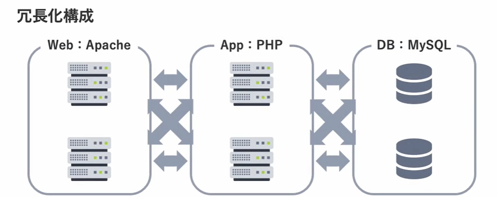

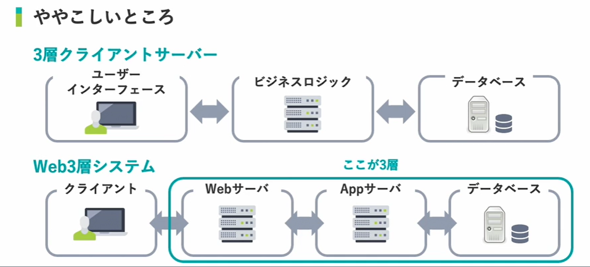

## 05: 信頼性を高めるシステム構成を知っておこう

- 多重化
  - コンピュータの世界で「多重化」は、「デュアルシステム」とも呼ばれています。
  - 複数のコンピュータを同時に動かして、その処理結果を一定時間ごとに比較します。
  - そして、もしも障害やメンテナンスで停止した場合は、一方で処理を継続し、復旧したら並行稼働に戻します。

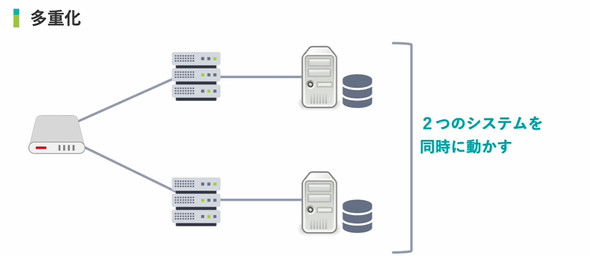

- 冗長化
  - コンピュータの「冗長化」は、「デュプレックスシステム」とも呼ばれて、複数のコンピュータを用意して片方ずつ動かす方式です。
  - 通常は、一方だけを動かして、もしも障害やメンテナンスで停止した場合は、もう一方に処理を引き継ぎます。

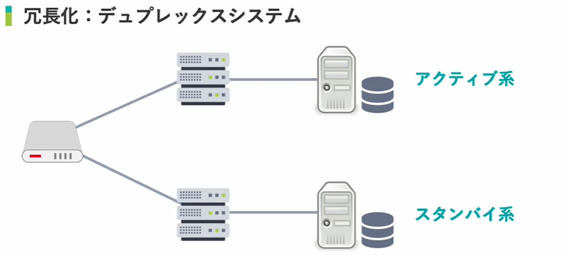

- 待機サイトの運用形態
  - ホットスタンバイ・ホットサイト： 同一環境をデータの同期を行いながら稼働させる。 本番系が停止した場合は、即座に待機系に切り替える。
  - ウォームスタンバイ・ウォームサイト： 同一環境をシステムを起動したまま待機させる。 データの同期などを実行しておかないため、本番系が停止した場合は、切り替えに時間がかかる。
  - コールドスタンバイ・コールドサイト： 同一環境を用意し、電源を切った状態で待機させる。 データの同期などを実行しておかないため、本番系が停止した場合は、切り替えに長い時間が必要となる。

## 06: RAIDについて知っておこう

- ハードディスクの弱点
  - モータやアームなどの可動部を持つ
  - ほこりや振動・高温に弱い
- ハードディスクが故障すると
  - データやプログラムを読みだせない
  - コンピュータやアプリケーションが起動できない
- 低コストで高速性・信頼性を高めるシステム構成が必要

- RAIDとは
  - Redundant Arrays of Inexpensive Disks
  - 複数のハードディスクを組み合わせて、1台のハードディスクとして動作
  - 高速性の向上、物理的な故障に対する冗長性を確保
  - RAID0からRAID6まで、高速性や信頼性の異なる組み合わせがある
    - RAID2からRAID4は、あまり使われていない

- RAID 0
  - ストライピング
    - 複数のハードディスクに分散して書き込み
    - 書き込みと読み出し速度の向上
    - 冗長性・信頼性向上には効果がない

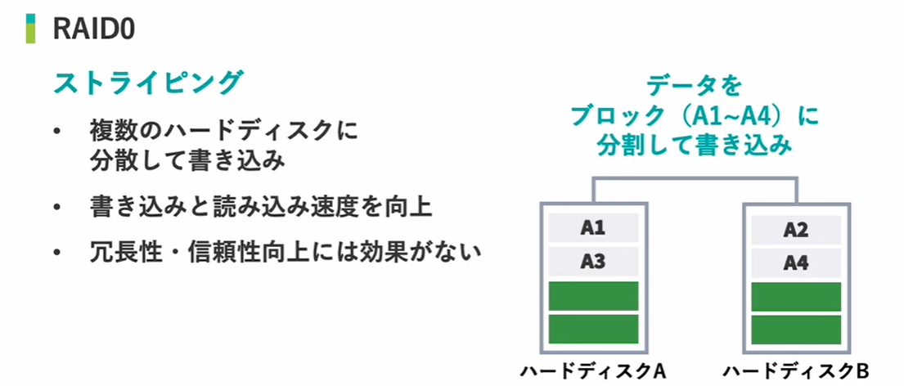

- RAID 1
  - ミラーリング
    - 複数のハードディスクに同じデータを書き込み
    - 1台のハードディスクが故障しても、残りのハードディスクからデータを復旧
    - ハードディスク全体よりも記録容量は少なくなる
  - RAID 0と組み合わせて、高速性と冗長性を実現

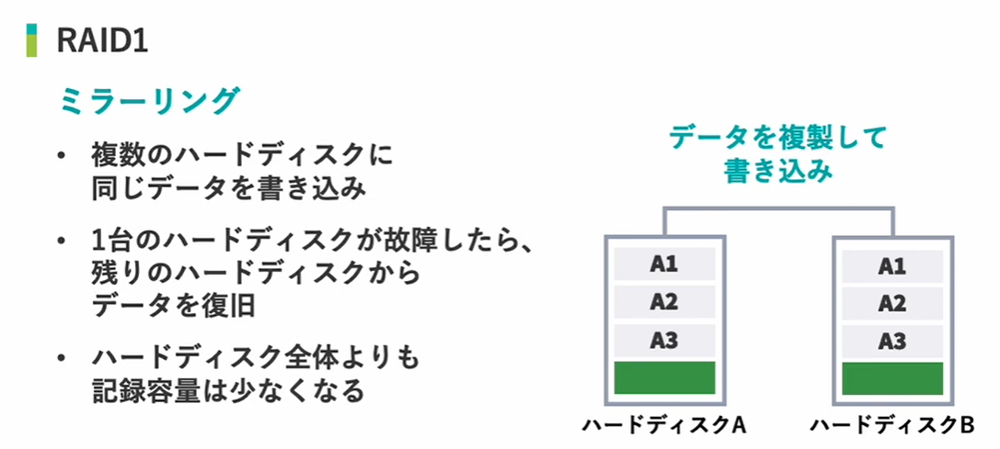

- RAID 5
  - 3台以上のハードディスクを用意し、均等に分散して記録
  - 一定サイズのブロックごとに誤り訂正符号を生成し、異なるハードディスクに記録
  - いずれか1台のハードディスクが故障しても、残りと誤り訂正符号からデータを復元
  - RAID 1よりも、ハードディスクの利用効率が高い

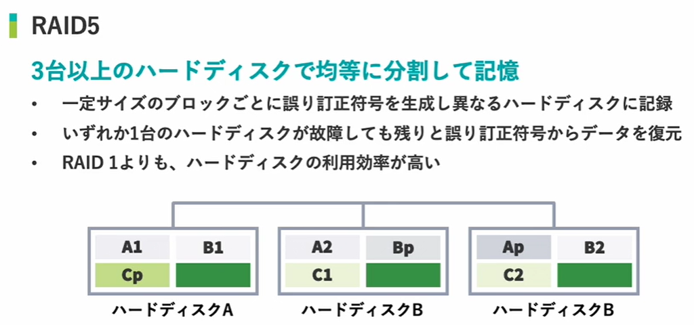

- RAID 6
  - 4台以上のハードディスクを用意し、均等に分散して記録
  - 誤り訂正符号を2種類生成して、分散して記録
  - 2台以上のハードディスクが故障しても、データを復元できる

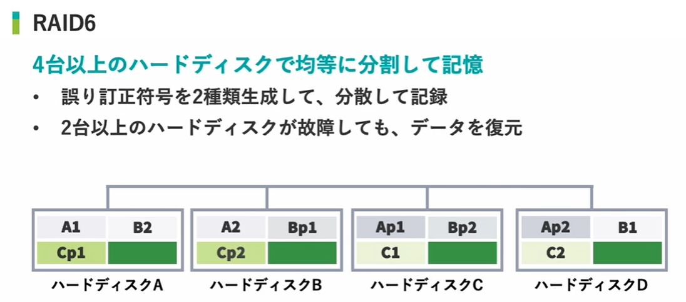

## 07: システムの信頼性設計を知っておこう

### 信頼性設計の考え方

- コンピュータシステムは、多数の複雑な要素の組み合わせ
- 部品の故障・操作ミス・複合的な障害をゼロにできない
- トラブルの予防、影響の最小化が必要

### トラブルに対応する方針

- フェイルセーフ：トラブルが起きたら、安全な状態になる

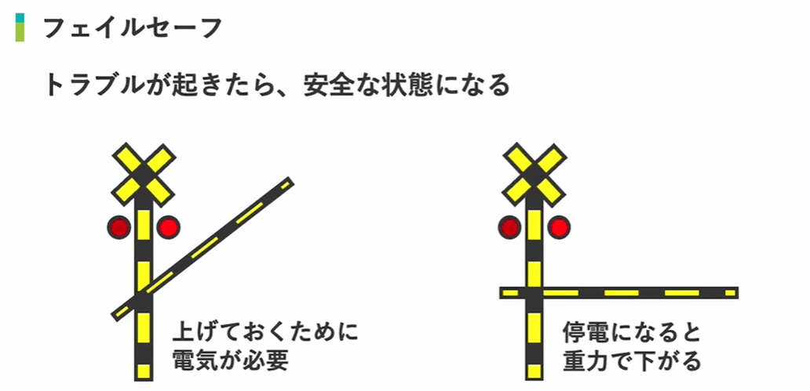

- フェイルソフト：トラブルが起きたら、性能を落として稼働を継続する

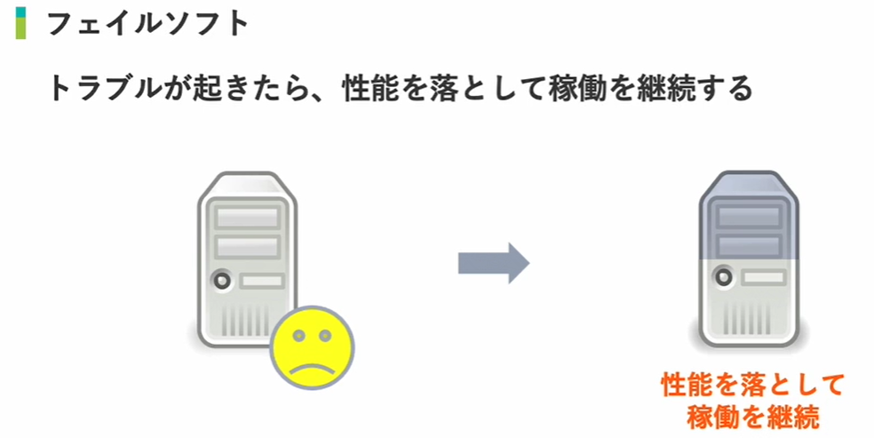

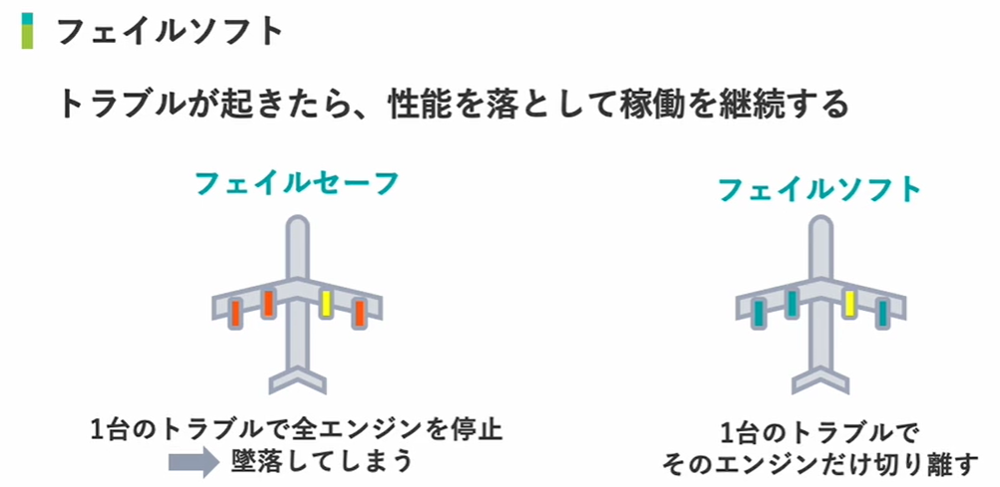

- フォールトトレラント：トラブルが起きても、正常に稼働させる

- フールプルーフ：操作を間違えても操作できない。操作を間違えても危険が生じない

## 08: 仮想化について理解しよう

### 仮想化とは

- ハードウェアでシステムを構成
- 物理的な空間が必要
- 組み立てる手間がかかる
- 部品が故障したら交換
- 仮想化：コンピュータの動作環境をソフトウェアで疑似的に再現

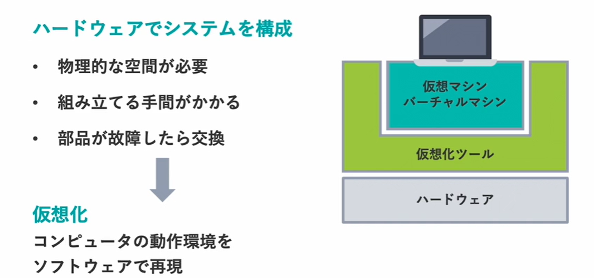

### 仮想化の代表的なメリット

- ひとつの仮想化プラットフォームで、複数の仮想マシンを動かす
- 仮想マシンの状態を、データとして保存・読み込み > イメージファイル
- イメージファイルを保存するだけで、コンピュータ全体をバックアップ
- イメージファイルを読み込むだけで、素早くシステムを構築
- ハードウェアが故障しても、別の環境で仮想マシンを稼働

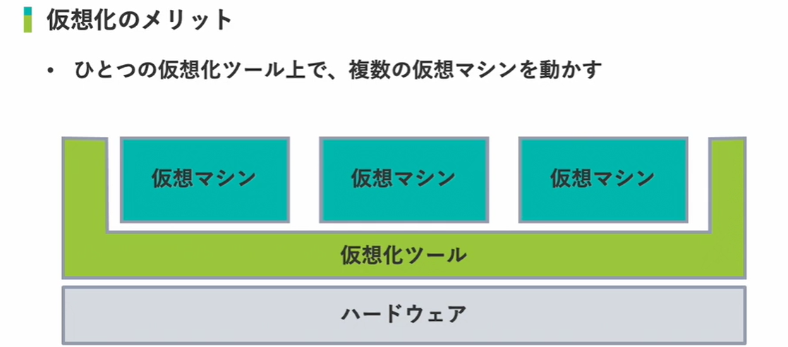

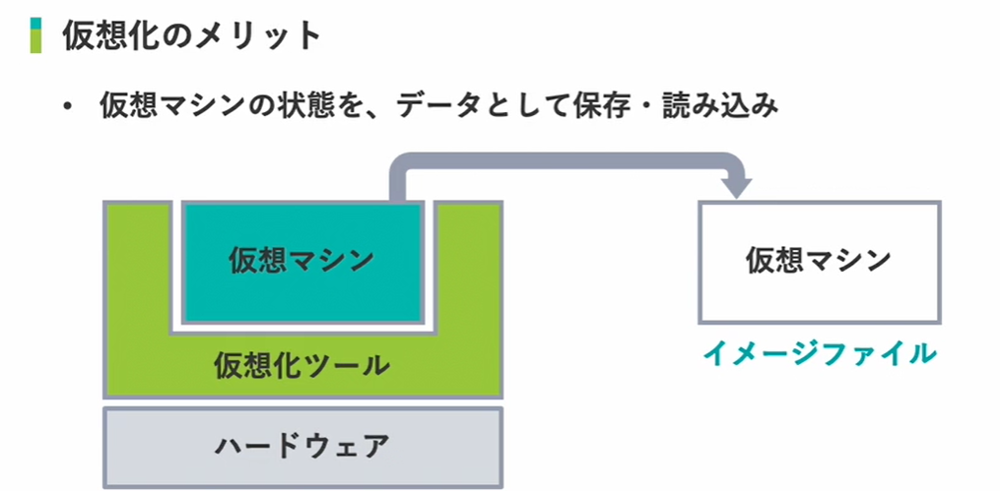

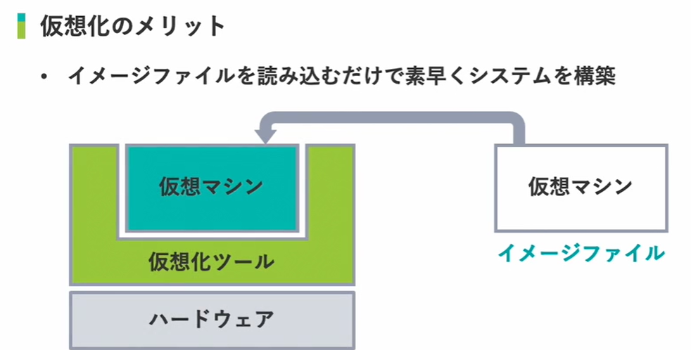

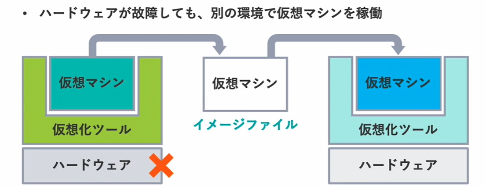

### ハイパーバイザー(Hypervisor)

- 1台のコンピュータ上で、複数の異なるOS(ゲストOS)を干渉なく並行して動作させるツール
- ゲストOSは、仮想的なコンピュータ(仮想マシン：VM)上で動作する

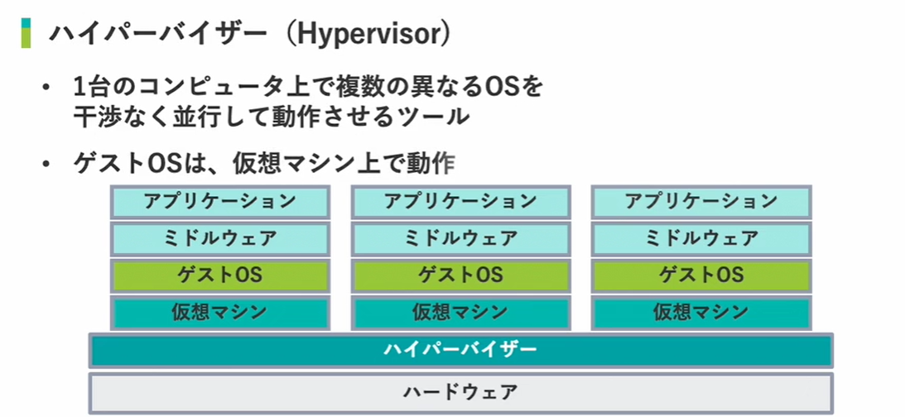

### コンテナ

- OSの一部を分離して、隔離された環境を提供する
- 仮想マシンを構築しないので、起動が速く、ディスク使用量も少ない
- 基本的にホストOSと異なるゲストOSは利用できない
- Dockerが広く普及している

### クラウドコンピューティング

- インターネットを経由して、仮想マシンをサービスとして利用する
- コンピュータ・クラスタのコンピュータ資源をプールして複数の仮想マシンを提供
- OpenStackやCloudStackといったツールがある

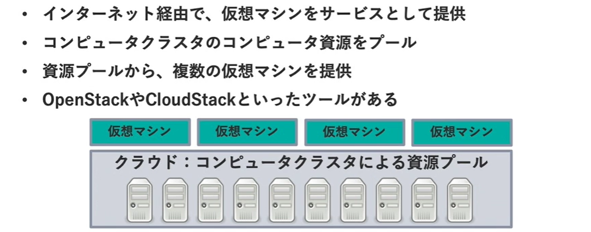

  

 

---

 

  

 

---

 

【EOF】

[←　README](../README.md)
