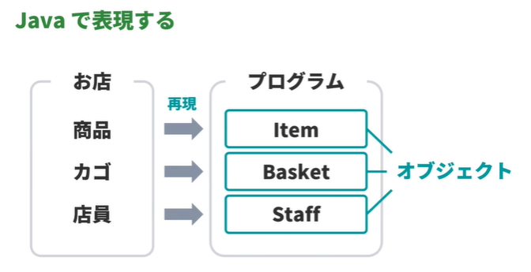
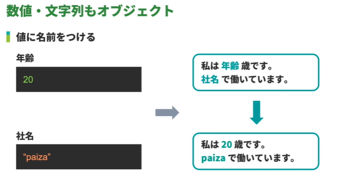

<!-- omit in toc -->
# 新・Java入門編 Lesson1 ～ Lesson 7

<!-- omit in toc -->
# [目次]

- [注意点](#注意点)
- [新・Java入門編1: プログラミングとJavaについて学習しよう](#新java入門編1-プログラミングとjavaについて学習しよう)
  - [01 : プログラミングとJavaについて](#01--プログラミングとjavaについて)
    - [プログラミングとは](#プログラミングとは)
    - [Javaとは](#javaとは)
    - [プログラミングを学習するコツ](#プログラミングを学習するコツ)
  - [02 : System.out.println() で Hello World を出力する](#02--systemoutprintln-で-hello-world-を出力する)
    - [文字列を出力する](#文字列を出力する)
    - [Hello World を出力するコード](#hello-world-を出力するコード)
    - [Hello paiza を出力するコード](#hello-paiza-を出力するコード)
    - [こんにちは を出力するコード](#こんにちは-を出力するコード)
  - [03 : Javaプログラムのよくある間違い](#03--javaプログラムのよくある間違い)
    - [大文字小文字の間違い](#大文字小文字の間違い)
    - [セミコロンのつけ忘れ](#セミコロンのつけ忘れ)
    - [波カッコの閉じ忘れ](#波カッコの閉じ忘れ)
    - [日本語入力の文字の混入](#日本語入力の文字の混入)
  - [04 : Javaプログラムの開発の流れ](#04--javaプログラムの開発の流れ)
    - [開発の流れの概要](#開発の流れの概要)
    - [ソースコードの作成](#ソースコードの作成)
    - [コンパイル](#コンパイル)
    - [実行](#実行)
- [新・Java入門編2: Javaプログラムの基本構造を学習しよう](#新java入門編2-javaプログラムの基本構造を学習しよう)
  - [01: Javaプログラムの基本構造](#01-javaプログラムの基本構造)
    - [プログラムの構造](#プログラムの構造)
    - [アプリケーションの仕組み](#アプリケーションの仕組み)
  - [02: mainメソッドを持つクラスの作成](#02-mainメソッドを持つクラスの作成)
    - [クラスブロックが記述されたコード](#クラスブロックが記述されたコード)
    - [mainメソッドが記述されたコード](#mainメソッドが記述されたコード)
    - [mainメソッドの中身が記述されたコード](#mainメソッドの中身が記述されたコード)
  - [03: インデント](#03-インデント)
  - [改行や空白を使う意味](#改行や空白を使う意味)
  - [改行や空白をどのように使う](#改行や空白をどのように使う)
  - [04: Java プログラムの世界観](#04-java-プログラムの世界観)
    - [Javaプログラムが目指すもの](#javaプログラムが目指すもの)
    - [オブジェクト指向プログラミング](#オブジェクト指向プログラミング)
- [新・Java入門編3: 「こんにちは」と出力する方法を学習しよう](#新java入門編3-こんにちはと出力する方法を学習しよう)
  - [01: 標準出力を扱うプログラム](#01-標準出力を扱うプログラム)
    - [標準出力](#標準出力)
  - [02: System.out.println を使った標準出力への出力](#02-systemoutprintln-を使った標準出力への出力)
    - [System.out.println](#systemoutprintln)
    - [System.out.println を使用したコード](#systemoutprintln-を使用したコード)
    - [System.out.println を連続で使用したコード](#systemoutprintln-を連続で使用したコード)
  - [03: System.out.print を使った標準出力への出力](#03-systemoutprint-を使った標準出力への出力)
    - [System.out.print](#systemoutprint)
    - [System.out.print を使用したコード](#systemoutprint-を使用したコード)
    - [System.out.print を連続で使用したコード](#systemoutprint-を連続で使用したコード)
- [新・Java入門編4: コメントの付け方を学習しよう](#新java入門編4-コメントの付け方を学習しよう)
  - [01: 単一行のコメント（//）](#01-単一行のコメント)
  - [02: 複数行のコメント（/*~*/）](#02-複数行のコメント)
- [新・Java入門編5: 演算子を学習しよう](#新java入門編5-演算子を学習しよう)
  - [01: 算術演算子](#01-算術演算子)
  - [02: 文字列連結演算子](#02-文字列連結演算子)
  - [03: 演算子の優先順位](#03-演算子の優先順位)
    - [※ 演算子の優先順位と結合規則 | JavaDrive](#-演算子の優先順位と結合規則--javadrive)
    - [【Java入門】括弧を使った演算子優先順位の変更 | エンジニアの入り口](#java入門括弧を使った演算子優先順位の変更--エンジニアの入り口)
- [新・Java入門編6: 変数を学習しよう](#新java入門編6-変数を学習しよう)
  - [01: 数値・文字列もオブジェクト](#01-数値文字列もオブジェクト)
  - [02: 変数の使い方](#02-変数の使い方)
  - [03: 変数の宣言方法](#03-変数の宣言方法)
  - [04: 変数名に使える文字](#04-変数名に使える文字)
    - [識別子とは](#識別子とは)
    - [使える文字](#使える文字)
    - [|Java言語で使用可能な文字](#java言語で使用可能な文字)
    - [|Java言語で使用可能な数字](#java言語で使用可能な数字)
    - [命名ルール](#命名ルール)
  - [05: よい変数名とは](#05-よい変数名とは)
    - [変数名](#変数名)
    - [|Javaの慣習](#javaの慣習)
  - [06: データ型](#06-データ型)
    - [文字を表すデータ型](#文字を表すデータ型)
    - [整数を表すデータ型](#整数を表すデータ型)
    - [小数を表すデータ型](#小数を表すデータ型)
    - [真偽値を表すデータ型](#真偽値を表すデータ型)
      - [Boolean型](#boolean型)
  - [07: 変数への再代入](#07-変数への再代入)
  - [08: finalを使った定数の宣言](#08-finalを使った定数の宣言)
- [新・Java入門編7: 演算子と変数の使い方を学習しよう](#新java入門編7-演算子と変数の使い方を学習しよう)
  - [01: 演算結果の代入](#01-演算結果の代入)
  - [02: 変数と算術演算子・文字列連結演算子の組合せ](#02-変数と算術演算子文字列連結演算子の組合せ)
  - [03: 自己代入](#03-自己代入)
  - [04: 複合代入演算子](#04-複合代入演算子)
  - [05: インクリメント・デクリメント演算子](#05-インクリメントデクリメント演算子)


<br>

---

<br>


#  注意点

> [!CAUTION]
> 日本語入力は、必要のない限りオフにする


<br>

---

<br>

# 新・Java入門編1: プログラミングとJavaについて学習しよう

## 01 : プログラミングとJavaについて

### プログラミングとは
  - プログラミング：コンピュータを制御するプログラムをつくること
  - ソースコード：プログラムの記述内容
  - プログラミング言語：ソースコードを記述する専用言語

### Javaとは
- Javaソフトウェア | オラクル | Oracle 日本
    - https://www.oracle.com/jp/java/

### プログラミングを学習するコツ

  - 実際にプログラムを書いて実行する
  - 最初は、動画のとおりにコードを書く
  - うまくいったら自分なりに修正してみる


<br>

---

<br>


## 02 : System.out.println() で Hello World を出力する

### 文字列を出力する

- ドキュメント：System.out.println()
  - https://docs.oracle.com/javase/jp/8/docs/api/java/lang/System.html#out


### Hello World を出力するコード

```java
public class Main {
    public static void main(String... args) {
        System.out.println("Hello world");
    }
}  
```

### Hello paiza を出力するコード

```java
public class Main {
    public static void main(String... args) {
        System.out.println("Hello paiza");
    }
}  
```


### こんにちは を出力するコード

```java
public class Main {
    public static void main(String... args) {
        System.out.println("こんにちは");
    }
}  
```

<br>

---

<br>


## 03 : Javaプログラムのよくある間違い


### 大文字小文字の間違い


  - 大文字小文字を間違えない

```java
system.out.println("Hello World");
```

### セミコロンのつけ忘れ

  - 命令する文の最後にセミコロンをつけ忘れる（文末にセミコロンは必須）

```java
System.out.println("Hello World")
```


### 波カッコの閉じ忘れ

  - 波カッコは対になる必要がある

```java
public class Main {
    public static void main(String... args) {
        System.out.println("Hello World");
    
}
```


### 日本語入力の文字の混入

  - 日本語入力の文字を混ぜない

```java
System.out.println("Hello World"）;
```


<br>

---

<br>


## 04 : Javaプログラムの開発の流れ


###  開発の流れの概要

  - Javaプログラムの開発は、「ソースコードの作成」「コンパイル」「実行」の3つのステップでおこなわれる

### ソースコードの作成

  - どのようなプログラムを作りたいのかを決める
  - どのような処理が必要になるかを整理する
  - Javaの文法規則に従ってコードを記述する


### コンパイル

  - ソースコードをバイトコードに変換
  - ソースコードの文法に誤りがあった場合、コンパイルエラーが発生


###  実行

  - バイトコードをインタプリタがマシン語に変換
  - マシン語をCPUが読み取って、コンピュータが動作


<br>

---

<br>


# 新・Java入門編2: Javaプログラムの基本構造を学習しよう


## 01: Javaプログラムの基本構造

### プログラムの構造

```java
クラス {
    メソッド1 {
        ステートメント1
        ステートメント2
    }
    メソッド2 {
        ステートメント3
        ステートメント4
    }
}
```

### アプリケーションの仕組み

  - Javaのプログラムのうち、「アプリケーション」と呼ばれるものには、必ず、`ひとつ以上のクラス`と、`ひとつのmainメソッド`がある


<br>

---

<br>


## 02: mainメソッドを持つクラスの作成


### クラスブロックが記述されたコード

```java
public class Main {
    
}
```

### mainメソッドが記述されたコード

```java
public class Main {
    public static void main(String... args) {

    }
}
```


### mainメソッドの中身が記述されたコード

```java
public class Main {
    public static void main(String... args) {
        System.out.println("こんにちは");
    }
}
```

<br>

---

<br>


## 03: インデント

## 改行や空白を使う意味

  - プログラムを見やすくするため


##  改行や空白をどのように使う

  - 各ブロックごとに改行を使う
  - ブロックの始まりと終わりに空白を使ってインデントする


<br>

---

<br>


## 04: Java プログラムの世界観

### Javaプログラムが目指すもの

  - 現実世界の活動をコンピュータ上で表現すること

### オブジェクト指向プログラミング

  - オブジェクトに注目してプログラムを作成すること





<br>

---

<br>


# 新・Java入門編3: 「こんにちは」と出力する方法を学習しよう

## 01: 標準出力を扱うプログラム

### 標準出力

  - データを出力することができる「標準出力」という場所
  - 書き込んだデータは、動画講座画面右下の欄に表示される


<br>

---

<br>


## 02: System.out.println を使った標準出力への出力

### System.out.println

  - System.out.println は、標準出力へ文字を出力するメソッド
  - 文字を出力した後に改行をおこなう

### System.out.println を使用したコード

```java
public class Main {
    public static void main(String... args) {
        System.out.println("こんにちは");
    }
}  
```


###  System.out.println を連続で使用したコード

```java
public class Main {
    public static void main(String... args) {
        System.out.println("こんにちは");
        System.out.println("こんばんは");
    }
} 
```


<br>

---

<br>


## 03: System.out.print を使った標準出力への出力

### System.out.print
・System.out.print は、標準出力へ文字を出力するメソッド
・文字を出力した後に`改行をおこなわない`


###  System.out.print を使用したコード

```java
public class Main {
    public static void main(String... args) {
        System.out.print("こんにちは");
    }
}  
```


### System.out.print を連続で使用したコード

```java
public class Main {
    public static void main(String... args) {
        System.out.print("こんにちは");
        System.out.print("こんばんは");
    }
} 
```


<br>

---

<br>


# 新・Java入門編4: コメントの付け方を学習しよう


## 01: 単一行のコメント（//）

```java

public class Main {
    public static void main(String... args) {
        //「paiza」と出力
        System.out.println("paiza");
    }
}

```

## 02: 複数行のコメント（/*~*/）

```java
/*
 * 複数行のコメント
 * 複数行のコメント
 */
public class Main {
    public static void main(String... args) {
        System.out.println("Hello World");
    }
}

```


<br>

---

<br>


# 新・Java入門編5: 演算子を学習しよう


## 01: 算術演算子

- (参考) 算術演算子 - JavaDrive
  - https://www.javadrive.jp/start/ope/index1.html
  
|演算子|使用例|意味|
|-----|------|----|
| +	|A + B	|AにBを加える|
| -	|A - B	|AからBを引く|
| *	|A * B	|AにBを掛ける|
| /	|A / B	|AをBで割る ` (両方ともint型だと整数商しか求まらない)`|
| %	|A % B	|AをBで割った余り|


## 02: 文字列連結演算子

```java
public class Main {
    public static void main(String... args) {
        System.out.println("Hello" + "world");
        System.out.println("私は" + 20 + "歳です"); 
    }
}

```


## 03: 演算子の優先順位

```java

public class Main {
    public static void main(String... args) {
        System.out.println(3+2*2);      // output:7 
        System.out.println((3+2)*2);    // output: 10
    }
}


```

### ※ 演算子の優先順位と結合規則 | JavaDrive

- https://www.javadrive.jp/start/ope/index4.html

-- ↓↓↓　優先順位が高い　↓↓↓ --
|結合規則|演算子|
|-------|-----|
|左	| (引数) [配列添字] . ++ --(後置き)|
|右	|! ~ + -(単項演算子) ++ --(前置き)|
|左	|new (型変換)|
|左	|* / %|
|左	|+ -(算術演算子)|
|左	|<< >> >>>|
|左	|> >= < <= instanceof|
|左	|== !=|
|左	|&|
|左	|^|
|左	|||
|左	|&&|
|左	||||
|右	|?:|
|左	|= += -= *= /= %= <<= >>= >>>= &= |= ^=|
-- ↑↑↑　優先順位が低い　↑↑↑ --


### 【Java入門】括弧を使った演算子優先順位の変更 | エンジニアの入り口

  - https://eng-entrance.com/java-cal-brackets


原文ママ

> [!TIP]
> 演算の優先順位を高くするには、括弧()で囲めばよい。<br>
> a+bの加算結果にcを掛けたい場合、a+b*cと書いてはいけない。<br>
> b*cが優先されるからだ。それで、括弧を使ってa+cが優先されるように変更する。<br>
> ```
> a + bを優先：a + b * c → (a + b) * c
> ```


<br>

---

<br>


# 新・Java入門編6: 変数を学習しよう


## 01: 数値・文字列もオブジェクト





## 02: 変数の使い方

```java

public class Main {
    public static void main(String... args) {
        String text = "paiza"
    }
}


```


## 03: 変数の宣言方法

```java

public class Main {
    public static void main(String... args) {
        String greeting;
        greeting = "こんばんは";
        System.out.println(greeting);
    }
} 


```


## 04: 変数名に使える文字


### 識別子とは

  - 変数名、メソッド名、クラス名、パッケージ名など
    - 「Java言語で使用可能な文字」と
    - 「Java言語で使用可能な数字」で構成
  - 長さに制限のない文字の並び


### 使える文字

  -  1文字目は「Java言語で使用可能な文字」
  -  2文字目以降は
     -  「Java言語で使用可能な文字」もしくは
     -  「Java言語で使用可能な数字」

### |Java言語で使用可能な文字

  -  日本語、中国語などを含むUnicode文字セット
  -  Character.isJavaldentifierStart / trueを返す


### |Java言語で使用可能な数字

  -  ASCIIの0~9
  -  Character.isJavaldentifierPart / trueを返す


### 命名ルール

  -  1文字目は英文字
  -  数字は2文字目以降


## 05: よい変数名とは

### 変数名

  -  文字の並びは自由
  -  自分以外にもわかりやすい名前をつける

### |Javaの慣習

  -  ひとつの単語で表現される場合は全て英小文字
  -  英小文字の単語を使用
     -  名前 = name
     -  住所 = address
  -  ふたつ以上の単語で表現される場合はふたつめ以降の単語の先頭文字のみ英大文字
     -  キャメルケース
        -  後続の各単語の先頭文字を大文字で表記する手法
     -  記号、マルチバイト文字は使用しない


## 06: データ型

### 文字を表すデータ型

|Character 型|String 型|
|------|------|
|1文字を表す<br>シングルクォーテーションで囲む|文字列(0文字以上の文字の集まり)を表す|
|```java Character paizaRank = 'S'; ```|```java  String name ="きりしま"; ```|


### 整数を表すデータ型

|Integer 型|Long 型|
|------|------|
|約±21億の範囲の整数を表す|約±900京の範囲の整数を表す|
|```java Integer money = 10000; ```|```java  Long population = 126500000L;```|


|Short型|Byte 型|
|------|------|
|約±3.2万の範囲の整数を表す<br>小さな整数|約±128の範囲の整数を表す|
|```java Short age = 20; ```|```java Byte month = 4; ```|


### 小数を表すデータ型


|Double 型|Float型|
|------|------|
|約±1.8×10^308~約±4.9× 10^-324 の範囲の小数を表す|約±3.4×10^38~約±1.4×10^-45の範囲の小数を表す<br>少し曖昧でも良い小数<br>末尾にF(またはf)をつける|
|```java Double pi = 3.14159265359; ```|```java Float height = 173.5F; ```|


### 真偽値を表すデータ型


#### Boolean型

- 真偽値を表す : (真偽値とは「はい·いいえ」などの、二者択一の情報のこと)
- 肯定情報を true、否定情報を falseで表す
  - Boolean result = true;
  - Boolean isEmpty = false;


## 07: 変数への再代入

```java

public class Main {
    public static void main(String... args) {
        Integer money = 1000;
        System.out.println(money);

        money = 2000;
        System.out.println(money);
    }
}


```


## 08: finalを使った定数の宣言

```java

public class Main {
    public static void main(String... args) {
        final Integer money = 1000;
        money = 2000;
        System.out.println(money);
    }
}

// エラーが出力
//  Main.java:*****: error: cannot assign a value to final *****

```


<br>

---

<br>

# 新・Java入門編7: 演算子と変数の使い方を学習しよう


## 01: 演算結果の代入

```java

public class Main {
    public static void main(String... args) {
        Integer i = 813 + 813;
        System.out.println(i);
    }
}


```

## 02: 変数と算術演算子・文字列連結演算子の組合せ

```java

public class Main {
    public static void main(String... args) {
        String product = "リンゴ";
        Integer price = 100;
        System.out.println(product + "の値段は" + price + "円です");
        
        Integer toralPrice = price * 5;
        System.out.println("総額は" + toralPrice + "円です");
    }
}


/*
 * 演習より:
 * 上記の式「apple*5*tax」だと答えは「550.0」になるが、
 * 逆に「apple*tax*5」だと答えは「550.000000001」になる
 */
public class Main {
    public static void main(String... args) {
        final Double tax = 1.1;
        Integer apple = 100;
        System.out.println(apple*5*tax);

    }
}


```


## 03: 自己代入

```java

public class Main {
    public static void main(String... args) {
        Integer i = 0;
        i = i + 1;
        System.out.println(i);
        
        i = i + 1;
        System.out.println(i);
    }
}

```


## 04: 複合代入演算子

```java

public class Main {
    public static void main(String... args) {
        Integer x = 1;
         x += 3;       // x = x + 3と同じ
        System.out.println(x);
        
        String s = "abc";
        s += "def";    // s = s + "def"と同じ
        System.out.println(s);
    }
}


```


## 05: インクリメント・デクリメント演算子

```java

public class Main {
    public static void main(String... args) {
        Integer n = 10;
        n++;
        System.out.println(n);           //11
        
        Integer x = 10;
        Integer y = 10;

        System.out.println(--x + 50);    //59
        System.out.println(y-- + 50);    //60
    }
}


```


<br>

---

<br>


【EOF】


[←　README](../README.md)

