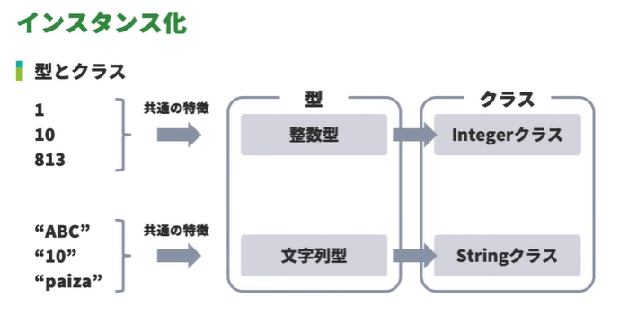
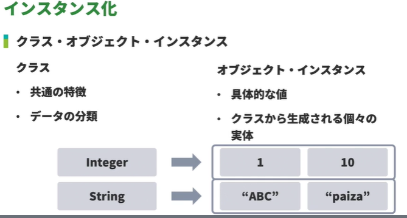
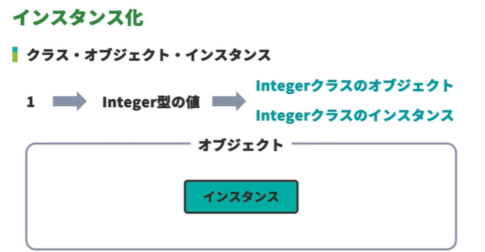
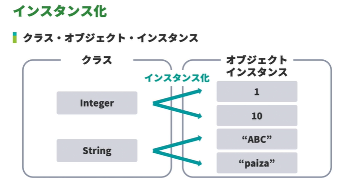
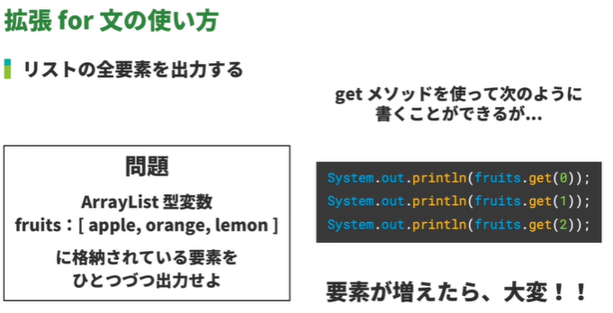
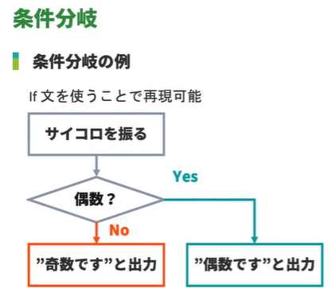

<!-- omit in toc -->
# 新・Java入門編 Lesson8 ～ Lesson 12

<!-- omit in toc -->
# [目次]

- [新・Java入門編8: new演算子を学習しよう](#新java入門編8-new演算子を学習しよう)
  - [01: インスタンス化](#01-インスタンス化)
  - [02: new 演算子](#02-new-演算子)
  - [03: new 演算子が必要なもの・必要でないもの](#03-new-演算子が必要なもの必要でないもの)
- [新・Java入門編9: ArrayListを学習しよう](#新java入門編9-arraylistを学習しよう)
  - [01: 01:ArrayList型の変数の宣言方法](#01-01arraylist型の変数の宣言方法)
    - [importとは](#importとは)
  - [02: 要素の追加（add）](#02-要素の追加add)
  - [03: 指定の位置に要素の追加（add）](#03-指定の位置に要素の追加add)
  - [04: 要素の置き換え（set）](#04-要素の置き換えset)
  - [05: 要素の取得（get）](#05-要素の取得get)
  - [06: 要素数の取得(size)](#06-要素数の取得size)
  - [07: 要素のインデックスを取得（indexOf）](#07-要素のインデックスを取得indexof)
  - [08: 要素の有無を確認（contains）](#08-要素の有無を確認contains)
  - [09: 指定した要素の削除（remove）](#09-指定した要素の削除remove)
  - [10: 全要素の削除（clear）](#10-全要素の削除clear)
  - [11: 要素の並び替え（Collections.sort）](#11-要素の並び替えcollectionssort)
  - [12: リストのコピー](#12-リストのコピー)
- [新・Java入門編10: forEachメソッドを学習しよう](#新java入門編10-foreachメソッドを学習しよう)
  - [01: forEach メソッドの使い方](#01-foreach-メソッドの使い方)
  - [02: forEach メソッドの引数・処理の「記述」の省略方法](#02-foreach-メソッドの引数処理の記述の省略方法)
    - [メソッド参照](#メソッド参照)
  - [03: forEach メソッドを使ってリストの全要素を出力](#03-foreach-メソッドを使ってリストの全要素を出力)
  - [04: forEach メソッド内で複数の処理をおこなう](#04-foreach-メソッド内で複数の処理をおこなう)
- [新・Java入門編11: 拡張for文を学習しよう](#新java入門編11-拡張for文を学習しよう)
  - [01: 拡張for文の使い方](#01-拡張for文の使い方)
    - [拡張for文とは ..](#拡張for文とは-)
  - [02: 拡張for文を使ったアレイリストの全要素の出力](#02-拡張for文を使ったアレイリストの全要素の出力)
- [新・Java入門編12: 条件分岐を理解しよう](#新java入門編12-条件分岐を理解しよう)
  - [01: 条件分岐とは](#01-条件分岐とは)
  - [02:条件式](#02条件式)
    - [関係演算子](#関係演算子)
  - [03: if 文の使い方](#03-if-文の使い方)
    - [if文とは](#if文とは)
    - [if 文の使い方](#if-文の使い方)
  - [04: else 句の使い方](#04-else-句の使い方)
  - [05: else if の使い方](#05-else-if-の使い方)
  - [06: 条件分岐と繰り返し処理との組み合わせ](#06-条件分岐と繰り返し処理との組み合わせ)
  - [07: 文字列の比較](#07-文字列の比較)
  - [08: 条件の組み合わせ（||） OR:論理和](#08-条件の組み合わせ-or論理和)
    - [A||B](#ab)
  - [09: 条件の組み合わせ（\&\&）AND:論理積](#09-条件の組み合わせand論理積)
    - [A \&\& B](#a--b)


<br>

---

<br>


# 新・Java入門編8: new演算子を学習しよう

## 01: インスタンス化














## 02: new 演算子

```java

//---------------- 例1

public class Main {
    public static void main(String... args) {
        Monster slime = new Monster();
    }
}

class Monster {
}


//---------------- 例2


public class Main {
    public static void main(String... args) {
        Item sword = new Item();
    }
}

class Item {
    public Item(){
        System.out.println("インスタンスを生成しました");
    }
}


```


## 03: new 演算子が必要なもの・必要でないもの


```java

public class Main {
    public static void main(String... args) {
        Monster slime = new Monster();

        // String text = "paiza";
        // Intger x = 100;
        String text = new String("paiza");
        Integer x = new Integer(100);
        
        System.out.println(text);
        System.out.println(x);
    }
}

class Monster {
}

```

> [!WARNING]
> `new Double`や`new Integer`はJDK9から非推奨になりWARNINGメッセージが出る <br>
> `java integer int in integer has been deprecated and marked for removal`<br><br>
> Java9で意外なものが非推奨(Deprecated)になっていた<br>
> https://tadashi.hatenablog.com/entry/2018/07/09/173018


<br>

---

<br>

# 新・Java入門編9: ArrayListを学習しよう


## 01: 01:ArrayList型の変数の宣言方法


### importとは
Javaにあらかじめ用意されているクラスなどを利用するためには、`完全修飾名`を使わなければなりません。
たとえば`ArrayList`の完全修飾名は `java.util.ArrayList` です。

このうち `java.util` は `パッケージ名`と呼ばれます。

プログラムの中で毎回完全修飾名を利用しても問題ありませんが、import文を利用することで、パッケージ名を省略し、クラス名のみの記述で利用することが可能になります。

```java
import java.util.ArrayList;

```


実例：

```java

import java.util.ArrayList;

public class Main {
    public static void main(String... args) {
        ArrayList <String> members = new ArrayList();
    }
}


```


## 02: 要素の追加（add）

```java

import java.util.ArrayList;

public class Main {
    public static void main(String... args) {
        ArrayList<String> fruits = new ArrayList<>();
        
        fruits.add("apple");
        fruits.add("orange");
        fruits.add("lemon");
        System.out.println(fruits);     // [apple, orange, lemon]
    }
}


```


## 03: 指定の位置に要素の追加（add）

```java

import java.util.ArrayList;

public class Main {
    public static void main(String... args) {
        ArrayList<String> fruits = new ArrayList<>();

        fruits.add("apple");
        fruits.add("orange");
        fruits.add("lemon");
        
        fruits.add(1, "grepe");

        System.out.println(fruits);       // [apple, grepe, orange, lemon]
    }
}


```


## 04: 要素の置き換え（set）

```java

import java.util.ArrayList;

public class Main {
    public static void main(String... args) {
        ArrayList<String> fruits = new ArrayList<String>();

        fruits.add("apple");
        fruits.add("orange");
        fruits.add("lemon");
        
        fruits.set(1, "grape");

        System.out.println(fruits);      // [apple, grape, lemon]
    }
}


```


## 05: 要素の取得（get）

```java

import java.util.ArrayList;

public class Main {
    public static void main(String... args) {
        ArrayList<String> fruits = new ArrayList<>();

        fruits.add("apple");
        fruits.add("orange");
        fruits.add("lemon");

        System.out.println(fruits.get(1));   // output: orange
    }
}


```


## 06: 要素数の取得(size)


```java
import java.util.ArrayList;

public class Main {
    public static void main(String... args) {
        ArrayList<String> fruits = new ArrayList<>();

        fruits.add("apple");
        fruits.add("orange");
        fruits.add("lemon");

        System.out.println(fruits.size());       // 3
    }
}

```


## 07: 要素のインデックスを取得（indexOf）


```java

import java.util.ArrayList;

public class Main {
    public static void main(String... args) {
        ArrayList<String> fruits = new ArrayList<>();

        fruits.add("apple");
        fruits.add("orange");
        fruits.add("lemon");

        System.out.println(fruits.indexOf("orange"));      // 1
        System.out.println(fruits.indexOf("banana"));      // -1
    }
}


```


## 08: 要素の有無を確認（contains）


```java

import java.util.ArrayList;

public class Main {
    public static void main(String... args) {
        ArrayList<String> fruits = new ArrayList<>();

        fruits.add("apple");
        fruits.add("orange");
        fruits.add("lemon");

        System.out.println(fruits.contains("grape"));      // False
        System.out.println(fruits.contains("apple"));      // True
    }
}

```


## 09: 指定した要素の削除（remove）

```java

import java.util.ArrayList;

public class Main {
    public static void main(String... args) {
        ArrayList<String> fruits = new ArrayList<>();

        fruits.add("apple");
        fruits.add("orange");
        fruits.add("lemon");

        System.out.println(fruits);            // [apple, orange, lemon]
        System.out.println(fruits.size());     // 3

        fruits.remove(1);

        System.out.println(fruits);            // [apple, lemon]
        System.out.println(fruits.size());     // 2
    }
}


```


## 10: 全要素の削除（clear）


```java
import java.util.ArrayList;

public class Main {
    public static void main(String... args) {
        ArrayList<String> fruits = new ArrayList<>();

        fruits.add("apple");
        fruits.add("orange");
        fruits.add("lemon");
        fruits.clear();
        System.out.println(fruits);
    }
}


```


## 11: 要素の並び替え（Collections.sort）


```java

import java.util.ArrayList;
import java.util.Collections;

public class Main {
    public static void main(String... args) {
        ArrayList<Integer> numbers = new ArrayList<>();

        numbers.add(1);
        numbers.add(14);
        numbers.add(10);
        numbers.add(5);
        numbers.add(8);
        numbers.add(2);
        
        //整列前
        System.out.println(numbers);       // [1, 14, 10, 5, 8, 2]
        
        //降順の時だけreverseOrderを加味。デフォルトは昇順
        Collections.sort(numbers, Collections.reverseOrder());    
        
        System.out.println(numbers);       // [14, 10, 8, 5, 2, 1]
    }
}

```


## 12: リストのコピー


```java

import java.util.ArrayList;

public class Main {
    public static void main(String... args) {
        ArrayList<String> fruits = new ArrayList<>();

        fruits.add("apple");
        fruits.add("orange");
        fruits.add("lemon");

        ArrayList<String> fruits_copy = new ArrayList<>(fruits);
        System.out.println("fruits：" + fruits);                // fruits：[apple, orange, lemon]
        System.out.println("fruits_copy：" + fruits_copy);      // fruits_copy：[apple, orange, lemon]
        fruits_copy.add("grape");
        System.out.println("fruits：" + fruits);                // fruits：[apple, orange, lemon]
        System.out.println("fruits_copy：" + fruits_copy);      // fruits_copy：[apple, orange, lemon, grape]
    }
}


```


<br>

---

<br>


# 新・Java入門編10: forEachメソッドを学習しよう


## 01: forEach メソッドの使い方

  - forEach メソッドとは
    - Java8 で実装された Stream API に用意されているメソッド
    - コレクション内の各要素に対して、同じ処理を繰り返しおこなうことができる
    - メソッド内でラムダ式という特殊な文法を使う

```java
コレクション変数.forEach((データ型 引数)->{
    処理;
});
```

  - forEach メソッドはコレクション変数にドットで繋げて記述する
  - 引数は、取り出した要素を処理の中で扱うためのもの
  - 「->」に続けて、各要素におこないたい処理を記述する

```java

import java.util.ArrayList;

public class Main {
    public static void main(String... args) {
        ArrayList<String> users = new ArrayList<>();

        users.add("kirishima");
        users.add("rokumura");
        users.add("midorikawa");

        users.forEach((String user) -> {
            System.out.println(user);
        });
    }
}

```

## 02: forEach メソッドの引数・処理の「記述」の省略方法

### メソッド参照
ラムダ式の省略について、最終的には下記の形まで変換することができます。
```java

fruits.forEach(System.out::println);   

// 上記と同じ
// fruits.forEach(x -> System.out.println(x));  
```

> [!TIP]
> 「`インスタンス名（staticメソッドの場合はクラス名）::メソッド名`」のような記述方法は「`メソッド参照`」と呼ばれます。
> ラムダ式の引数を、使用したいメソッドの引数としてそのまま渡している場合、ラムダ式の引数やそれをメソッドに渡す記述を省略し、メソッド参照にすることが可能になります。


```java

import java.util.ArrayList;

public class Main {
    public static void main(String... args) {
        ArrayList<String> fruits = new ArrayList<>();

        fruits.add("apple");
        fruits.add("orange");
        fruits.add("lemon");
/*
        fruits.forEach((String x) -> {
            System.out.println(x);
        });  
*/
        fruits.forEach(System.out::println);
        //または
        fruits.forEach(x -> System.out.println(x));

    }
}


```


## 03: forEach メソッドを使ってリストの全要素を出力


```java

import java.util.ArrayList;

public class Main {
    public static void main(String... args) {
        ArrayList<String> fruits = new ArrayList<>();

        fruits.add("apple");
        fruits.add("orange");
        fruits.add("lemon");
        fruits.forEach(fruit -> System.out.println(fruit));
    }
}

```


## 04: forEach メソッド内で複数の処理をおこなう

```java

import java.util.ArrayList;

public class Main {
    public static void main(String... args) {
        ArrayList<String> fruits = new ArrayList<>();

        fruits.add("apple");
        fruits.add("orange");
        fruits.add("lemon");

        fruits.forEach(fruit -> {
            String fruitUpper = fruit.toUpperCase();
            System.out.println(fruitUpper);
        });
    }
}


```


<br>

---

<br>

# 新・Java入門編11: 拡張for文を学習しよう


## 01: 拡張for文の使い方


### 拡張for文とは ..


- 繰り返し処理をおこなう機能である for 文を、コレクションクラスに対応させたもの
- コレクションの各要素に対して、同じ処理を繰り返しおこなうことができる




```java
for(データ型変数名:コレクション変数){
    処理;
}
```


  -  コレクションから取り出した要素を代入するための変数を宣言する
  -  データ型はコレクションの要素と同じ
  -  波カッコの中に、各要素におこないたい処理を記述する


## 02: 拡張for文を使ったアレイリストの全要素の出力


```java

import java.util.ArrayList;

public class Main {
    public static void main(String... args) {
        ArrayList<String> fruits = new ArrayList<>();

        fruits.add("apple");
        fruits.add("orange");
        fruits.add("lemon");
        
        for (String fruit: fruits){
            System.out.println(fruit);
        }

    }
}


```


<br>

---

<br>

# 新・Java入門編12: 条件分岐を理解しよう

## 01: 条件分岐とは

  -  条件に応じて、実行する命令を変化させること





## 02:条件式

  - 処理を分岐させるための条件を表現したもの
  - 関係演算子などを使い記述する


### 関係演算子


|演算子|読み方|役割|
|------|------|---|
|==|イコールイコール|左辺と右辺が等しい|
|!=|エクスクラメーションイコール|左辺と右辺が異なる|
|>|大なり|左辺が右辺より大きい|
|<|小なり|左辺が右辺より小さい|
|>=|大なりイコール|左辺が右辺より大きいか等しい|
|<=|小なりイコール|左辺が右辺より小さいか等しい|


## 03: if 文の使い方

### if文とは

  - 条件によって処理を分岐させるための構文
  - 条件に応じて、実行する命令を変更で

### if 文の使い方

```java

if (条件式) {
    処理;
}

```


## 04: else 句の使い方

```java

public class Main {
    public static void main(String... args) {

        Integer i = 1;

        if (i == 0) {
            System.out.println("iは0です");
        } else {
            System.out.println("iは非0です");
        }
    }
}

```


## 05: else if の使い方

```java

public class Main {
    public static void main(String... args) {

        Integer i = 1;

        /* BEFORE 
        if (i == 0) {
            System.out.println("iは0です");
        } else {
            if (i == 1) {
               System.out.println("iは0です");
            } else {
               System.out.println("iは0ではありません");
            }
        }
        */

        if (i == 0) {
            System.out.println("iは0です");
        } else if(i == 1){
            System.out.println("iは0です");
        } else {
            System.out.println("iは0ではありません");
        }
    }
}

```


## 06: 条件分岐と繰り返し処理との組み合わせ

```java

import java.util.ArrayList;

public class Main {
    public static void main(String... args) {
        ArrayList <Integer> scores = new ArrayList<>();
        scores.add(1);
        scores.add(2);
        scores.add(3);
        scores.add(4);
        scores.add(5);
        
        scores.forEach(score -> {
            if(score % 2 == 0) {
                System.out.println(score + "は偶数");
            } else {
                System.out.println(score + "は奇数");
            }
        });
    }
}

```


## 07: 文字列の比較

```java

public class Main {
    public static void main(String... args) {
        String s = "paiza";    // "paiza": true, "PAIZA": false 大文字小文字の区別がある
        
        if (s == "paiza") {
            System.out.println("sはpaizaです");            
        } else {
            System.out.println("sはpaizaではありません");            
        }
    }
}

```


## 08: 条件の組み合わせ（||） OR:論理和

### A||B

AとBのいずれかが真であれば真

```java

public class Main {
    public static void main(String... args) {
        Integer japanese = 80;
        Integer mathematics = 80;
        if (japanese >= 80 || mathematics >= 80) {
            System.out.println("合格");
        } else {
            System.out.println("不合格");
        }
    }
}

```


## 09: 条件の組み合わせ（&&）AND:論理積

### A && B

AとBのいずれも真であれば真

```java

public class Main {
    public static void main(String... args) {
        Integer japanese = 80;
        Integer mathematics = 80;
        
        if (japanese >= 80 && mathematics >= 80) {
           System.out.println("合格");
        } else {
           System.out.println("不合格");
        }
    }
}

```

<br>

---

<br>


【EOF】


[←　README](../README.md)

