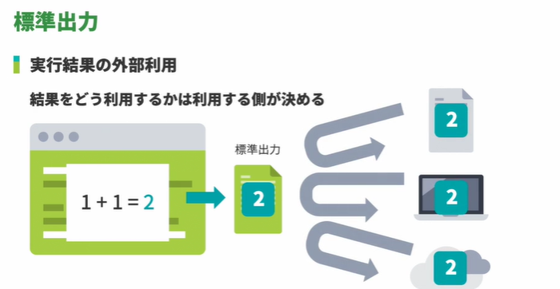
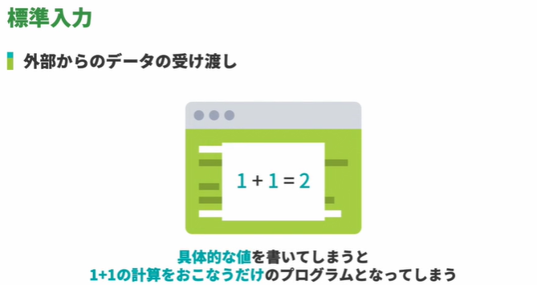
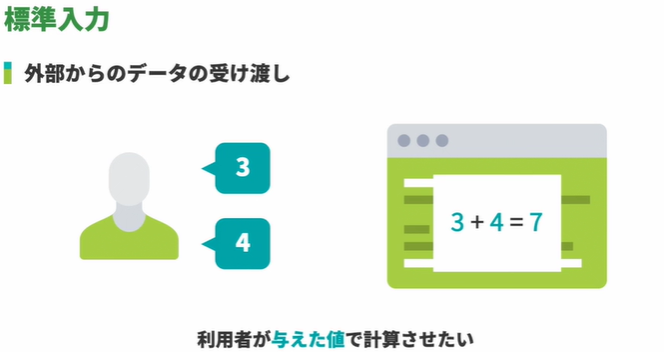
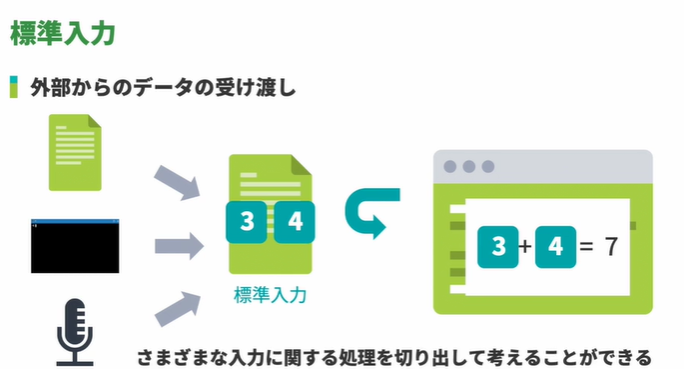
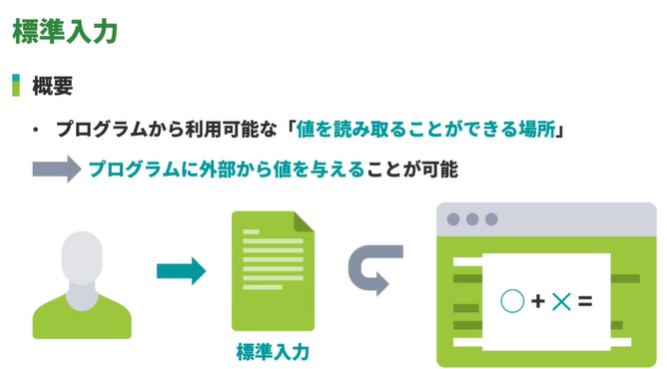

<!-- omit in toc -->
# 新・Java入門編 Lesson13 ～ Lesson 

<!-- omit in toc -->
# [目次]
- [新・Java入門編13: for文を学習しよう](#新java入門編13-for文を学習しよう)
  - [01: for文の使い方](#01-for文の使い方)
  - [02: for文を使ってアレイリストの中身を出力](#02-for文を使ってアレイリストの中身を出力)
  - [03: for文とforEachメソッドと拡張for文](#03-for文とforeachメソッドと拡張for文)
  - [04: for文とif文の組み合わせ](#04-for文とif文の組み合わせ)
- [新・Java入門編14: 標準入力と標準出力を学習しよう](#新java入門編14-標準入力と標準出力を学習しよう)
  - [01: 標準出力](#01-標準出力)
    - [標準出力](#標準出力)
  - [02: 標準入力](#02-標準入力)
- [新・Java入門編15: Scannerを使用した標準入力からの値の取得方法について学習しよう](#新java入門編15-scannerを使用した標準入力からの値の取得方法について学習しよう)
  - [01: nextLineを使った標準入力からの値の取得](#01-nextlineを使った標準入力からの値の取得)
    - [Scanner](#scanner)
    - [System.in](#systemin)
    - [空白文字](#空白文字)
    - [System.out](#systemout)
  - [02: nextを使った標準入力からの値の取得](#02-nextを使った標準入力からの値の取得)
  - [03: nextIntを使った標準入力からの値取得](#03-nextintを使った標準入力からの値取得)
  - [文字列連結演算子](#文字列連結演算子)
- [新・Java入門編16: 複数のデータを標準入力から取得しよう](#新java入門編16-複数のデータを標準入力から取得しよう)
  - [01: 入力されるデータの数があらかじめ決まっている場合の取得方法](#01-入力されるデータの数があらかじめ決まっている場合の取得方法)
  - [02: 入力されるデータの数があらかじめ決まっていない場合の取得方法](#02-入力されるデータの数があらかじめ決まっていない場合の取得方法)
- [新・Java入門編17: while文を学習しよう](#新java入門編17-while文を学習しよう)
  - [01: while文の使い方](#01-while文の使い方)
- [新・Java入門編18: コレクションフレームワークを理解しよう（LinkedHashSet）](#新java入門編18-コレクションフレームワークを理解しようlinkedhashset)
  - [01: コレクションフレームワークとは](#01-コレクションフレームワークとは)
  - [02: LinkedHashSet型の変数の宣言及び初期化方法](#02-linkedhashset型の変数の宣言及び初期化方法)
  - [03: 要素の追加（add）](#03-要素の追加add)
  - [04: 要素数の取得（size）](#04-要素数の取得size)
  - [05: 要素の有無を確認（contains）](#05-要素の有無を確認contains)
  - [06: 指定した要素の削除（remove）](#06-指定した要素の削除remove)
  - [07: 全要素の削除（clear）](#07-全要素の削除clear)
  - [08: 空かどうか（isEmpty）](#08-空かどうかisempty)
  - [09: 反復処理（forEachメソッド、拡張for文）](#09-反復処理foreachメソッド拡張for文)


<br>

---

<br>


# 新・Java入門編13: for文を学習しよう


## 01: for文の使い方

```java

public class Main {
    public static void main(String... args) {
        /* BEFORE
            System.out.println(0);
            System.out.println(1);
            System.out.println(2);
            System.out.println(3);
            System.out.println(4);
            System.out.println(5);
        */    

        // AFTER
        for(Integer i = 0; i < 6; i++) {
            System.out.println(i);
        }
    }
}

```

## 02: for文を使ってアレイリストの中身を出力

```java

import java.util.*;

public class Main {
    public static void main(String... args) {
        ArrayList<String> fruits = new ArrayList<>();
        fruits.add("apple");
        fruits.add("orange");
        fruits.add("lemon");
        fruits.add("banana");
        fruits.add("grape");

        /* BEFORE
        System.out.println(fruits.get(0));
        System.out.println(fruits.get(1));
        System.out.println(fruits.get(2));
        System.out.println(fruits.get(3));
        System.out.println(fruits.get(4));
        */

       //AFTER
       for(Integer i=0; i < fruits.size(); i++){
            System.out.println(fruits.get(i));
       }
    }
}

```


## 03: for文とforEachメソッドと拡張for文


```java

import java.util.*;
public class Main {
    public static void main(String... args) {
        ArrayList<String> fruits = new ArrayList<>();
        fruits.add("apple");
        fruits.add("orange");
        fruits.add("lemon");
        fruits.add("banana");
        fruits.add("grape");

        //for
        for(Integer i=0; i< fruits.size(); i++){
            System.out.println(fruits.get(i));
        }
        
        //forEach
        fruits.forEach(fruit -> {
            System.out.println(fruit);
        });
        
        
    }
}

```

## 04: for文とif文の組み合わせ


```java

public class Main {
    public static void main(String... args) {
        for (int i = 1; i <= 7; i++) {
            System.out.println(i + "日目");
            if (i==6 || i==7){
                System.out.println("今日はお休み");    
            }
        }
    }
} 

```


<br>

---

<br>


#  新・Java入門編14: 標準入力と標準出力を学習しよう


## 01: 標準出力

### 標準出力

-  プロセスに与えられる特別なストリーム
-  外部への出力を抽象化したようなものであり、標準出力へ書き込まれたデータは「他のプログラムの入力として利用する」「ファイルに書き込む」などの柔軟な取り扱いがなされる
-  paiza.IO 環境では、標準出力に書き込まれたデータはコード欄の下の出力欄に文字列として表示される

## 02: 標準入力













<br>

---

<br>


# 新・Java入門編15: Scannerを使用した標準入力からの値の取得方法について学習しよう


## 01: nextLineを使った標準入力からの値の取得

###  Scanner

  - https://docs.oracle.com/javase/jp/17/docs/api/java.base/java/util/Scanner.html


;


```java
import java.util.*;

public class Main {
    public static void main(String... args) {
        Scanner sc = new Scanner(System.in);
        String s1 = sc.nextLine();   //1行目
        System.out.println(s1);
        String s2 = sc.nextLine();   //2行目
        System.out.println(s2);      
    }
}

//このロジックでは標準入力が3行以上入るとエラーとなる

```

###  System.in

  - https://docs.oracle.com/javase/jp/17/docs/api/java.base/java/lang/System.html#in

### 空白文字

  - Character.isWhitespace
    - https://docs.oracle.com/javase/jp/17/docs/api/java.base/java/lang/Character.html#isWhitespace(int)


   - Unicodeの空白文字(SPACE_SEPARATOR、LINE_SEPARATOR、またはPARAGRAPH_SEPARATOR)であるが、<br>改行なしの空白('\u00A0'、'\u2007'、'\u202F')ではない。
   - '\t' (U+0009水平タブ)である。
   - '\n' (U+000A改行)である。
   - '\u000B' (U+000B垂直タブ)である。
   - '\f' (U+000Cフォーム・フィード)である。
   - '\r' (U+000D復帰)である。
   - '\u001C' (U+001Cファイル区切り文字)である。
   - '\u001D' (U+001Dグループ区切り文字)である。
   - '\u001E' (U+001Eレコード区切り文字)である。
   - '\u001F' (U+001F単位区切り文字)である。


### System.out

   -  https://docs.oracle.com/javase/jp/17/docs/api/java.base/java/lang/System.html#out


## 02: nextを使った標準入力からの値の取得

(参考) 
   - Scannerクラス next,nextLine,nextIntメソッドの使い分け
   - https://qiita.com/kitamuwork/items/e383411e5191b85d14b9
     - nextLine
       - ⇛改行をスキャンする
       - ⇛改行のみでも改行（\n）としてスキャンしている
     - next
       - ⇛改行をスキャンしない
       - ⇛文字をスキャンするまで改行は無視される
     - nextInt
       - ⇛改行をスキャンしない
       - ⇛数字をスキャンするまで改行は無視される

## 03: nextIntを使った標準入力からの値取得

## 文字列連結演算子
   - https://paiza.jp/works/java/new-primer/java-new-primer-5/80401


<br>

---

<br>


# 新・Java入門編16: 複数のデータを標準入力から取得しよう


## 01: 入力されるデータの数があらかじめ決まっている場合の取得方法


```java

import java.util.*;

public class Main {
    public static void main(String... args) {
        Scanner sc = new Scanner(System.in);
        ArrayList<String> inputList = new ArrayList<>();
        inputList.add(sc.next());
        inputList.add(sc.next());
        inputList.add(sc.next());
        System.out.println(inputList);
    }
}

```


## 02: 入力されるデータの数があらかじめ決まっていない場合の取得方法


このコードのユースケース：最初に数字を入れて、そのあとの行ごとに文字列を拾う

```java

import java.util.*;

public class Main {
    public static void main(String... args) {

        Scanner sc = new Scanner(System.in);

        ArrayList<String> inputData = new ArrayList<>();

        Integer n = sc.nextInt();

        for(Integer i=0; i < n; i++){
            inputData.add(sc.next());
        }
        System.out.println(inputData);
    }
}


```


<br>

---

<br>

# 新・Java入門編17: while文を学習しよう


## 01: while文の使い方

```java

public class Main {
    public static void main(String... args) {
    
        Integer i = 1;
        while(i < 8){
            System.out.println(i);
            i++;            
        }
        
        System.out.println("paiza");
    }
}

```


<br>

---

<br>


# 新・Java入門編18: コレクションフレームワークを理解しよう（LinkedHashSet）


## 01: コレクションフレームワークとは


## 02: LinkedHashSet型の変数の宣言及び初期化方法


## 03: 要素の追加（add）


## 04: 要素数の取得（size）


## 05: 要素の有無を確認（contains）


## 06: 指定した要素の削除（remove）


## 07: 全要素の削除（clear）


## 08: 空かどうか（isEmpty）


## 09: 反復処理（forEachメソッド、拡張for文）


<br>

---

<br>


【EOF】


[←　README](../README.md)

