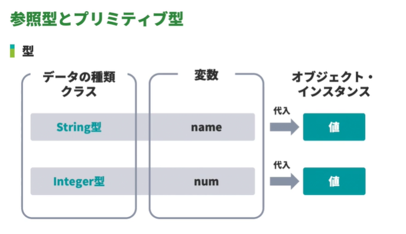
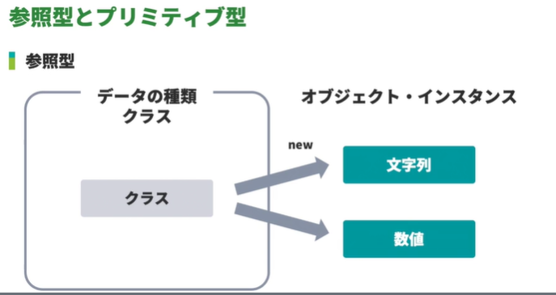
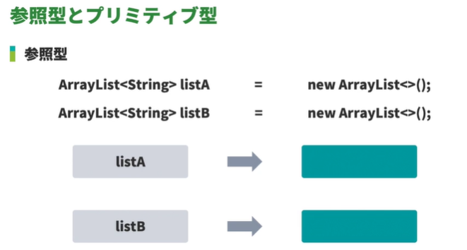
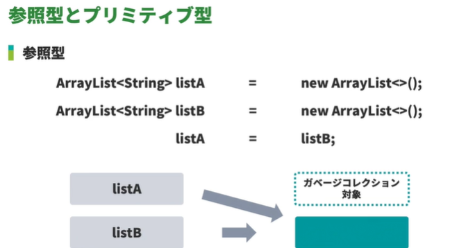
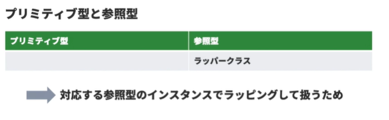
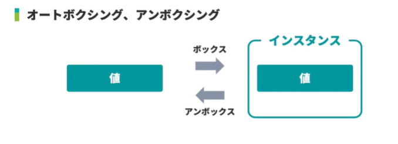
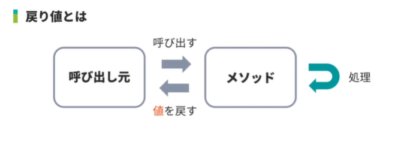

<!-- omit in toc -->
# 新・Java入門編 Lesson21 ～ Lesson23

<!-- omit in toc -->
# [目次]

- [新・Java入門編21: 参照型とプリミティブ型について学習しよう](#新java入門編21-参照型とプリミティブ型について学習しよう)
  - [01: 参照型とプリミティブ型](#01-参照型とプリミティブ型)
    - [参照型](#参照型)
    - [プリミティブ型](#プリミティブ型)
  - [02: リテラル](#02-リテラル)
    - [整数リテラル](#整数リテラル)
    - [浮動小数点リテラル](#浮動小数点リテラル)
    - [booleanリテラル](#booleanリテラル)
    - [文字リテラル](#文字リテラル)
    - [文字列リテラル](#文字列リテラル)
    - [null](#null)
  - [03: リミティブ型とラッパークラス](#03-リミティブ型とラッパークラス)
    - [プリミティブ型と対応するラッパークラス](#プリミティブ型と対応するラッパークラス)
  - [04: 整数型の型変換](#04-整数型の型変換)
  - [04: 整数型の型変換](#04-整数型の型変換-1)
  - [05: 浮動小数点数型の型変換](#05-浮動小数点数型の型変換)
  - [06: 整数型と浮動小数点数型の型変換](#06-整数型と浮動小数点数型の型変換)
- [新・Java入門編22: クラスについて学習しよう](#新java入門編22-クラスについて学習しよう)
  - [01: クラスとは](#01-クラスとは)
    - [クラスの定義方法](#クラスの定義方法)
    - [クラス名に使用しても問題ない文字の並び](#クラス名に使用しても問題ない文字の並び)
    - [Javaの慣習](#javaの慣習)
  - [02: インスタンス変数とは](#02-インスタンス変数とは)
    - [インスタンス変数の宣言方法](#インスタンス変数の宣言方法)
  - [03: メソッドとは](#03-メソッドとは)
    - [インスタンスメソッドとスタティックメソッド](#インスタンスメソッドとスタティックメソッド)
    - [インスタンス変数とローカル変数](#インスタンス変数とローカル変数)
    - [メソッドの定義方法](#メソッドの定義方法)
    - [メソッド名に使用しても問題ない文字の並び](#メソッド名に使用しても問題ない文字の並び)
    - [Javaの慣習](#javaの慣習-1)
  - [04: 戻り値のあるメソッド（return）](#04-戻り値のあるメソッドreturn)
  - [05: 戻り値のないメソッド（void）](#05-戻り値のないメソッドvoid)
  - [06: 仮引数（パラメータ）のあるメソッド](#06-仮引数パラメータのあるメソッド)
  - [07: メソッドのオーバーロード](#07-メソッドのオーバーロード)
  - [08: コンストラクタとは](#08-コンストラクタとは)
  - [09: 仮引数のないコンストラクタ（デフォルトコンストラクタ）](#09-仮引数のないコンストラクタデフォルトコンストラクタ)
    - [仮引数のないコンストラクタの定義方法](#仮引数のないコンストラクタの定義方法)
    - [よくある間違い](#よくある間違い)
    - [デフォルトコンストラクタ](#デフォルトコンストラクタ)
  - [10: 仮引数のあるコンストラクタ](#10-仮引数のあるコンストラクタ)
    - [コンストラクタの役割](#コンストラクタの役割)
  - [11: static変数とは](#11-static変数とは)
    - [static が付与されたメンバ変数](#static-が付与されたメンバ変数)
    - [static 変数とfinal キーワードで定数化が可能](#static-変数とfinal-キーワードで定数化が可能)
    - [定数](#定数)
  - [12: staticメソッドとは](#12-staticメソッドとは)
    - [static の付与されたメソッド](#static-の付与されたメソッド)
- [新・Java入門編23: アクセス制御について学習しよう1（public、private）](#新java入門編23-アクセス制御について学習しよう1publicprivate)
  - [01: アクセス修飾子](#01-アクセス修飾子)
    - [public](#public)
    - [protected](#protected)
    - [パッケージプライベート](#パッケージプライベート)
    - [private](#private)
  - [02: publicなコンストラクタとprivateなコンストラクタ](#02-publicなコンストラクタとprivateなコンストラクタ)
    - [セーフな例](#セーフな例)
    - [エラー発生例](#エラー発生例)
    - [private コンストラクタの使いどころ](#private-コンストラクタの使いどころ)
  - [03: publicなメソッドとprivateなメソッド](#03-publicなメソッドとprivateなメソッド)
  - [04: publicなフィールドとprivateなフィールド](#04-publicなフィールドとprivateなフィールド)
  - [05: カプセル化](#05-カプセル化)


<br>

---

<br>


# 新・Java入門編21: 参照型とプリミティブ型について学習しよう


## 01: 参照型とプリミティブ型








### 参照型

- 特別な値:「参照」
- 特別な値があらわすインスタンスを確認する:「参照する」





```java
ArrayList<String> l1 = new ArrayList();
ArrayList<String> l2 = l1;

l1.add("ABC");

System.out.println(l1);    // output: [ABC]
System.out.println(l2);    // output: [ABC]


```




### プリミティブ型

|データ型|値の範囲|
|-------|--------|
|byte   |8ビット整数(-128~127) |
|short  |16ビット整数(-32768~32767) |
|int    |32ビット整数(-2147483468~2147483467) |
|long   |64ビット整数(-9223372036854775808~92233772036854775807) |
|float  |32ビット浮動小数点数 |
|double | 64ビット浮動小数点数 |
|char   |16ビット(0~65535) |
|boolean|true もしくは false |


```java
int i1 = 0;
int i2 = i1;

i1++;

System.out.println(i1);  // output: 1
System.out.println(i2);  // output: 0

```


## 02: リテラル

-  プリミティブ型
-  文字列型
-  null型
-  整数:Integer型の値 -> 整数リテラル(int型)


```java
public class Main {
    public static void main(String... args) {

        // 整数リテラル - Integer Literals
        int i = 0;
        byte b = 0;
        short s = 0;
        long l = 0L;

        // 浮動小数点リテラル - Floating-Point Literals
        float f = 8.13f;
        double d = 8.13;

        // ブーリアンリテラル - Boolean Literals
        boolean bl = true;

        // 文字リテラル - Character Literals
        char c = 'a';

        // 文字列リテラル - String Literals
        String st = "a";
    }
}


```


### 整数リテラル

- 10進数
- 16進数 = 0x
- 8進数 = 0
- 2進数 = 0b
- long型 = 末尾にLをつける


### 浮動小数点リテラル

- 10進数
- 16進数 = 0x
- float = 末尾にfをつける


### booleanリテラル

- trueとfalseの2つの値がある


### 文字リテラル

- シングルクォーテーションで囲まれた文字


### 文字列リテラル

- ダブルクォーテーションで囲まれたゼロ個以上の文字


### null

- null型の変数を宣言することはできない
- 唯ーnullという値がある
- 何も参照していないことを表す特別な値
- あらゆる参照型の変数に割り当てることが可能


## 03: リミティブ型とラッパークラス




```java
  //　誤: コンパイルエラーになる
  ArrayList<int> i = new ArrayList<>();

  //　正: 
  ArrayList<Integer> i = new ArrayList<>();


```


- Integer.valueOf
  - https://docs.oracle.com/javase/jp/17/docs/api/java.base/java/lang/Integer.html#valueOf(int)





- box
  - Javaのバージョン9より非推奨となりましたが、それ以前のboxはコンストラクタを使用していました。

```java
public class Main {
    public static void main(String... args) {

        int i1 = 0;

        // box
        Integer i2 = new Integer(i1);
    }
}
```

### プリミティブ型と対応するラッパークラス


| プリミティブ型 | ラッパークラス |
| ------------- | ---------- |
| byte          | Byte |
| short         | Short |
| int           | Integer |
| long          | Long |
| float         | Float |
| double        | Double |
| char          | Charactor |
| boolean       | Boolean |


```java

import java.util.ArrayList;

public class Main {
    public static void main(String... args) {
        //誤  ArrayList<int> l = new ArrayList<>();
        //↓正
        ArrayList<Integer> l = new ArrayList<>();

        l.add(8);
        l.add(1);
        l.add(3);

        System.out.println(l);    // output: [0,1,3]
    }
}


```


## 04: 整数型の型変換

- キャストが必要ない
  - byte型を、short型、int型、long型へ変換
  - short型を、int型、long型へ変換
  - int型を、long型へ変換

- キャストが必要
  - short型を、byte型、char型へ変換
  - char型を、byte型、short型へ変換
  - int型を、byte型、short型、char型へ変換
  - long型を、byte型、short型、char型、int型へ変換


## 04: 整数型の型変換


```java
public class Main {
    public static void main(String... args) {

        // Long <-> long
        long l = 0L;

        // Integer <-> int
        int i = 0;

        // Short <-> short
        short s = 0;

        // Byte <-> byte
        byte b = 0;
        
        // Cast 
        i = (int) l;


        long l = 813L;      
        int i = (int) l;
        System.out.println(i);   // output: 813
    }
}
```


## 05: 浮動小数点数型の型変換

- キャストが必要ない
  - float型を、double型へ変換

- キャストが必要
  - double型を、float型へ変換


```java
public class Main {
    public static void main(String... args) {

        // Double <-> double
        double d = 0.0;

        // Float <-> float
        float f = 0.0f;
        
        //セーフ
        d = f;

        // error: incompatible types: possible lossy conversion from double to float
        f = d;


        double d = 3.16;
        float f = 8.13f;
        f = (float) d;
        System.out.println(f);     // 3.16
    }
}
```


## 06: 整数型と浮動小数点数型の型変換

- キャストが必要ない
  - byte型を、float型、double型へ変換
  - short型を、float型、double型へ変換
  - char型を、float型、double型へ変換
  - int型を、float型、double型へ変換

- キャストが必要
  - float型を、byte型、short型、char型、int型、long型へ変換
  - double型を、byte型、short型、char型、int型、long型へ変換


```java
public class Main {
    public static void main(String... args) {

        int i = 813;
        double d = 8.13;
        
        d = i;
        System.out.println(d);   // output: 813.0
        
        i = (int) d;
        System.out.println(i);   // output: 813
    }
}
```

> [!CAUTION]
> 浮動小数点数から整数への変換は、ゼロに近づくよう丸められる


<br>

---

<br>


# 新・Java入門編22: クラスについて学習しよう


## 01: クラスとは

- インスタンスを生成する際に必要となる設計図
- データ型はクラスによって分類される
- コードは必ずいずれかのクラスに含まれている必要がある

- インスタンス変数
  - 同じクラスから生成されたインスタンスであっても異なる値を持つことができる
- メソッド
  - 「どのような処理をおこなうか」の指示
  - インスタンス変数の値によって処理の結果が変わる可能性がある


### クラスの定義方法

```java

アクセス修飾子class クラス名{

//クラスブロック

}
```

### クラス名に使用しても問題ない文字の並び

1. 1文字目は英文字
2. 2文字目以降は英文字か数字
3. キーワードとしてすでに予約されている単語および、trueやfalse、nullといったリテラル値とまったく同じ文字の並び以外


### Javaの慣習

- クラス名には「パスカルケース」を用いる
- 単語の1文字目を英大文字
- 残りの文字は英小文字
- 複数の単語からなる場合、切れ目となる単語の先頭文字も英大文字

```java
// 例)
Math
ArrayList
ArrayIndexOutOfBoundsException
```


```java
public class Main {
    public static void main(String... args) {
        MyFirstClass o1 = new MyFirstClass();
    }
}

class MyFirstClass {
    
}
```


## 02: インスタンス変数とは


### インスタンス変数の宣言方法

```java

アクセス修飾子 データ型 変数名;

public class Main {
    public static void main(String... args) {
        MyFirstClass o1 = new MyFirstClass();
        o1.name = "Kyoko";
        System.out.println(o1.name);       // output: Kyoko
        
        MyFirstClass o2 = new MyFirstClass();
        o2.name = "Rio";
        System.out.println(o2.name);       // output: Kyoko
        
    }
}

class MyFirstClass {
    String name;
}

```


## 03: メソッドとは

- クラス、インスタンスのもつ機能
  - 指示のまとまりに名前をつける
  - 指示のまとまりを実行できる


```java

クラス{
  メソッド1{
    ステートメント1
    ステートメント2
  }
  メソッド2{
    ステートメント3
  }
}

```

### インスタンスメソッドとスタティックメソッド

- インスタンスメソッド
  - あるインスタンスに対して呼び出す形で利用するメソッド

- スタティックメソッド
  - クラスを指定して呼び出す形で利用するメソッド


### インスタンス変数とローカル変数

```java

  クラス{

    インスタンス変数 //クラス内のインスタンスメソッドから利用可能

    メソッド1{
      ローカル変数 // メソッド1内で利用可能
    }

  }

```

### メソッドの定義方法

```java

アクセス修飾子 戻り値のデータ型 メソッド名(){
  //処理
}

```

### メソッド名に使用しても問題ない文字の並び

1. 1文字目は英文字
2. 2文字目以降は英文字か数字
3. キーワードとしてすでに予約されている単語および、trueやfalse、nullといったリテラル値とまったく同じ文字の並び以外


### Javaの慣習

- メソッド名には「キャメルケース」を用いる
  - 1単語の場合はすべて英小文字
  - 複数の単語からなる場合、切れ目となる単語の先頭文字を英大文字

```java

//例)
contains
valueOf
toUpperCase

```


## 04: 戻り値のあるメソッド（return）





```java

public class Main {
    public static void main(String... args) {
        MyFirstClass o1 = new MyFirstClass();
        o1.name = "kyoko";
        String name1 = o1.getName();
        System.out.println(name1);      // output: 私の名前は kyoko
        
        MyFirstClass o2 = new MyFirstClass();
        o2.name = "rio";
        
        String name2 = o2.getName();
        System.out.println(name2);      // output: 私の名前は rio
    }
}

class MyFirstClass {
    String name;
    
    String getName() {
        return "私の名前は " + name;
    }
}

```


## 05: 戻り値のないメソッド（void）


- System.out.println()
  - 文字列を出力したあとに処理結果を返す必要はない

- メソッドの戻り値がない場合
  - データ型の代わりに void と記述する

```java
public class Main {
    public static void main(String... args) {
        MyFirstClass o1 = new MyFirstClass();
        o1.name = "kyoko";
        o1.printName();      // output: kyoko
    }
}

class MyFirstClass {
    String name;

    String getName() {
        return "私の名前は" + name;
    }
    
    void printName() {
        System.out.println(name);
    }
    
}


```


## 06: 仮引数（パラメータ）のあるメソッド


- 仮引数と実引数
  - メソッドには値を渡すことができる
  - メソッドを呼び出す際に渡す値  => `実引数、引数`
  - メソッド側に渡された値  => `仮引数、パラメータ、引数`


```java

// 仮引数のあるメソッドの定義方法

戻り値の型メソッド名(仮引数の型変数名[,仮引数の型変数名 .. ]){
  //処理
}

import java.util.ArrayList;

public class Main {
    public static void main(String... args) {
        MyFirstClass o1 = new MyFirstClass();
        o1.name = "kyoko";
        o1.printName();
        
        //実引数
        o1.printIntValue(0);    // output: 0
        int i = o1.multiply(2, 3);
        System.out.println(i);  // output: 6
        
        ArrayList<String> list = new ArrayList<>();
        o1.addString(list);
        System.out.println(list);    // output: [add]
        
        int i2 = 0;
        o1.addInt(i2);
        System.out.println(i2);    // output: 0 (Why?)

    }
}

class MyFirstClass {
    String name;

    String getName() {
        return "私の名前は" + name;
    }

    void printName() {
        System.out.println(name);
    }
    
    //仮引数
    void printIntValue(int i) {
        System.out.println(i);
    }
    
    int multiply(int i1, int i2) {
        return i1 * i2;
    }
    
    void addString(ArrayList<String> l) {
        l.add("add");
    }
    
    void addInt(int i){
        i++;
    }
}

```

## 07: メソッドのオーバーロード

- 同じメソッド名で仮引数の異なるメソッドを複数定義すること
  - 戻り値の型を変更することも可能
  - 戻り値の型のみを変更することはできない
- 呼び出し側が、実引数として与える型によって異なるメソッド名のメソッドを選択する必要がなくなる


```java
import java.util.ArrayList;

public class Main {
    public static void main(String... args) {
        MyFirstClass o1 = new MyFirstClass();
        o1.name = "kyoko";

        //これらもオーバーロード        
        //実引数なし
        System.out.println();
        
        //文字列
        System.out.println("1");
        
        //数値
        System.out.println(1);
        
        //論理値
        System.out.println(true);
        
        //参照型
        System.out.println(new ArrayList<String>());
        
    }
}

```


```java

import java.util.ArrayList;

public class Main {
    public static void main(String... args) {
        MyFirstClass o1 = new MyFirstClass();
        o1.print(1);
        o1.print("s");
    }
}

class MyFirstClass {
    String name;

    void print(int i){
        System.out.println(i);
    }

    void print(String s){
        System.out.println(s);
    }
}

```


## 08: コンストラクタとは


- インスタンス化を行う際、利用可能になるための準備をおこなう
- インスタンスへの参照が変数に代入される前に実行される

```java
MyFirstClass mfc = new MyFirstClass();
```

- デフォルトコンストラクタ
  - コンストラクタがひとつも定義されていない場合に、コンパイラが自動的に作成する


## 09: 仮引数のないコンストラクタ（デフォルトコンストラクタ）

```java

import java.util.ArrayList;

public class Main {
    public static void main(String... args) {
        MyFirstClass o1 = new MyFirstClass();
        o1.name = "kyoko";
    }
}

class MyFirstClass {
    String name;
    
    //デフォルトコンストラクタ
    public MyFirstClass(){
        System.out.println("デフォルトコンストラクタ");
    }

    String getName() {
        return "私の名前は" + name;
    }

    void printName() {
        System.out.println(name);
    }

    void print(int i) {
        System.out.println("print(int)");
        print(String.valueOf(i));
    }

    void print(String s) {
        System.out.println("print(String)");
        System.out.println(s);
    }

    int multiply(int i1, int i2) {
        return i1 * i2;
    }

    void addString(ArrayList<String> l) {
        l.add("add");
    }

    void addInt(int i) {
        i++;
    }
}

```


### 仮引数のないコンストラクタの定義方法

```java
アクセス修飾子 クラス名(){
  //処理内容
}
```

### よくある間違い

- 名前が異っている場合
  - メソッドだと認識され、戻り値の型がないためコンパイルエラー

- 戻り値の型を記述した場合
  - コンストラクタとは認識されず、メソッドとして扱われる


### デフォルトコンストラクタ

- コンストラクタがひとつも定義されていない場合にだけコンパイラが作成する
- 仮引数のあるコンストラクタを定義した場合は、自動的に作成されない
- 仮引数のないコンストラクタが必要な場合は明示的に定義する必要がある


## 10: 仮引数のあるコンストラクタ


### コンストラクタの役割

- インスタンス化の際に、そのインスタンスが利用可能になるための準備を行うこと

```java
Scanner sc = new Scanner(System.in);
```


> [!WARNING]
> デフォルトコンストラクタのままで引数を入れた状態でインスタンスを呼び出そうとするとエラーになる。<br>
> 逆もしかり。（仮引数の有無の両方定義した場合はエラーにならない）


```java
error: constructor MyFirstClass in class MyFirstClass cannot be applied to given types;
        MyFirstClass o2 = new MyFirstClass("rio");  

```


## 11: static変数とは

- インスタンスではなく、クラスに属することを示すキーワード
- インスタンス化せずにクラス経由で利用可能になる
  -  フィールドに付与した場合
     - 変数がオブジェクト間で共有される
  -  メソッドに付与した場合
     - オブジェクトを生成せずとも呼び出せる


### static が付与されたメンバ変数

アクセス修飾子が妥当な場合インスタンス化せずに、クラス経由で利用できる

```java
System.out
```

```java

public class Main {
    public static void main(String... args) {

        MyFirstClass o1 = new MyFirstClass();
        MyFirstClass o2 = new MyFirstClass("rio");
        MyFirstClass.secretNumber = 813;
        System.out.println(MyFirstClass.secretNumber);     // output: 813
        System.out.println(o1.secretNumber);     // output: 813   インスタンスにも影響を受けることに注意
        System.out.println(o2.secretNumber);     // output: 813   インスタンスにも影響を受けることに注意
    }
}

class MyFirstClass {
    static int secretNumber;
}

```

### static 変数とfinal キーワードで定数化が可能

- static 変数の初期化処理
- JVMによってクラスがロードされる際に行われる
- finalキーワードが付与された変数は、初期化後に値を変更できない
- クラスがロードされて以降、値が変わらないことが保証される


### 定数

- 定数名
  - 慣習的にすべて英大文字  例)PAIZA
  - 単語の区切り文字 _(アンダースコア)を使用する 例)PAIZA_LEARNING

```java

    //呼び出すとき
    Class名.定数名
    // 例
    static final int secretNumber = 813;

```


## 12: staticメソッドとは

### static の付与されたメソッド

- インスンタンス化をせずにクラス経由で使用できる
  - 例) Math クラスの static メソッド(abs,random,max,min,…)


> [!WARNING]
> · static メソッドからインスタンス変数を操作できない<br>
> · どのインスタンスに属する変数なのか判断がつかない<br>
> · static メソッドから同ークラスのインスタンスメソッドを利用できない


```java

public class Main {
    public static void main(String... args) {
  
        MyFirstClass.print(1);  // output: print(int) print(String) 1
        Main.print("paiza");    // output: paiza
        
        Main m = new Main();
        m.print(1);        // output: 1
    }
    
    static void print(String s){
        System.out.println(s);
    }
    
    void print(int i){
       System.out.println(i);
    }
}

class MyFirstClass {

    static void print(int i){
        System.out.println("print(int)");
        print(String.valueOf(i));
    }
    
    static void print(String s){
        System.out.println("print(String)");
        System.out.println(String.valueOf(s));
    }
    

    public MyFirstClass() {
        System.out.println("デフォルトコンストラクタ");
    }

}

```


<br>

---

<br>


# 新・Java入門編23: アクセス制御について学習しよう1（public、private）


## 01: アクセス修飾子

クラス、コンストラクタ、メソッド、フィールドなどがどのクラスから利用できるかを表すもの

| アクセスレベル | 意味 | アクセス修飾子 |
| -------------- | ---------- | ------------ |
| public| どこからでもアクセス可能 | public |
| protected| 同ーパッケージもしくは<br>サブクラスからのみアクセス可能 | protected |
| パッケージプライベート| 同ーパッケージ内からのみアクセス可能 | なし |
| private | 自クラスおよび同ークラスから生成した<br>別インスタンスからのみアクセス可能 | private |


### public

- すべてのクラスからアクセス可能
- 他のあらゆるクラスから利用される場合に使用する
- 複数人で開発を行っている場合
  - 他の開発者に自由に使ってもらって構わない場合に`public`を指定して公開する

### protected

- 同じパッケージに属するクラス、もしくはそのクラスを継承したクラスからのみアクセス可能


### パッケージプライベート

- 同じパッケージに属しているクラスからのみアクセス可能
- アクセス修飾子が付与されていない場合、パッケージプライベートと呼ぶ


### private

- 自クラスおよび同ークラスから生成した別インスタンスからのみアクセス可能
- 自クラスでのみ使用されることを想定する場合に使用する


## 02: publicなコンストラクタとprivateなコンストラクタ


### セーフな例

```java
public class Main {
    public static void main(String... args) {
        SampleClass o1 = new SampleClass();
    }
}

class SampleClass {
    public SampleClass(){
        
    }
}
```

### エラー発生例

```java
public class Main {
    public static void main(String... args) {
        SampleClass o1 = new SampleClass();
    }
}

class SampleClass {
    private SampleClass(){
        
    }
}

//エラーになる
error: SampleClass() has private access in SampleClass
        SampleClass o1 = new SampleClass();


```

### private コンストラクタの使いどころ

シングルトンクラスを作るケース

- 参考
  - https://it-biz.online/java/java-private-constructor/


```java

public class Singleton {

    // 自分自身のインスタンスをstatic領域に保持
    private static Singleton instance = new Singleton();
    // コンストラクタをprivateにする
    private Singleton() {
        // 外部からのnewを禁止
    }
    // インスタンスを取得するpublicメソッド
    public static Singleton getInstance() {
        return instance;
    }
    // クラスとしての機能
    public void doSomething() {
        System.out.println("Singleton instance is working!");
    }
}

```


## 03: publicなメソッドとprivateなメソッド

```java
public class Main {
    public static void main(String... args) {
        SampleClass o1 = new SampleClass();
        System.out.println(SampleClass.methodB());
        System.out.println(o1.methodC());
        o1.methodD(o1);
        
    }
}

class SampleClass {
    private String methodA(){         //←　privateにするとエラーになる（外部から呼べない）
        return "paiza";
    }
    
    public static String methodB(){  //←　privateにするとエラーになる（外部から呼べない）
        return "Java";
    }
    
    public String methodC(){
        return methodA();
    }
    
    public void methodD(SampleClass o){
        System.out.println(o.methodA());
    }
    
}
```


## 04: publicなフィールドとprivateなフィールド

```java

public class Main {
    public static void main(String... args) {
        SampleClass o1 = new SampleClass();
        o1.fieldA = "kyoko";
        System.out.println(o1.fieldA);
        SampleClass.fieldB = "813";
        System.out.println(SampleClass.fieldB);
        o1.methodA(o1);
    }
}

class SampleClass {
    public String fieldA;        // ←privateにするとエラーになる
    public static String fieldB;
    private String fieldC;
    
    public void methodA(SampleClass o){
        System.out.println(o.fieldC);   // output: null;
    }
}


```


## 05: カプセル化

- インスタンス変数への直接的な操作を許してしまうと、外部からインスタンスの状態を自由に変更できる
- カプセル化を利用して、インスタンス変数を保護する
- インスタンス変数のアクセスレベルをプライベートに設定
- 外部からインスタンス変数を操作する際には、パブリックなメソッドを経由しなければならないよう実装
- インスタンス変数に値を設定するメソッドを`セッター`
- インスタンス変数の値を取得するメソッドを`ゲッター`
- セッターとゲッターを合わせて`アクセサ`


```java
public class Main {
    public static void main(String... args) {
        SampleClass o1 = new SampleClass();
        o1.setFieldA("rio");
        System.out.println(o1.getFieldA());
    }
}

class SampleClass {
    private String fieldA;
    
    public void setFieldA(String s){
        fieldA = s;
    }
    
    public String getFieldA(){
        return fieldA;
    }

}


```


<br>

---

<br>


<br>

---

<br>


【EOF】


[←　README](../README.md)

