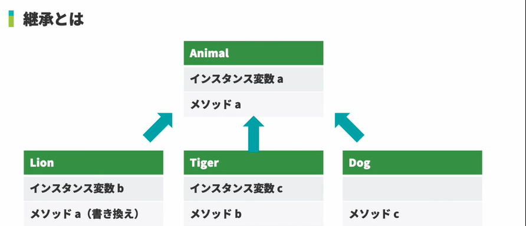
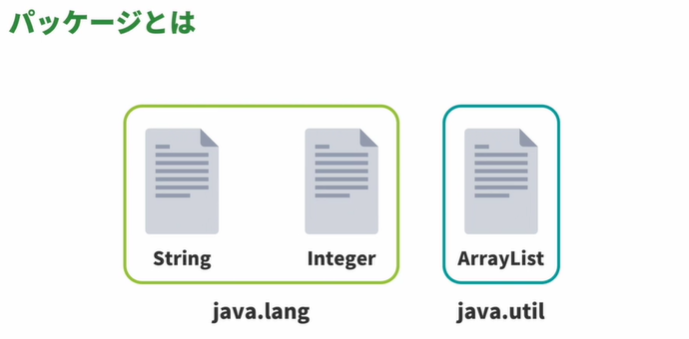

<!-- omit in toc -->
# 新・Java入門編 Lesson24 ～ Lesson25

<!-- omit in toc -->
# [目次]

- [新・Java入門編24: オブジェクト指向について学習しよう（継承・ポリモーフィズム](#新java入門編24-オブジェクト指向について学習しよう継承ポリモーフィズム)
  - [01: 継承とは](#01-継承とは)
    - [継承とは](#継承とは)
    - [is a関係](#is-a関係)
  - [02: extends](#02-extends)
  - [03: インスタンス変数の継承](#03-インスタンス変数の継承)
  - [04: インスタンスメソッドの継承](#04-インスタンスメソッドの継承)
  - [05: アクセスレベルがprivateなインスタンス変数](#05-アクセスレベルがprivateなインスタンス変数)
  - [06: オーバーライド](#06-オーバーライド)
    - [オーバーライドとは](#オーバーライドとは)
    - [オーバーライドのルール](#オーバーライドのルール)
  - [07: ポリモーフィズム](#07-ポリモーフィズム)
  - [08: ポリモーフィズムの活用方法](#08-ポリモーフィズムの活用方法)
  - [09: 変数の型](#09-変数の型)
  - [10: インスタンスのキャスト](#10-インスタンスのキャスト)
  - [11: instanceof演算子](#11-instanceof演算子)
    - [instanceofのパターンマッチング](#instanceofのパターンマッチング)
  - [12: Objectクラス](#12-objectクラス)
  - [13: this](#13-this)
  - [14: super](#14-super)
  - [15: 継承時のコンストラクタ](#15-継承時のコンストラクタ)
    - [継承時のコンストラクタ](#継承時のコンストラクタ)
- [新・Java入門編25: パッケージについて学習しよう](#新java入門編25-パッケージについて学習しよう)
  - [01: パッケージとは](#01-パッケージとは)
  - [02: パッケージを表すディレクトリ](#02-パッケージを表すディレクトリ)
  - [03: クラスが属するパッケージを指定する（package）](#03-クラスが属するパッケージを指定するpackage)
  - [04: コンパイル（javac）と実行（java）](#04-コンパイルjavacと実行java)
  - [05: import](#05-import)
  - [06: 別パッケージの自作クラスをimport](#06-別パッケージの自作クラスをimport)


<br>

---

<br>


# 新・Java入門編24: オブジェクト指向について学習しよう（継承・ポリモーフィズム


## 01: 継承とは

### 継承とは

- クラスの属性や機能を引き継いで、より特殊なクラスを作成すること
- 引き継がれるクラス →　スーパークラス、親クラス
- 引き継ぐクラス →　サブクラス、子クラス





- 共通の機能や属性をスーパークラスに定義
- 個別の機能や属性をサブクラスに定義
- コードの重複を防ぎ、差分のみに着目できる


### is a関係

- あるふたつのクラスが継承関係にあるかを調べる
  - isa が成り立つかを考える

- Lion is an Animal  => 成り立つ
- Dog is an Animal   => 成り立つ
- Cat is a Dog  => 成り立たない

> [!WARNING]
> 複数のクラスを同時に継承する多重継承はできない


## 02: extends

```java
public class Main {
    public static void main(String... args) {
        Lion l = new Lion();
    }
}

class Animal {}

class Lion extends Animal {
    
}

```


## 03: インスタンス変数の継承


 
```java
public class Main {
    public static void main(String... args) {
        Lion l = new Lion();
        l.japaneseName = "ライオン";
        l.habitat = "アフリカ";
        
        System.out.println(l.japaneseName);
        System.out.println(l.habitat);
        
        l.mane = "long";
        System.out.println(l.mane);
    }
}

class Animal {
    public String japaneseName;
    public String habitat;
}

class Lion extends Animal {
    public String mane;
}

```


## 04: インスタンスメソッドの継承


```java

public class Main {
    public static void main(String... args) {
        Lion l = new Lion();
        l.japaneseName = "ライオン";
        l.eat("肉");
        l.printJapaneseName();
    }
}

class Animal {
    public String japaneseName;
    
    public void eat(String food) {
        System.out.println(food+"を食べました");
    }
}

class Lion extends Animal {
    public void printJapaneseName(){
        System.out.print(japaneseName);
    }
}

```

## 05: アクセスレベルがprivateなインスタンス変数


```java
public class Main {
    public static void main(String... args) {
        Lion l = new Lion();
        l.japaneseName = "ライオン";
        l.printJapaneseName();
    }
}

class Animal {
    public String japaneseName;
    
    public void setJapaneseName(String s){
        japaneseName = s;
    }
    
    public String getJapaneseName(){
        return japaneseName;
    }
}

class Lion extends Animal {
    
    //サブクラスとは言えどもprivate変数を直接操作できない
    
    public void printJapaneseName() {
        System.out.println(getJapaneseName());
    }
}
```


## 06: オーバーライド

### オーバーライドとは

- スーパークラスのインスタンス変数およびメソッドをサブクラスで上書きし、処理内容を書き換えること
- サブクラスにはスーパークラスの持つインスタンス変数やメソッドが存在することが約束されつつ、個別にその内容を変更できる


```java
public class Main {
    public static void main(String... args) {
        Lion l = new Lion();
        l.habitat = "アフリカ";
        System.out.println(l.habitat);
        l.eat("肉");
        System.out.println(l.getHabitat());    //output : null
    }
}
class Animal {
    public String habitat;
    public void eat(String food) {
        System.out.println(food + "を食べました");
    }
    public String getHabitat(){
        return habitat;
    }
    
}
class Lion extends Animal {
    public String habitat;
    
    public void eat(String food){
        System.out.println("勢いよく" + food + "をたべました");
    }
}


```

### オーバーライドのルール

1. アクセスレベルを下げない
   - オーバーライドする際に、アクセスレベルを下げた場合
     - 今まで利用可能だったインスタンス変数およびメソッドが利用できなくなってしまう
     - インスタンス変数はオーバーライドする際にアクセスレベルを下げるべきではない
     - メソッドはオーバーライドをする際にアクセスレベルを下げることはできない
2. メソッドをオーバーライドする際は、仮引数の型および数を変えず、戻り値は同じ型にする
   - メソッドをオーバーライドする際に仮引数を変更した場合ただのオーバーロードとなる
   - 戻り値の型を変更した場合メソッドの戻り値を受け取っている箇所に矛盾が発生してしまう 


## 07: ポリモーフィズム

- サブクラスのインスタンスをスーパークラスのインスタンスとして扱うことができる
- 実行される処理内容はそのインスタンスの実際のクラスに応じて変更される
- サブクラスはスーパークラスのもつ属性や機能を必ず有している
- サブクラスはスーパークラスの一種である
- 特殊なサブクラスのインスタンスを、スーパークラスのインスタンスとして扱える


```java
public class Main {
    public static void main(String... args) {
        Animal o1 = new Lion();
        Animal o2 = new Tiger();
        
        o1.eat("肉");
        o1.bark();
        
        o2.eat("魚");
        o2.bark();
        
    }
}

class Animal {

    public void eat(String food) {
        System.out.println(food + "を食べました");
    }

    public void bark() {
        System.out.println("!");
    }
}

class Lion extends Animal {
    public void bark(){
        System.out.println("!!!");
    }
}

class Tiger extends Animal {
    public void eat(String food){
        System.out.println("勢いよく" + food + "をたべました");
    }
}


```

## 08: ポリモーフィズムの活用方法

```java
import java.util.ArrayList;
public class Main {
    public static void main(String... args) {
        Lion l = new Lion();
        Tiger t = new Tiger();
        
        callBark(l);
        callBark(t);
        
        Animal a1 =  getAnimal(1);
        Animal a2 =  getAnimal(2);
        a1.eat("肉");
        a2.eat("魚");
        
        ArrayList<Animal> al = new ArrayList<>();
        al.add(a1);
        al.add(a2);
        
        al.forEach(a -> a.bark());
        
    }
    
    public static void callBark(Animal a){
        a.bark();
    }
    
    public static Animal getAnimal (int i){
        return switch(i){
            case 1 -> new Lion();
            case 2 -> new Tiger();
            default -> new Animal();
        };
    }
    
}

class Animal {
    public void eat(String food) {
        System.out.println(food + "を食べました");
    }
    public void bark() {
        System.out.println("!");
    }
}

class Lion extends Animal {
    public void bark() {
        System.out.println("!!!");
    }
}

class Tiger extends Animal {
    public void eat(String food) {
        System.out.println("勢いよく" + food + "を食べました");
    }
}

/************************/


public class Main {
    public static void main(String... args) {
        Yusha Player1 = new Yusha();
        Wizard Player2 = new Wizard();

        callHit(Player1);
        callHit(Player2);
    }

    //　Jobクラスにあるインスタンスメソッドのhitメソッドを、Mainクラスから呼び出すコードを記述する
    private static void callHit(Job j){
        j.hit();
    }
    
}

class Job {
    public void hit() {
        System.out.println("100のダメージ");
    }
}

class Yusha extends Job {
    public void hit() {
        System.out.println("80のダメージ");
    }
}

class Wizard extends Job {
    public void hit() {
        System.out.println("120のダメージ");
    }
}


```

## 09: 変数の型


- インスタンスでどのようなメソッドを利用できるかは実際のインスタンスの型ではなく、変数の型に依存する
- そのため、ポリモーフィズムによりスーパークラスのインスタンスとして扱うと`スーパークラスのフィールドやメソッドのみとなる`
  - コンパイラではスーパークラスのインスタンスとみなされてしまうため


- 下記のソース3行目で、Lion型ではなくAnimal形で型の宣言をしてしまうと、Animal型のフィールドとメソッドだけしか使えないためエラーになる


```java
public class Main {
    public static void main(String... args) {
        Lion l = new Lion();
        l.mane = "long";
        l.sleep();
    }
}

class Animal {
    public void eat(String food) {
        System.out.println(food + "を食べました");
    }
    public void bark() {
        System.out.println("!");
    }
}

class Lion extends Animal {
    public String mane;
    public void sleep() {
        System.out.println("zzz...");
    }
}

```


## 10: インスタンスのキャスト

```java
public class Main {
    public static void main(String... args) {
        Lion l1 = new Lion();
        Animal o = l1;
        // Lion l2 = o;  //エラーになる コンパイラがAnimalなのかLionなのかが判断できない
        Lion l2 = (Lion) o;
        // Tiger t = (Tiger) o;   //エラーになる LLionクラスはTigerクラスのキャストができない
    }
}

class Animal {
}

class Lion extends Animal {
}

class Tiger extends Animal {
}
```

## 11: instanceof演算子

```java
public class Main {
    public static void main(String... args) {
        Lion l1 = new Lion();
        Animal a = l1;
        System.out.println(a instanceof Animal);    // output:true
        System.out.println(a instanceof Lion);      // output:true
        System.out.println(a instanceof Tiger);     // output:false
    }
}

class Animal {
}

class Lion extends Animal {
}

class Tiger extends Animal {
}


```
### instanceofのパターンマッチング

Java16以降で利用可能なinstanceofパターンマッチングを利用するとキャストを利用せずに記述することが可能です。

```java
public class Main {
    public static void main(String... args) {
        Animal a = new Lion();
        if (a instanceof Lion l) {
            l.method();
        }
    }
}

class Animal {
}

class Lion extends Animal {
    void method() {
    }
}

class Tiger extends Animal {
}
```


## 12: Objectクラス

JavaのあらゆるクラスはすべてObjectクラスのサブクラス

```java
import java.util.*;

public class Main {
    public static void main(String... args) {
        Object o1 = new Animal();
        Object o2 = new Lion();
        Object o3 = new ArrayList();
        // ↑このことから上記のクラスはすべてObjectクラスを暗黙に継承している
        System.out.println(o1.toString());   //Objectクラスのメソッド、オブジェクト名の文字列出力
        System.out.println(o1); //printlnメソッドは最終的にtoStringｗ０呼び出している

        Object obj1 = new Object();
        Object obj2 = new Object();
        Object obj3 = obj1;

        System.out.println(obj1.equals(obj2));   // output: false
        System.out.println(obj1.equals(null));   // output: false 
        System.out.println(obj1.equals(obj3));   // output: true
        System.out.println(obj1.getClass());     // output: class java.lang.Object
    }
}

class Animal extends Object{
    // toString()をオーバーライド
    public String toString(){
        return "アニマルクラス";
    }
}

class Lion extends Animal {
}
```


## 13: this

###　this
- インスタンスメソッドで使用された場合は、呼び出されたインスタンスへの参照
- コンストラクタで使用された場合は、構築中のインスタンスへの参照

> [!WARNING]
> staticには使用できない

```java

public class Main {
    public static void main(String... args) {
        Animal a = new Animal("動物");
        a.printJapaneseName();
    }
}
class Animal {

    private String japaneseName;

    public Animal() {
      this("?");        // コンストラクタ呼び出し時に最初に呼ばれる。かならずコンストラクタの1行目でないとエラーになる。
    }

    public Animal(String japaneseName) {
        this.japaneseName = japaneseName;  //仮引数が優先される。また、明示的にthisをつけて別名として定義しないと間違った結果になる   
    }

    public String getJapaneseName() {
        return japaneseName;
    }

    public void printJapaneseName() {
        System.out.println(getJapaneseName());
    }
}
```


## 14: super

- 指定のインスタンスのsuperクラスのインスタンスを表す

> [!WARNING]
> staticには使用できない

```java
public class Main {
    public static void main(String... args) {
        (new Lion()).test();
    }
}

class Animal {
    public String japaneseName = "動物";

    public void animalMethod() {
        System.out.println("animalMethod");
    }

    public void sleep() {
        System.out.println("Animal zzz...");
    }
}

class Lion extends Animal {
    public String japaneseName = "ライオン";

    public void sleep() {
        System.out.println("Lion zzz...");
    }

    void test() {
        super.animalMethod();
        this.animalMethod();  //結果は同じ
        sleep();     //superと明示していないため「「Lionクラスのsleepがよばれる。
        super.sleep();
        
        System.out.println(japaneseName);
        System.out.println(super.japaneseName);

    }
}


```


## 15: 継承時のコンストラクタ


```java


public class Main {
    public static void main(String... args) {
        Lion l1 = new Lion();
        System.out.println("---");
        Lion l2 = new Lion("ライオン");
    }
}

class Animal {
    public Animal() {
        System.out.println("Animal()");
    }

    public Animal(String s) {
        System.out.println("Animal(String)");
    }
}

class Lion extends Animal {
    public Lion() {
        System.out.println("Lion()");
    }

    public Lion(String s) {
        System.out.println("Lion(String)");
    }
}


/*最初の結果*/
Animal()
Lion()
---
Animal()
Lion(String)


```

### 継承時のコンストラクタ

- あるクラスを定義すると、必ずスーパークラスが存在する
- あるクラスを継承するとフィールドも継承し、サブクラスで利用可能
- コンストラクタの役割
- そのインスタンスが利用可能になるための準備を行う
- あるクラスをインスタンス化した場合スーパークラスのコンストラクタも準備のために実行される
- ·継承が多階層になっていた場合連鎖的にコンストラクタが実行される

> [!IMPORTANT]
> 上記のソースの各メソッド（含コンストラクタ）1行目にsuper()メソッドを呼びだすと結果は同じになる。
>
> javaコンパイラが最初に呼び出すのは引数なしのコンストラクタだけになる。
>
> super()メソッドに引数ありの状態で呼び出すと、引数ありのコンストラクタが呼び出される。
>
> 引数有無のコンストラクタは明確に記述しないとsuper呼び出しの時にコンストラクタが見つからないエラーになる
>
> thisと同じく、superメソッドはメソッド（含コンストラクタ）の1行目に呼び出さないとエラーになる。


<br>

---

<br>


# 新・Java入門編25: パッケージについて学習しよう


## 01: パッケージとは

- java.langパッケージに属するクラス
  -   https://docs.oracle.com/javase/jp/8/docs/api/java/lang/package-summary.html





- 完全修飾名
  - Stringクラス：java.lang.String
  - ArrayListクラス：java.util.ArrayList
  - Integerクラス：java.lang.Integer


```java

import java.util.ArrayList;

public class Main {
public static void main(String ... args) {
//java.util.ArrayList l = new java.util.ArrayList();　　//importしなくても呼び出す例
ArrayList 1 = new ArrayList();      // importが必須の呼び方

```
- java.lang パッケージ
  - 完全修飾名を指定せずに使用可能
  - コード →　インポート →　同ーパッケージ →　java.lang パッケージ


## 02: パッケージを表すディレクトリ

-  コンパイル
  -  javac -d 出力ディレクトリ ソースファイル
- 実行
  - java メインメソッドを持つクラスの完全修飾名


- パッケージ名の決め方
  - ほかの開発者が作成するクラス名や導入するライブラリなどで使用するクラス名の重複を避ける必要がある
  - そのため使われがちな単語だけの使用を避けたほうが良い
  - 企業で使う場合は、企業のドメイン名を逆にする定義が一般的
  - paizaであれば、`jp.co.paiza`


```bash

~/java-package$ mkdir source
~/java-package$ mkdir classes
~/java-package$ cd source
~/java-package/source$ mkdir -p jp/co/paiza/practice
~/java-package/source$

```


## 03: クラスが属するパッケージを指定する（package）


- Sampleクラスのソースコード
```java
public class Sample {
    public static void main(String... args) {
        System.out.println("hello java");
    }
}
```

- クラスが属するパッケージの指定方法
    - 構文
```java
package パッケージ名;
// jp.co.paiza.practiceパッケージに属する場合
package jp.co.paiza.practice;
```

-  Sampleクラスのソースコード完成形
```java
package jp.co.paiza.practice;

public class Sample {
    public static void main(String... args) {
        System.out.println("hello java");
    }
}

```

- ソースコードの生成

```bash
/home/ubuntu
    | java-package
        | classes
        | source
            | jp
               | co
                  | paiza
                      | practice
                           | Sample.java   (←今回作成するソース)                      

```


```java

package jp.co.paiza.practice;

public class Sample {
    public static void main(String... args) {
        System.out.println("hello java");
    }
}

```


## 04: コンパイル（javac）と実行（java）


-  javac

```bash
javac -d ../classes jp/co/paiza/practice/Sample.java
```

-  CLASSPATH
   - JVMやコンパイラに対して、クラスやパッケージを見つけるためのパスを表す引数や環境変数などのことです


```bash
~/java-package$ cd source
~/java-package/source$ javac -d ../classes jp/co/paiza/practice/Sample.java
~/java-package/source$
```

> [!TIP]
> javac -d コンパイルしたファイルの書き出し先の指定 <br>
>  `classes/jp/co/paiza/practice/`にSample.classが書き出される。

- java コマンド
  - java [option][クラスの完全修飾名]
  - 今回の場合は、`java jp.co.paiza.practice.Sample`


## 05: import

- import 完全修飾名;

```java
import java.util.ArrayList;      // ArrayList向けのインポート
import java.util.*;               // HashSet用のインポート
import static  java.lang.Math.max;

public class Main {
    public static void main(String... args) {
        ArrayList<String> l = new ArrayList<>();
        HashSet<String> m = new HashSet<>();
        System.out.println(Math.max(1,2));
        System.out.println(max(1,2));
        System.out.println(PI);    //java.lang.Math.*;のインポート
    }
}
```


- static import
- クラス修飾せずに使用する
- `import static 完全修飾名.識別子;`

```java

// ここに import文 を記述する
import java.util.List;
import java.util.ArrayList;

public class Main {
    public static void main(String... args) {
        List<String> list = new ArrayList<String>(){
            {
                add("勇者");
                add("戦士");
            }
        };

        for(int i = 0; i < list.size(); i++) {
            System.out.println(list.get(i));
        }
    }
}

//これはオンデマンド宣言
import java.util.*;

```


## 06: 別パッケージの自作クラスをimport


```bash
/home/ubuntu/java-package
   |  classes
   |  source
       | jp
         | co
           | paiza
              | practice
                 | Sample.java
              | practice2
                 | Sample.java
              | test
                 | Test.java
```


- practiceパッケージのコード
```java
package jp.co.paiza.practice;

public class Sample {
    public void method() {
        System.out.println("1");
    }
}
```

- practice2パッケージのコード
```java
package jp.co.paiza.practice2;

public class Sample {
    public void method() {
        System.out.println("2");
    }
}
```


- テストクラスのコード (1)
```java

package jp.co.paiza.test;

import jp.co.paiza.practice.Sample;

public class Test {
    public static void main(String... args) {
        Sample s1 = new Sample();
        s1.method();
    }
}


```


- テストクラスのコード (1)
```java

package jp.co.paiza.test;

import jp.co.paiza.practice.Sample;

public class Test {
    public static void main(String... args) {
        Sample s1 = new Sample();
        s1.method();
    }
}


```


- テストクラスのコード (2)
```java

package jp.co.paiza.test;

//import jp.co.paiza.practice.Sample;
import jp.co.paiza.practice2.Sample;

public class Test {
    public static void main(String... args) {
        Sample s1 = new Sample();
        s1.method();
    }
}


```


- テストクラスのコード (3)
```java

package jp.co.paiza.test;

import jp.co.paiza.practice.Sample;    //別パッケージかつじクラス名は呼び出せない。Asなどのエイリアスも定義できない
//import jp.co.paiza.practice2.Sample;

public class Test {
    public static void main(String... args) {
        Sample s1 = new Sample();
        s1.method();
        jp.co.paiza.practice2.Sample s2 = new jp.co.paiza.practice2.Sample();
        s2.method();
    }
}
```


- 動作確認

```bash
~/java-package/classes$ cd ../source/
~/java-package/source$ javac -d ../classes/ jp/co/paiza/*/*.java
~/java-package/source$ javac -d ../classes/ jp/co/paiza/test/Test.java
~/java-package/classes$ java jp.co.paiza.test.Test  
1    //テストクラスのコード (1)の結果
~/java-package/classes$ java jp.co.paiza.test.Test  
2    //テストクラスのコード (2)の結果
~/java-package/classes$ java jp.co.paiza.test.Test  
1
2    //テストクラスのコード (3)の結果
```


<br>

---

<br>


【EOF】


[←　README](../README.md)

