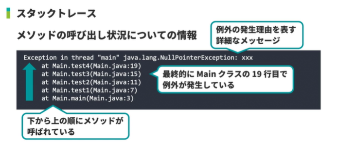
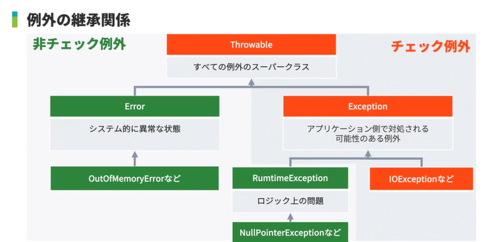

<!-- omit in toc -->
# 新・Java入門編 Lesson26 ～ Lesson27

<!-- omit in toc -->
# [目次]

- [新・Java入門編26: アクセス制御について学習しよう2（protected、パッケージプライベート）](#新java入門編26-アクセス制御について学習しよう2protectedパッケージプライベート)
  - [01: アクセス修飾子](#01-アクセス修飾子)
    - [アクセスレベル](#アクセスレベル)
    - [public](#public)
    - [protected](#protected)
    - [パッケージプライベート](#パッケージプライベート)
    - [private](#private)
  - [02: クラスのアクセス制御](#02-クラスのアクセス制御)
    - [privateクラス](#privateクラス)
  - [03: protectedなコンストラクタ](#03-protectedなコンストラクタ)
  - [04: protectedなメソッド](#04-protectedなメソッド)
  - [05: protectedなフィールド](#05-protectedなフィールド)
  - [06: パッケージプライベートなコンストラクタ](#06-パッケージプライベートなコンストラクタ)
  - [07: パッケージプライベートなメソッド](#07-パッケージプライベートなメソッド)
  - [08: パッケージプライベートなフィールド](#08-パッケージプライベートなフィールド)
- [新・Java入門編27: 例外について学習しよう](#新java入門編27-例外について学習しよう)
  - [01: 例外とは](#01-例外とは)
    - [エラーの種類](#エラーの種類)
      - [2. 実行時エラー/ランタイムエラーの実演](#2-実行時エラーランタイムエラーの実演)
    - [例外とは](#例外とは)
    - [Throwableクラス](#throwableクラス)
    - [Errorクラス](#errorクラス)
    - [Exceptionクラス](#exceptionクラス)
    - [RuntimeExceptionクラス](#runtimeexceptionクラス)
  - [02: 例外処理とは](#02-例外処理とは)
  - [03: throws](#03-throws)
  - [04: tryとcatch](#04-tryとcatch)
    - [例外処理を記述した場合のプログラムの挙動](#例外処理を記述した場合のプログラムの挙動)
  - [05: finally](#05-finally)
    - [try-with-resources](#try-with-resources)
    - [catchを抜いた場合 (スタックトレースが発生)](#catchを抜いた場合-スタックトレースが発生)
  - [06: thorw](#06-thorw)
  - [07: 複数の例外](#07-複数の例外)
  - [08: 例外クラスとポリモーフィズム](#08-例外クラスとポリモーフィズム)
  - [09: 独自の例外クラス](#09-独自の例外クラス)


<br>

---

<br>


# 新・Java入門編26: アクセス制御について学習しよう2（protected、パッケージプライベート）


## 01: アクセス修飾子

### アクセスレベル

- クラス、コンストラクタ、メソッド、フィールドなどがどのクラスから利用できるかを表すもの
- 4つの段階があり、3つのアクセス修飾子で区別する
- 下表では下に行くほど厳しくなる

| アクセスレベル | 意味 | アクセス修飾子 |
| -------------- | ---------- | ------------ |
| public| どこからでもアクセス可能 | public |
| protected| 同ーパッケージもしくは<br>サブクラスからのみアクセス可能 | protected |
| パッケージプライベート| 同ーパッケージ内からのみアクセス可能 | なし |
| private | 自クラスおよび同ークラスから生成した<br>別インスタンスからのみアクセス可能 | private |


### public

- 全てのクラスからアクセス可能
- 他のあらゆるクラスから利用されることを想定
- `自由に使ってもらって構わない場合`にパブリックを指定


### protected

- 同じパッケージに属するクラス
- そのクラスを継承したクラスからのみアクセス可能


### パッケージプライベート

- アクセス修飾子が何も付与されていない
- 同じパッケージに属しているクラスからのみアクセス可能
- `アクセス修飾子が付与されていない場合`、パッケージプライベートと呼ぶ


### private

- 自クラスでのみ使用されることを想定する場合に使用


## 02: クラスのアクセス制御


```bash

/home/ubuntu/java-access
    | classes
    | source
      | jp
        | co
          | paiza
              | access
                 | pp
                    | PackagePrivateClass.java       // (1)
                    | PackagePrivateTestClass.java   // (2)
                 | pro
                    | ProtectedClass.java            // (3)
                    | ProtectedTestClass.java        // (4)
                 | pub
                    | PublicClass.java               // (5)
                 | test
                    | Test.java                      // (6)

```

-  (1) PackagePrivateClass

```java
package jp.co.paiza.access.pp;

class PackagePrivateClass {

    String field = "PackagePrivateField";

    PackagePrivateClass() {
        System.out.println("PackagePrivateConstructor");
    }

    void test() {
        System.out.println("PackagePrivateMethod");
    }
}

```

- (2) PackagePrivateTestClass

```java
package jp.co.paiza.access.pp;

public class PackagePrivateTestClass {
    public static void main(String... args) {
        //同一パッケージを呼び出すため、importは必要がない
        PackagePrivateClass pp1 = new PackagePrivateClass();
    }
```


- (3) ProtectedClass

- protectedクラス
  - 内部クラスとして定義可能
  - トップレベルのクラスとしては定義できない
  - `同ーパッケージ`もしくは`サブクラスからのみ`アクセスが可能
  - サブクラスとなるためにはそのクラスが利用可能でなければならない
  - `同一パッケージに属する必要がある` (パッケージプライベートと同じ)


```java
package jp.co.paiza.access.pro;

public class ProtectedClass {

    protected String field = "ProtectedField";

    protected ProtectedClass() {
        System.out.println("ProtectedConstructor");
    }

    protected void test() {
        System.out.println("ProtectedMethod");
    }
}

```

- (4) ProtectedTestClass


```java

package jp.co.paiza.access.pro;

public class ProtectedTestClass {
    public static void main(String... args) {
    }
}

```


- (5) PublicClass

- publicクラス
  - どのクラスからでも利用が可能


```java
package jp.co.paiza.access.pub;

public class PublicClass {
    public PublicClass() {
        System.out.println("PublicConstructor");
    }
}


```

- (6) Test

```java

package jp.co.paiza.access.test;

import jp.co.paiza.access.pub.PublicClass;

public class Test {
    public static void main(String... args) {
        PublicClass o1 = new PublicClass();
    }
}

```


### privateクラス

- 内部クラスとして定義可能
- トップレベルのクラスとしては定義できない
  - プライベートクラスの場合、自クラスからのみアクセス可能
  - 内部クラスからアクセス可能
  - トップレベルのクラスとしては定義できない
- `誰も使用できない`ため許可されていない


## 03: protectedなコンストラクタ

- `同じパッケージに属するクラス`もしくは`そのクラスを継承したクラスからのみ`インスタンス化できる
- 継承したクラスは別のパッケージであっても問題ない
- 別パッケージの場合は、`サブクラスからであってもスーパークラスの参照を利用してアクセスすることはできない`

- protectedクラス

```java
package jp.co.paiza.access.pro;

public class ProtectedClass {

    protected String field = "ProtectedField";

    protected ProtectedClass() {
        System.out.println("ProtectedConstructor");
    }

    protected void test() {
        System.out.println("ProtectedMethod");
    }
}


```


- protectedクラスの同一パッケージのクラス

```java
package jp.co.paiza.access.pro;

//同一パッケージにあるためimportは不要

public class ProtectedTestClass {
    public static void main(String... args) {
        ProtectedClass o1 = new ProtectedClass();
    }
}
```


- テスト用のクラス

```java
package jp.co.paiza.access.test;

import jp.co.paiza.access.pro.ProtectedClass;

public class Test {
    public static void main(String... args) {
        // エラー：パッケージが異なるためインスタンス化できない
        ProtectedClass o1 = new ProtectedClass();
    }
}

```


- テスト用のクラス（ProtectedClassからの継承）

```java
package jp.co.paiza.access.test;

import jp.co.paiza.access.pro.ProtectedClass;

public class Test extends ProtectedClass {
    public static void main(String... args) {
        // エラー：継承しているにもかかわらず、コンストラクタがprotectedのためインスタンス化できない
        // ProtectedClass o1 = new ProtectedClass();
        // 継承したので、自分をインスタンス化すると実行可能になる。
        Test t = new Test();
    }
}

```


## 04: protectedなメソッド

- `同じパッケージに属するクラス`もしくは`そのクラスを継承したクラスからのみ`メソッドを利用することができる
- 継承するクラスは別のパッケージであっても問題ない
- 別パッケージの場合は、`サブクラスからであってもスーパークラスのインスタンスへの参照を利用してアクセスすることはできない`


- protectedクラス

```java
package jp.co.paiza.access.pro;

public class ProtectedClass {

    protected String field = "ProtectedField";

    public ProtectedClass() {    //暫定的にprotected -> publicにする
        System.out.println("ProtectedConstructor");
    }

    protected void test() {
        System.out.println("ProtectedMethod");
    }
}

```

- protectedクラスのテスト用クラス（同一パッケージ）

```java

package jp.co.paiza.access.pro;

public class ProtectedTestClass {
    public static void main(String... args) {
        ProtectedClass o1 = new  ProtectedClass();
        o1.test();    //ok　同一パッケージのため正しい使い方となる
    }
}

```

- Test用のクラス

```java
package jp.co.paiza.access.test;

import jp.co.paiza.access.pro.ProtectedClass;

public class Test {
    public static void main(String... args) {
        ProtectedClass o1 = new  ProtectedClass();
        o1.test();  // エラー：別パッケージでprotectedされたメソッドのため
    }
}
```


- テスト用のクラス（ProtectedClassからの継承）

```java
package jp.co.paiza.access.test;

import jp.co.paiza.access.pro.ProtectedClass;

public class Test extends ProtectedClass {
    public static void main(String... args) {
        //ProtectedClass o1 = new ProtectedClass();
        //o1.test();
        Test t = new Test();
        t.callMethod();
    }
    
    public void callMethod(){
        test();
    }
}

```


## 05: protectedなフィールド


- `同じパッケージに属するクラス`もしくは`そのクラスを継承したクラスからのみ`フィールドを操作できる
- 継承したクラスは別のパッケージであっても問題ない
- 別パッケージの場合は、`サブクラスからであってもスーパークラスのインスタンス参照を利用してアクセスすることはできない`


- protectedクラス

```java
package jp.co.paiza.access.pro;

public class ProtectedClass {

    protected String field = "ProtectedField";

    public ProtectedClass() {    //暫定的にprotected -> publicにする
        System.out.println("ProtectedConstructor");
    }

    protected void test() {
        System.out.println("ProtectedMethod");
    }
}

```

- protectedクラスのテスト用クラス（同一パッケージ）

```java

package jp.co.paiza.access.pro;

public class ProtectedTestClass {
    public static void main(String... args) {
        ProtectedClass o1 = new ProtectedClass();
        System.out.println(o1.field);     //エラー：別パッケージかつprotectedの変数を使おうとしたから
    }
}

```

- Test用のクラス

```java
package jp.co.paiza.access.test;

import jp.co.paiza.access.pro.ProtectedClass;

public class Test {
    public static void main(String... args) {
        ProtectedClass o1 = new ProtectedClass();
        System.out.println(o1.field);     //エラー：別パッケージかつprotectedの変数を使おうとしたから
    }
}
```


- テスト用のクラス（ProtectedClassからの継承）

```java
package jp.co.paiza.access.test;

import jp.co.paiza.access.pro.ProtectedClass;

public class Test extends ProtectedClass{
    public static void main(String... args) {
        //ProtectedClass o1 = new ProtectedClass();
        //System.out.println(o1.field);    //エラー：継承したにもかかわらず、protectedの変数にはアクセスできない
        Test t = new Test();
        t.printField();
    }

    public void printField() {
        System.out.println(field);
    }
}

```


## 06: パッケージプライベートなコンストラクタ

- `同じパッケージに属するクラス`からのみインスタンス化することができる
- 呼び出されるコンストラクタがパッケージプライベートの場合は、`継承を行ってもインスタンス化することができない`


- パッケージプライベートクラス

```java
package jp.co.paiza.access.pp;

public class PackagePrivateClass {     //このままだと使えないのでpublic を付記

    String field = "PackagePrivateField";

    PackagePrivateClass() {
        System.out.println("PackagePrivateConstructor");
    }

    void test() {
        System.out.println("PackagePrivateMethod");
    }
}

```

- テスト用のクラス

```java
package jp.co.paiza.access.test;

import jp.co.paiza.access.pp.PackagePrivateClass;

public class Test{
    public static void main(String... args) {
        PackagePrivateClass o1 = new PackagePrivateClass();  //エラー：パッケージプライベートだから
    }
}

```

- パッケージプライベートクラスのテスト用クラス（同一パッケージ）

```java
package jp.co.paiza.access.pp;

public class PackagePrivateTestClass {
    public static void main(String... args) {
        PackagePrivateClass o1 = new PackagePrivateClass();    // OK: 同一パッケージ
    }
}

```

- テスト用のクラス（PackagePrivateClassからの継承）

```java
package jp.co.paiza.access.test;

import jp.co.paiza.access.pp.PackagePrivateClass;

public class Test extends PackagePrivateClass{
    public static void main(String... args) {
        PackagePrivateClass o1 = new PackagePrivateClass();  //エラー：パッケージプライベートは継承しても使用できない
    }
}

```


## 07: パッケージプライベートなメソッド

- `同じパッケージに属するクラスからのみ`メソッドを利用できる


- パッケージプライベートクラス

```java
package jp.co.paiza.access.pp;

public class PackagePrivateClass {    // インスタンス化できるようにprivateを付記する

    String field = "PackagePrivateField";

    public PackagePrivateClass() {    // インスタンス化できるようにprivateを付記する
        System.out.println("PackagePrivateConstructor");
    }

    void test() {
        System.out.println("PackagePrivateMethod");
    }
}
```


- テスト用のクラス

```java
package jp.co.paiza.access.test;

import jp.co.paiza.access.pp.PackagePrivateClass;

public class Test {
    public static void main(String... args) {
        PackagePrivateClass o1 = new PackagePrivateClass();
        o1.test();      //エラー： パッケージプライベートのメソッドにアクセスしようとしたため
    }
}

```

- パッケージプライベート用のテストクラス

```java
package jp.co.paiza.access.pp;

public class PackagePrivateTestClass {
    public static void main(String... args) {
        PackagePrivateClass o1 = new PackagePrivateClass();   //OK: 同一パッケージ

    }
}
```

- テスト用のクラス（パッケージプライベートクラスからの継承）

```java
package jp.co.paiza.access.test;

import jp.co.paiza.access.pp.PackagePrivateClass;

public class Test extends PackagePrivateClass{
    public static void main(String... args) {
        //PackagePrivateClass o1 = new PackagePrivateClass();
        //o1.test();   // エラー：継承してもパッケージプライベートのメソッドのため

        Test t = new Test();
        t.callMethod();   // エラー：protectedと違い、継承してもパッケージプライベートのメソッドは使えない
    }

    public void callMethod(){
        test();
    }
}

```


## 08: パッケージプライベートなフィールド

- `同じパッケージに属するクラスからのみ`フィールドを操作できる


- パッケージプライベートクラス

```java
package jp.co.paiza.access.pp;

public class PackagePrivateClass {    // インスタンス化できるようにprivateを付記する

    String field = "PackagePrivateField";

    public PackagePrivateClass() {    // インスタンス化できるようにprivateを付記する
        System.out.println("PackagePrivateConstructor");
    }

    void test() {
        System.out.println("PackagePrivateMethod");
    }
}
```


- テスト用のクラス

```java
package jp.co.paiza.access.test;

import jp.co.paiza.access.pp.PackagePrivateClass;

public class Test {
    public static void main(String... args) {
        PackagePrivateClass o1 = new PackagePrivateClass();
        System.out.println(o1.field);//エラー： パッケージプライベートの変数にアクセスしようとしたため
    }
}

```

- パッケージプライベート用のテストクラス

```java
package jp.co.paiza.access.pp;

public class PackagePrivateTestClass {
    public static void main(String... args) {
        PackagePrivateClass o1 = new PackagePrivateClass();
        System.out.println(o1.field);    //OK:同一パッケージ
    }
}
```

- テスト用のクラス（パッケージプライベートクラスからの継承）

```java
package jp.co.paiza.access.test;

import jp.co.paiza.access.pp.PackagePrivateClass;

public class Test extends PackagePrivateClass{
    public static void main(String... args) {
        PackagePrivateClass o1 = new PackagePrivateClass();
        System.out.println(o1.field);//エラー： 継承してもパッケージプライベートの変数にアクセスしようとしたため

        Test t = new Test();
        t.printField();   // エラー：protectedと違い、継承してもパッケージプライベートのメソッドは使えない
    }

    public void printField(){
        System.out.println(field);// エラー：protectedと違い、継承してもパッケージプライベートの変数は使えない
    }
}
```


<br>

---

<br>


# 新・Java入門編27: 例外について学習しよう


## 01: 例外とは


### エラーの種類

1. コンパイルエラー
   - 構文の間違いなどによりコンパイラによる変換処理を続けられなくなった
2. 実行時エラー/ランタイムエラー
   - プログラム実行時に問題があり、処理を中断せざるをえない際に発生させる


#### 2. 実行時エラー/ランタイムエラーの実演


```java
public class Main {
    public static void main(String... args) {
        System.out.println(1/0);
    }
}

/** 
    エラーの内容

    Exception in thread "main" java.lang.ArithmeticException: / by zero at Main.main(Main.java:3)
    (Exit status: 1)
*/

```

### 例外とは

- エラーの中でもプログラム実行時に発生する問題
- インスタンスとして扱われる
  - クラス名には末尾に「Exception」がつくのが一般的
- 例外処理
  - 例外が発生する可能性がある時に予め記述する処理







### Throwableクラス

- 全ての例外のスーパークラス
- Throwableクラス、そのサブクラスのインスタンスだけが「例外」として投げられる
- サブクラス : Errorクラス、Exceptionクラス


### Errorクラス

- Throwableクラスのサブクラス
- システム的に異常な状態を表す
  - プログラム側で対処するのは困難
  - 必ずしも例外処理を記述する必要はない(非検査例外、非チェック例外)
- 例:OutOfMemoryError:必要なメモリ割り当てができなかった


### Exceptionクラス

- Throwableクラスのサブクラス
- アプリケーション側で対処される可能性がある
  - 例外処理を記述しなければコンパイルできない (検査例外、チェック例外)


### RuntimeExceptionクラス

- Exceptionクラスのサブクラス
- ロジック上の問題がある
  - 事前にチェックを行い、例外が発生しないようにする
  - 必ずしも例外処理を記述する必要はない (非検査例外、非チェック例外)
- 例:
  - NullPointerException:nullを参照する変数に対してメソッドを呼び出した
  - ArithmeticException:ゼロ除算をした
  - IndexOutOfBoundsException:ArrayListの範囲外のインデックスを指定した


## 02: 例外処理とは

- チェック例外が発生する可能性があるメソッドを利用する場合にコンパイラにその旨を示す必要がある

1. 例外が発生した際のリカバリ処理を記述(例外処理)
   - 例外処理がない場合はコンパイルエラー
   - try,catch,finally
2. 呼び出し元へ例外処理を任せる
   - チェック例外の発生する可能性のあるメソッドとして自身を定義
   - throws
3. 例外発生時に処理を実施しなかった場合、アプリケーションが終了


## 03: throws

- Java 公式ドキュメント valueOf(String s)より
  - https://docs.oracle.com/javase/jp/8/docs/api/java/lang/Integer.html#valueOf-java.lang.String-
  - `throws NumberFormatException` - 文字列が解析可能な整数型を含まない場合。
- クラス "NumberFormatException" とは
  - https://docs.oracle.com/javase/jp/8/docs/api/java/lang/NumberFormatException.html
  - アプリケーションが文字列を数値型に変換しようとしたとき、文字列の形式が正しくない場合にスローされます。


```java
public class Main throws Exception{
    public static void main(String... args) {
        test();
    }

    static void test() throws Exception {
        System.out.println("test");
    }
}

/**
エラー内容：
「例外発生を宣言するからには、例外のcatch, throwするかの定義が必要になる」
Main.java:3: error: unreported exception Exception; must be caught or declared to be thrown
        test();
            ^
1 error

---------
しかし上記の状態でさらに、Mainメソッドにthrows Exceptionを宣言するとエラーにならない。
test()で例外が発生した場合は、呼び出し元であるMainの例外処理に任される。
上記の状態では、Mainメソッドには例外処理が記述されておらず、さらに呼び出し元
Mainメソッドへの例外処理に任されることになる。
例外処理が見つかるまで、上の層に登って例外処理を探し続けることになる。
*/


```


## 04: tryとcatch


```java
try {
    //例外が発生する可能性のあるメソッド呼び出し
}catch(処理対象の例外クラス変数名){
    //例外が発生した際の処理
}

```


- IOExceptionが発生する例

```java

import java.io.*;
import java.nio.file.*;
import java.nio.charset.*;

public class Main {
    public static void main(String... args) {
        test();
    }

    static void test() {
        Files.lines(Paths.get("/", "a"), Charset.forName("UTF-8"));
    }
}

/**
エラー内容：
Main.java:11: error: unreported exception IOException; must be caught or declared to be thrown
        Files.lines(Paths.get("/", "a"), Charset.forName("UTF-8"));
                   ^
1 error
*/
```


- IOExceptionが発生することを想定してtest()に throws IOException を付記した場合。

```java

import java.io.*;
import java.nio.file.*;
import java.nio.charset.*;

public class Main {
    public static void main(String... args) {
        test();
    }

    static void test() throws IOException {
        Files.lines(Paths.get("/", "a"), Charset.forName("UTF-8"));
    }
}


/**
エラー内容：
Main.java:7: error: unreported exception IOException; must be caught or declared to be thrown
        test();
            ^
1 error
*/

```

- try catch を実装した例外処理

```java

import java.io.*;
import java.nio.file.*;
import java.nio.charset.*;

public class Main {
    public static void main(String... args) {
        try {
            test();            
        } catch (IOException e) {
            System.out.println("入出力例外が発生しました");
        }
    }

    static void test() throws IOException {
        Files.lines(Paths.get("/", "a"), Charset.forName("UTF-8"));
    }
}


/*
OK : メッセージ内容
入出力例外が発生しました
*/

```

### 例外処理を記述した場合のプログラムの挙動

1. 例外が発生せず正常にプログラムが終了した場合
2. 例外が発生してcatchブロックの処理が発生する場合


- 例外発生の有無による、処理の流れをトレース

```java

import java.io.*;
import java.nio.file.*;
import java.nio.charset.*;

public class Main {
    public static void main(String... args) {
        System.out.println("1");
        try {
            System.out.println("2");
            test();            
            System.out.println("3");
        } catch (IOException e) {
            System.out.println("入出力例外が発生しました");
        }
        System.out.println("4");
    }

    static void test() throws IOException {
        Files.lines(Paths.get("/", "a"), Charset.forName("UTF-8"));
    }
}

/*
    正常終了の場合は：1,2,3,4が出力
    例外発生の場合は：1,2,入出力例外が発生しました,4が出力
*/

```

## 05: finally

> [!IMPORTANT]
> 例外の有無に限らず実行される。<br>
> catchブロックに続いて記述する


- 例:ファイル操作後は対象ファイルを閉じる処理が必要

```java
try {
    //例外が発生する可能性のあるメソッド呼び出し
}catch(処理対象の例外クラス変数名){
    //例外が発生した際の処理
} finally {
    //必ず実行したい処理
}
```

```java

import java.io.*;
import java.nio.file.*;
import java.nio.charset.*;

public class Main {
    public static void main(String... args) {
        System.out.println("1");
        try {
            System.out.println("2");
            test();
            System.out.println("3");
        } catch (IOException e) {
            System.out.println("入出力例外が発生しました");
        } finally {
            System.out.println("finally");
        }
        System.out.println("4");
    }

    static void test() throws IOException {
        Files.lines(Paths.get("/", "a"), Charset.forName("UTF-8"));
    }
}

/*
OK : 例外発生の場合は：1,2,入出力例外が発生しました,finally,4が出力
*/

```

### try-with-resources
- Java7以降で利用できるtry-with-resourcesを使うと、Closeable及びAutoCloseable<br>
インターフェースを実装しているリソースのクローズ処理をfinallyブロックを用いずに<br>
確実に行うことができます。


```java
// try-with-resources
try (Statement stmt = connection.createStatement()) {
    // 処理
} catch (SQLException e) {
    // 例外時の処理
}
```

### catchを抜いた場合 (スタックトレースが発生)

```java

import java.io.*;
import java.nio.file.*;
import java.nio.charset.*;

public class Main {
    public static void main(String... args) throws IOException  {
        System.out.println("1");
        try {
            System.out.println("2");
            test();
            System.out.println("3");
        //} catch (IOException e) {
        //    System.out.println("入出力例外が発生しました");
        } finally {
            System.out.println("finally");
        }
        System.out.println("4");
    }

    static void test() throws IOException {
        Files.lines(Paths.get("/", "a"), Charset.forName("UTF-8"));
    }
}

/*

Exception in thread "main" java.nio.file.NoSuchFileException: /a
	at java.base/sun.nio.fs.UnixException.translateToIOException(UnixException.java:92)
	at java.base/sun.nio.fs.UnixException.rethrowAsIOException(UnixException.java:106)
	at java.base/sun.nio.fs.UnixException.rethrowAsIOException(UnixException.java:111)
	at java.base/sun.nio.fs.UnixFileSystemProvider.newFileChannel(UnixFileSystemProvider.java:181)
	at java.base/java.nio.channels.FileChannel.open(FileChannel.java:298)
	at java.base/java.nio.channels.FileChannel.open(FileChannel.java:357)
	at java.base/java.nio.file.Files.lines(Files.java:4133)
	at Main.test(Main.java:21)
	at Main.main(Main.java:10)
(Exit status: 1)

そして裏では「1,2,finally」が出力されている。
このことから、finallyは例外の有無を問わず必ず処理される
*/


```

## 06: thorw

- 意図的に例外を発生させることができる
- 例外インスタンスを生成し、throwキーワードに与える
- チェック例外を発生させる場合はメソッドの定義に`throws`キーワードを使用し明記
- 非チェック例外の場合も明記すると良い

```java

public class Main {
    public static void main(String... args) {
        String s = null;
        try {
            test(s);
        } catch (Exception e) {
            e.printStackTrace();
            System.out.println("実行時エラーが発生しました");
        }
    }

    static void test(String s) throws Exception {
        if (s == null) {
            throw new Exception("引数がNULLです。");
        }
        System.out.println(s);
    }
}

/*
実行時エラーが発生しました

java.lang.Exception: 引数がNULLです。
	at Main.test(Main.java:17)
	at Main.main(Main.java:6)
*/


- System.err.println

```java

public class Main {
    public static void main(String... args) {
        String s = null;
        try {
            test(s);
        } catch (Exception e) {
            e.printStackTrace();
            System.out.println("実行時エラーが発生しました");
        }
    }

    static void test(String s) throws Exception {
         try {
            if (s == null) {
                throw new Exception("引数がNULLです。");
            }
        } catch (Exception e) {
            System.err.println("throwした例外をキャッチ");
            throw e;
        }
        System.out.println(s);
    }
}


/*
実行時エラーが発生しました
throwした例外をキャッチ
java.lang.Exception: 引数がNULLです。
	at Main.test(Main.java:15)
	at Main.main(Main.java:5)
*/

```


## 07: 複数の例外

```java
import java.io.*;
import java.nio.file.*;

public class Main {
    public static void main(String... args) {
        String path = null;
        try {
            test(path);
        } catch (FileNotFoundException e) {
            System.err.println("FileNotFoundExceptionをキャッチ");
            e.printStackTrace();
        } catch (FileSystemException e) {
            System.err.println("FileSystemExceptionをキャッチ");
            e.printStackTrace();
        }
    }

    //　カンマ区切りで複数のExceptionクラスをthrowすることを宣言する
    static void test(String path) throws FileNotFoundException,FileSystemException {
        if(path == null) {
            throw new FileNotFoundException("引数がnullです。");
        }
        if(path.isEmpty()) {
            throw new FileSystemException("引数が空文字です。");
        }
        
        System.out.println(path);
    }
}

/*
String path = null の場合
FileNotFoundExceptionをキャッチ
java.io.FileNotFoundException: 引数がnullです。
	at Main.test(Main.java:20)
	at Main.main(Main.java:8)

String path = "" の場合
FileSystemExceptionをキャッチ
java.nio.file.FileSystemException: 引数が空文字です。
	at Main.test(Main.java:23)
	at Main.main(Main.java:8)
*/
```

## 08: 例外クラスとポリモーフィズム


```java
import java.io.*;
import java.nio.file.*;

public class Main {
    public static void main(String... args) {
        String path = null;

        try {
            test(path);
        } catch (IOexception e) {
            System.err.println("IOexceptionをキャッチ");
            e.printStackTrace();
        }
    }


    // 

    static void test(String path)
        // FileNotFoundException, FileSystemExceptionは、IOExceptionを継承している
        // throws FileNotFoundException, FileSystemException {
        throws IOException {

        if (path == null) {
            throw new FileNotFoundException("pathがnull");
        }

        if (path.isEmpty()) {
            throw new FileSystemException("pathが空文字");
        }

        System.out.println(path);
    }
}

```


```java
import java.io.*;
import java.nio.file.*;

public class Main {
    public static void main(String... args) {
        String path = null;

        try {
            test(path);

        // これはエラーになる。サブクラスよりも先にスーパークラスをキャッチした場合は必ず先に実行されてしまう
        // exception IOException has already been caught
        // 　-----　上から順にキャッチする例外の範囲を広げていかなくてはならない　-----
        } catch (Exception e) {


        // この例でもセーフ。IOExceptionは FileNotFoundException, FileSystemExceptionの親クラスだから
        } catch (IOException e) {
            System.err.println("IOexceptionをキャッチ");
            e.printStackTrace();
        
        // こっちはセーフになる
        } catch (Exception e) {

        }
    }

    static void test(String path)
        throws FileNotFoundException, FileSystemException {
        if (path == null) {
            throw new FileNotFoundException("pathがnull");
        }

        if (path.isEmpty()) {
            throw new FileSystemException("pathが空文字");
        }

        System.out.println(path);
    }
}

```


## 09: 独自の例外クラス

```java
public class Main {
    public static void main(String... args) {
        String s = null;
        try { 
            test(s);
        } catch (NullCheckException e) {
            System.err.println("例外が発生しました");
            e.printStackTrace();
        }
    }

    static void test(String s) throws NullCheckException {
        if (s == null) {
            throw new NullCheckException();
        }
        
        
        System.out.println(s);
    }
}

class NullCheckException extends Exception {
    
}

/*
例外が発生しました
NullCheckException
	at Main.test(Main.java:14)
	at Main.main(Main.java:5)
*/

```


<br>

---

<br>


【EOF】


[←　README](../README.md)

