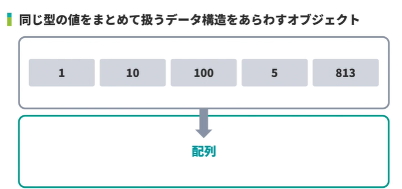
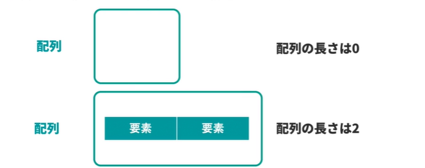
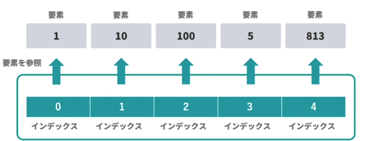
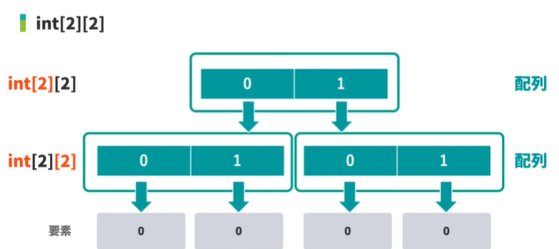
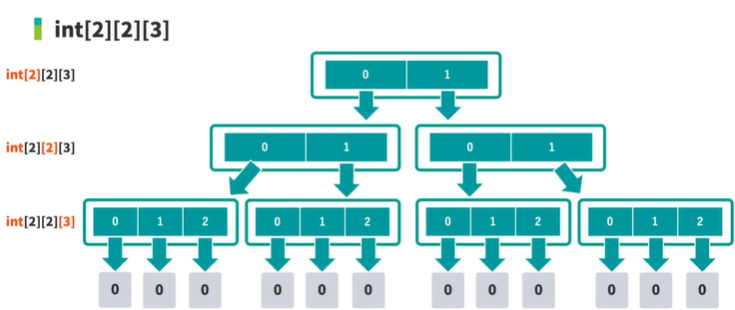
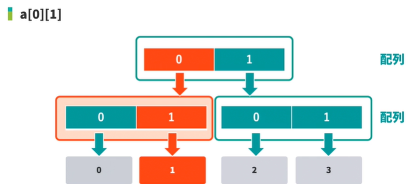
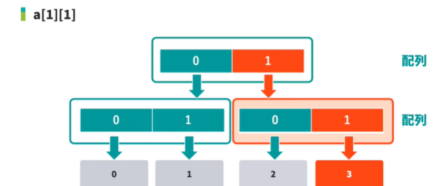

<!-- omit in toc -->
# 新・Java入門編 Lesson28 ～ Lesson29

<!-- omit in toc -->
# [目次]
- [新・Java入門編28: ローカル変数の型推論（var）について学習しよう](#新java入門編28-ローカル変数の型推論varについて学習しよう)
  - [01: varの利用方法](#01-varの利用方法)
    - [型推論](#型推論)
  - [02: varの利用できる場合とできない場合](#02-varの利用できる場合とできない場合)
    - [匿名クラス](#匿名クラス)
    - [ジェネリクス](#ジェネリクス)
- [新・Java入門編29: 配列について学習しよう](#新java入門編29-配列について学習しよう)
  - [01: 配列とは](#01-配列とは)
  - [02: 配列の宣言方法](#02-配列の宣言方法)
  - [03: 配列作成式](#03-配列作成式)
    - [Arraysクラス](#arraysクラス)
    - [型ごとのデフォルト値](#型ごとのデフォルト値)
  - [04: 配列初期化子（{}）](#04-配列初期化子)
  - [05: 配列の要素へのアクセス](#05-配列の要素へのアクセス)
    - [ArrayIndexOutOfBoundsException](#arrayindexoutofboundsexception)
  - [06: 配列の要素の置き換え](#06-配列の要素の置き換え)
  - [07: 配列の長さ(length)](#07-配列の長さlength)
  - [08: 配列を用いた繰り返し処理](#08-配列を用いた繰り返し処理)
    - [付録：【Java】意外に知らないStream.of()とArrays.stream()メソッドの違い](#付録java意外に知らないstreamofとarraysstreamメソッドの違い)
    - [付録2 ：　【第四回】Stream APIの基礎的な使い方](#付録2-第四回stream-apiの基礎的な使い方)
  - [09: 多次元配列](#09-多次元配列)
  - [10: 多次元配列の要素へのアクセス](#10-多次元配列の要素へのアクセス)
  - [11: Arraysクラス](#11-arraysクラス)
    - [付録1 :](#付録1-)
    - [Arraysクラス](#arraysクラス-1)
  - [12: 配列からListへの変換](#12-配列からlistへの変換)
    - [公式ドキュメント](#公式ドキュメント)
  - [13: Listから配列への変換](#13-listから配列への変換)
    - [オートボクシング](#オートボクシング)
    - [コンストラクタもメソッド参照と同じように記述できます。](#コンストラクタもメソッド参照と同じように記述できます)
- [新・Java入門編30: シフト演算子とビット演算子](#新java入門編30-シフト演算子とビット演算子)
  - [01: 左シフト演算子と代入演算子（\<\< / \<\<=）](#01-左シフト演算子と代入演算子--)
    - [情報処理入門 テクノロジー編 - テクノロジー編01: コンピュータのデータ表現](#情報処理入門-テクノロジー編---テクノロジー編01-コンピュータのデータ表現)
  - [02: 符号付き右シフト演算子と代入演算子（\>\> / \>\>=）](#02-符号付き右シフト演算子と代入演算子--)
  - [03: 符号なし右シフト演算子と代入演算子（\>\>\> / \>\>\>=）](#03-符号なし右シフト演算子と代入演算子--)
  - [04: ビット演算子AND（\&）](#04-ビット演算子and)
  - [05:ビット演算子OR（|）](#05ビット演算子or)
  - [06: ビット演算子XOR（^）](#06-ビット演算子xor)
  - [07: ビット演算子NOT（~）](#07-ビット演算子not)
  - [01:](#01)


<br>

---

<br>


# 新・Java入門編28: ローカル変数の型推論（var）について学習しよう


## 01: varの利用方法

### 型推論

- 変数などの型を明示的に宣言しなくても文脈などから自動的に型を決定する機能
- 変数を初期化する記述内容から、コンパイラが自動的に適切な型を選択してくれる
- 型推論を利用することで、定型な記述を減らすことができ可読性が向上する。

```java
import java.util.*;
public class Main {
    public static void main(String... args) {
        // String s = "paiza";
        var s = "paiza";
        System.out.println(s.getClass());     // output : class java.lang.String
    }
}
```


## 02: varの利用できる場合とできない場合


> [!WARNING]
> varを利用した型推論は、ローカル変数が機能する範囲だけ有効になる。
> 

- varが利用できるパターン

```java
import java.util.*;

public class Main {
    public static void main(String... args) {
        var s = "paiza";
        var l = new ArrayList<String>();
        var r = 1 + 2;
        for (var i = 0; i < 3 ; i++) {
            System.out.println(i);
        }
        l.add("a");
        l.add("b");
        l.add("c");
        for (var e: l){
            System.out.println(e);
        }       
    }
}
```


- varが利用できないパターン

```java
import java.util.*;

public class Main {
    public static void main(String... args) {
        var s;       // error: cannot infer type for local variable s  (cannot use 'var' on variable without initializer)
        var s = null;  // error: cannot infer type for local variable  (variable initializer is 'null')
        test("a");

        // var はラムダ式に利用できない        
        var f = (i1, i2) -> i1 + i2;    // error: cannot infer type for local variable f  (lambda expression needs an explicit target-type)
        
        // 再代入する際に型が違うケース
        var s = "paiza";
        s = 813;    // error: incompatible types: int cannot be converted to String
        
        var e = new Error();
        e = new Exception();   //  error: incompatible types: Exception cannot be converted to Error
    }

    //メソッドの仮引数にvarは使えない
    public void test(var s){}    // error: 'var' is not allowed here public void test(var s)
}

```

### 匿名クラス

- 匿名クラスおいてvarが利用可能です。

```java
var o = new Object() {
    int i = 0;
};
System.out.println(o.i);
```

###  ジェネリクス
- ジェネリクスにおいてvarが利用可能です。
  - ただし、推論される要素の型はObjectとなります。

```java
var l = new ArrayList<>();
```


<br>

---

<br>


# 新・Java入門編29: 配列について学習しよう

## 01: 配列とは

- 参照型
- プリミティブ型










## 02: 配列の宣言方法

```java
public class Main {
    public static void main(String... args) {
        int[] a;
        int b[];
        String[] array = {"a","b","c"};
    }
}

```


## 03: 配列作成式

```java
import java.util.*;
public class Main {
    public static void main(String... args) {
        int[] a = new int[5];
        System.out.println(a);   // output: [I@2626b418
        System.out.println(Arrays.toString(a));   // output: [0, 0, 0, 0, 0]
    }
}
```

###  Arraysクラス
https://docs.oracle.com/javase/jp/17/docs/api/java.base/java/util/Arrays.html


### 型ごとのデフォルト値
- byte: 0
- short: 0
- int: 0
- long: 0L
- float: 0.0f
- double: 0.0d
- char: '\u0000'
- boolean: false
- 参照型: null


## 04: 配列初期化子（{}）

```java
import java.util.*;
public class Main {
    public static void main(String... args) {
        int[] a = {1,2,3};
        var a  = {1,2,3};      // error: cannot infer type for local variable a (array initializer needs an explicit target-type)
        var a  = new int[]{1,2,3}   // OK
        System.out.println(Arrays.toString(a));
    }
}
```


## 05: 配列の要素へのアクセス

```java
import java.util.*;
public class Main {
    public static void main(String... args) {
        int[] a = {1, 2, 3};
        System.out.println(a[0]);
        System.out.println(a[1-1]);
        int index = 1-1;
        System.out.println(a[index]);
        System.out.println(a[0L]);    // error: incompatible types: possible lossy conversion from long to int
        System.out.println(a[-1]);    // Exception in thread "main" java.lang.ArrayIndexOutOfBoundsException: Index -1 out of bounds for length 3
        System.out.println(a[3]);       // Exception in thread "main" java.lang.ArrayIndexOutOfBoundsException: Index 3 out of bounds for length 3
    }
}

```

### ArrayIndexOutOfBoundsException
- https://docs.oracle.com/javase/jp/17/docs/api/java.base/java/lang/ArrayIndexOutOfBoundsException.html


## 06: 配列の要素の置き換え

```java
import java.util.*;
public class Main {
    public static void main(String... args) {
        int[] a = new int[3];      // [0, 0, 0]
        System.out.println(Arrays.toString(a));
        a[1] = 813; 
        System.out.println(Arrays.toString(a));   // [0, 813, 0]
        a[1] = "813";
        System.out.println(Arrays.toString(a));   // error: incompatible types: String cannot be converted to int
    }
}

```


## 07: 配列の長さ(length)

```java
import java.util.*;
public class Main {
    public static void main(String... args) {

        int[] a1 = {1, 2, 3};
        int[] a2 = {1, 2, 3, 4};

        printLast(a1);    // 3
        printLast(a2);    // 4
    }

    /**
     * 配列の最後の要素を出力する
     */
    static void printLast(int[] a) {
        System.out.println(a[a.length -1]);
    }
}

```

## 08: 配列を用いた繰り返し処理

```java
import java.util.*;
public class Main {
    public static void main(String... args) {
        int[] a = {1, 2, 3};
        System.out.println(a[0]);
        System.out.println(a[1]);
        System.out.println(a[2]);
        
        for (int i=0; i < a.length; i++){
            System.out.println(a[i]);
        }
        
        for (int i : a) {
            System.out.println(i);
        }
        Arrays.stream(a).forEach(i -> System.out.println(i));
    }
}


```


### 付録：【Java】意外に知らないStream.of()とArrays.stream()メソッドの違い
 
  - https://qiita.com/rebi/items/ca2a0c92db71dfc953f1


| 引数に用いる配列の型 | Arrays.stream() | Stream.of() |
| ------------------ | --------------- | ----------- |
|double型|○|○|
|float型|×|○|
|long型|○|○|
|int型|○|○|
|short型|×|○|
|byte型|×|○|
|char型|×|○|
|boolean型|×|○|
|String型|○|○|
|クラス型|○|○|


### 付録2 ：　【第四回】Stream APIの基礎的な使い方

- https://qiita.com/tech_newbie/items/3ee76c639f6a1a311174

```java
String[] arrays = {"cat","dog","cow"};
Stream<String> arraysStream = Arrays.stream(arrays);
arraysStream.filter(s -> s.startsWith("c")).forEach(System.out::println);
```


## 09: 多次元配列


- この形式の2次元配列を実現するには

;

```java
import java.util.*;
public class Main {
    public static void main(String... args) {
        int[][] a = new int[2][2];
        
        // またはこの形式で初期化
        int[][] a = { {0, 0}, {0, 0} }; 
    }
}

```


- この形式の3次元配列を実現するには

;

```java
import java.util.*;
public class Main {
    public static void main(String... args) {
        int[][][] a = new int[2][2][3];
        
        // またはゼロ埋めによる初期化
        int[][][] a = { 
            {
                {0, 0, 0},
                {0, 0, 0}
            }, 
            {
                {0, 0, 0},
                {0, 0, 0}
            }
        };
        
        //別バージョン
        var a = int[][][]{ 
            {
                {0, 0, 0},
                {0, 0, 0}
            }, 
            {
                {0, 0, 0},
                {0, 0, 0}
            }
        };
    }
}

// 鬼畜の5次元String配列
String[][][][][] array = new String[1][1][1][1][1];
System.out.println(array[0][0][0][0][0]);

```


## 10: 多次元配列の要素へのアクセス


```java
import java.util.*;
public class Main {
    public static void main(String... args) {
        int[][] a =
            {
                {0, 1},
                {2, 3}
            };
            System.out.println(a[0]);    // [I@2626b418
            
            int[] e = a[0];
            System.out.println(e[0]);    // 0
    }
}


```

- なぜこんな出力になるのか？


;


- 具体的なアクセス

```java
import java.util.*;
public class Main {
    public static void main(String... args) {
        int[][] a =
            {
                {0, 1},
                {2, 3}
            };
            System.out.println(a[0][1]);    // 1
            System.out.println(a[1][1]);    // 3
    }
}
```

;


;


- ループによる取り出し

```java

import java.util.*;
public class Main {
    public static void main(String... args) {
        int[][] a =
            {
                {0, 1},
                {2, 3}
            };

        for (int i = 0; i < a.length; i++){
            int[] e = a[i];
            for (int j = 0; j < e.length; j++) {
                System.out.println(e[j]);
            }
        }
        
        for (int i = 0; i < a.length; i++){
            for (int j = 0; j < a[i].length; j++) {
                System.out.println(a[i][j]);
            }
        }
        
        for (int[] i : a) {
            for (int j : i) {
                System.out.println(j);
            }
        }
    }
}

```


## 11: Arraysクラス


```java
import java.util.*;
public class Main {
    public static void main(String... args) {
        String[] a = {"A", "B", "C"};
        List<String> l = Arrays.asList(a);
        System.out.println(l);   //  [A, B, C]
        
        Integer[] i = {1, 2, 3};  // intだとエラーになる error: incompatible types: inference variable T has incompatible bounds
                                  // ↑プリミティブ型からラッパークラスへの変換ができないのが理由
        List<Integer> l2 = Arrays.asList(i);
        System.out.println(l2);   //  [1, 2, 3]
        
        String[] b = {"A", "B", "C"};
        String[] c = {"A", "B", "C"};
        System.out.println(Arrays.equals(b, c));   // true
        System.out.println(Arrays.toString(b));    // [A, B, C]
        
        
        var a2 = new int[][]
        {
           {0, 0, 0},
           {0, 0, 0}               
        };
        System.out.println(Arrays.deepToString(a2));   // [[0, 0, 0], [0, 0, 0]]
        
        String[] a3 = Arrays.copyOf(a,3);    //  第2引数は長さの指定　lengthオーバーの場合はnullが加味される
        System.out.println(Arrays.deepToString(a3));
        
        String[] a4 =new String[3];    // [null, null, null]
        Arrays.fill(a4, "Z");          // ["Z", "Z", "Z"]

        String[] a5 = {"c", "a", "b"};
        Arrays.sort(a5);     // [a, b, c]
    }
}
```


### 付録1 : 
https://yuuri-programming.com/programming/java/error-series10/


### Arraysクラス

https://docs.oracle.com/javase/jp/17/docs/api/java.base/java/util/Arrays.html


## 12: 配列からListへの変換


```java
import java.util.*;
import java.util.stream.*;
public class Main {
    public static void main(String... args) {
        String[] a = {"A", "B", "C"};
        
        // あらかじめArrayList
        ArrayList<String> l = new ArrayList<>();
        for (String s :a) {
            l.add(s);
        }
        
        System.out.println(l);     //  [A, B, C]
        
        // 参照型のみ使えるのでプリミティブ型には使えない
        Collections.addAll(l, a);     //  [A, B, C]

        // 配列　→　List
        List<String> l2 = Arrays.asList(a);     //  [A, B, C]
        //l2.add("D");   // Exception in thread "main" java.lang.UnsupportedOperationException
                       // ↑　Listではaddメソッドは使えない
        l2.set(2,"D");
        System.out.println(Arrays.toString(a));
        
        // 配列 → List (変換元は参照型の配列のみ有効、プリミティブ型はエラー)
        List<String> l3 = List.of(a);   // 要素の変更を加えることができない。戻り値がListで不変
        //l3.add("D");    //  Exception in thread "main" java.lang.UnsupportedOperationException
        //l3.set(2, "D");   // Exception in thread "main" java.lang.UnsupportedOperationException
        
        // streamを用いた　配列　→　Listへの変換 (返されるList は可変)
        List<String> l4 = Arrays.stream(a).collect(Collectors.toList());   // [A, B, C]
        l4.add("D");       // [A, B, C, D]
        // このパターンで返されるList は不変)
        List<String> l5 = Arrays.stream(a).toList();   // [A, B, C]
        //l5.add("D");    // Exception in thread "main" java.lang.UnsupportedOperationException
        // プリミティブ型配列から参照型Listに変換する場合はそれぞれのラッパークラスに変換する必要がある
        // Listなどが参照型しか要素が保持できないため
        
        int[] a2 = {1,2,3};
        List<Integer> l6 = Arrays.stream(a2).boxed().toList();  // [1,2,3]
        
    }
}


```


### 公式ドキュメント

- Collectionsクラス
  - https://docs.oracle.com/javase/jp/17/docs/api/java.base/java/util/Collections.html

- Arraysクラス
  - https://docs.oracle.com/javase/jp/17/docs/api/java.base/java/util/Arrays.html

- Listインターフェース
  - https://docs.oracle.com/javase/jp/17/docs/api/java.base/java/util/List.html

- Streamインターフェース
  - https://docs.oracle.com/javase/jp/17/docs/api/java.base/java/util/stream/Stream.html

- IntStreamインターフェース
  - https://docs.oracle.com/javase/jp/17/docs/api/java.base/java/util/stream/IntStream.html


## 13: Listから配列への変換


```java
import java.util.*;
public class Main {
    public static void main(String... args) {
        List<String> l = List.of("A", "B", "C");
        
        String[] a = new String[l.size()];
        for (int i = 0; i <l.size(); i++) {
            a[i] = l.get(i);
        }

        String[] a = l.toArray(new String[l.size()]);
        
        String[] a = l.stream().toArray(String[]::new);
        
        List<Integer> l = List.of(1,2,3);
        
        int[] a = l.stream().mapToInt(Integer::intValue).toArray();
    }
}

```


### オートボクシング
- プリミティブ型とラッパークラス
  - https://paiza.jp/works/java/new-primer/java-new-primer-21/89002

### コンストラクタもメソッド参照と同じように記述できます。

String[]::new


<br>

---

<br>


# 新・Java入門編30: シフト演算子とビット演算子


## 01: 左シフト演算子と代入演算子（<< / <<=）

```java


```


### 情報処理入門 テクノロジー編 - テクノロジー編01: コンピュータのデータ表現
https://paiza.jp/works/technology/primer/beginner-technology1


## 02: 符号付き右シフト演算子と代入演算子（>> / >>=）

```java


```


## 03: 符号なし右シフト演算子と代入演算子（>>> / >>>=）

```java


```


## 04: ビット演算子AND（&）

```java


```


## 05:ビット演算子OR（|） 

```java


```


## 06: ビット演算子XOR（^）

```java


```


## 07: ビット演算子NOT（~）

```java


```


## 01: 

```java


```


【EOF】


[←　README](../README.md)