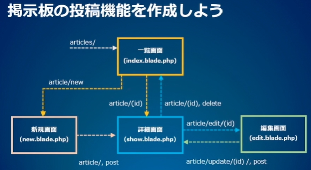
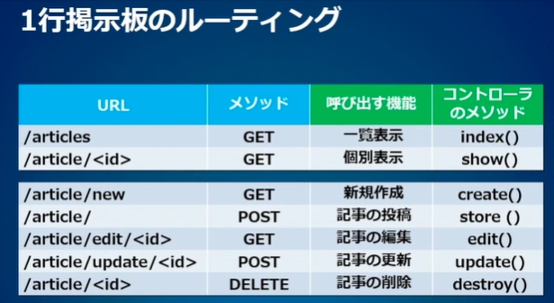

<!-- omit in toc -->
# paiza Lesson 3: Laravelのビューとフォームを理解しよう

https://paiza.jp/works/laravel/primer/beginner-laravel3

<!-- omit in toc -->
[目次]
- [01:投稿フォームを作成しよう](#01投稿フォームを作成しよう)
  - [参考になるWebページ](#参考になるwebページ)
    - [【Bladeテンプレートエンジン】](#bladeテンプレートエンジン)
    - [【ビューの共通化】](#ビューの共通化)
    - [【検索フォーム】](#検索フォーム)
    - [【リンクの生成】](#リンクの生成)
    - [【フォーム】](#フォーム)
- [02:テンプレートを共通化しよう](#02テンプレートを共通化しよう)
  - [共通テンプレートの変更部分を指定する](#共通テンプレートの変更部分を指定する)
  - [※（Qiita）laravel入門！　bladeの作り方（extends,yield,section）](#qiitalaravel入門bladeの作り方extendsyieldsection)
    - [@extends：ビューの継承](#extendsビューの継承)
    - [@yield(読み方：イールド)と@section~@endsection：コンテンツの挿入](#yield読み方イールドとsectionendsectionコンテンツの挿入)
  - [index.blade.phpに、セクションを追加](#indexbladephpにセクションを追加)
  - [show.blade.phpに、セクションを追加](#showbladephpにセクションを追加)
  - [参考になるWebページ](#参考になるwebページ-1)
- [03:掲示板にBootstrapを適用しよう](#03掲示板にbootstrapを適用しよう)
  - [Bootstrapを読み込む](#bootstrapを読み込む)
  - [ナビゲーションバーを追加する](#ナビゲーションバーを追加する)
  - [layout.blade.phpにBootstrapとナビゲーションバーを追加する](#layoutbladephpにbootstrapとナビゲーションバーを追加する)
  - [参考になるWebページ](#参考になるwebページ-2)
- [04:Bootstrapでページの見栄えを整えよう](#04bootstrapでページの見栄えを整えよう)
  - [一覧ページをテーブルとボタンに変える](#一覧ページをテーブルとボタンに変える)
  - [詳細ページのボタンを変える](#詳細ページのボタンを変える)
  - [参考になるWebページ](#参考になるwebページ-3)
- [05:検索フォームを設置しよう](#05検索フォームを設置しよう)
  - [ファサードとは](#ファサードとは)
  - [検索フォームのテンプレートを用意する](#検索フォームのテンプレートを用意する)
  - [記事一覧に検索フォームを追加する](#記事一覧に検索フォームを追加する)
  - [Form用ライブラリのインストールについて](#form用ライブラリのインストールについて)
  - [参考になるWebページ](#参考になるwebページ-4)
- [06:フォームの値を取得しよう](#06フォームの値を取得しよう)
  - [検索機能を追加する](#検索機能を追加する)
- [07:掲示板のルーティングを設計しよう](#07掲示板のルーティングを設計しよう)
  - [ルーティングを記述する](#ルーティングを記述する)
  - [コントローラのメソッドをテストする](#コントローラのメソッドをテストする)
  - [参考になるWebページ](#参考になるwebページ-5)
- [08:新規投稿フォームを作成しよう](#08新規投稿フォームを作成しよう)
  - [コントローラのstoreメソッドで、固定テキストを保存する](#コントローラのstoreメソッドで固定テキストを保存する)
  - [createメソッドで、フォームを呼び出す](#createメソッドでフォームを呼び出す)
  - [参考になるWebページ](#参考になるwebページ-6)
- [09:記事の保存機能を完成させよう](#09記事の保存機能を完成させよう)
  - [新規投稿フォームをnew.blade.phpに記述する](#新規投稿フォームをnewbladephpに記述する)
  - [投稿内容を保存するようstoreメソッドを修正する](#投稿内容を保存するようstoreメソッドを修正する)
  - [参考になるWebページ](#参考になるwebページ-7)
- [10:編集フォームを追加しよう - その1](#10編集フォームを追加しよう---その1)
  - [コントローラに、Editを追加する](#コントローラにeditを追加する)
  - [編集フォームを記述する](#編集フォームを記述する)
  - [参考になるWebページ](#参考になるwebページ-8)
- [11:編集フォームを追加しよう - その2](#11編集フォームを追加しよう---その2)
  - [コントローラに、updateを追加する](#コントローラにupdateを追加する)
  - [show.blade.phpから、編集フォームにリンクする](#showbladephpから編集フォームにリンクする)
  - [参考になるWebページ](#参考になるwebページ-9)

---

## 01:投稿フォームを作成しよう


###  参考になるWebページ

#### 【Bladeテンプレートエンジン】

- Bladeテンプレート 5.6 Laravel
  - https://readouble.com/laravel/5.6/ja/blade.html
  
- 【Laravel】Viewのbladeの書き方 - Qiita
  - https://qiita.com/sola-msr/items/a128f4e0900f3541690c


#### 【ビューの共通化】

- LaravelのBladeテンプレートでレイアウト部分を共通にする | cly7796.net
  - http://cly7796.net/wp/php/to-a-common-layout-in-blade-template-of-laravel/

- Blade テンプレートについて - Laravel学習帳
  - http://laraweb.net/knowledge/2174/


#### 【検索フォーム】

- 検索機能の作成 - Laravel学習帳
  - http://laraweb.net/tutorial/607/

- Laravelで検索フォームを実装してみる | cly7796.net
  - http://cly7796.net/wp/php/try-to-implement-the-search-form-in-the-laravel/

- Laravel5.5でお手軽にフィルタ&検索付きメモアプリを作るチュートリアル - Qiita
  - https://qiita.com/namaozi/items/11b65ccb6b7ecaefc23e

- Laravel Recipes日本語版 | Formファサードのレシピ
  - http://recipes.laravel.jp/category/17

- CSRF保護 5.6 Laravel
  - https://readouble.com/laravel/5.6/ja/csrf.html


#### 【リンクの生成】

- URL生成 5.6 Laravel
  - https://readouble.com/laravel/5.6/ja/urls.html

- Laravel Recipes日本語版 | Htmlファサードのレシピ
  - http://recipes.laravel.jp/category/20

- Laravel Recipes日本語版 | HTMLリンクを生成する
  - http://recipes.laravel.jp/recipe/250

- Laravel Recipes日本語版 | コントローラのアクションへのHTMLリンクを生成する
  - http://recipes.laravel.jp/recipe/246


#### 【フォーム】

- Laravel Recipes日本語版 | Formファサードのレシピ
  - http://recipes.laravel.jp/category/17

- Laravel Recipes日本語版 | モデルをベースにしたフォームを作成する
  - http://recipes.laravel.jp/recipe/221

- Laravel Collective
- https://github.com/LaravelCollective/docs/blob/master/html.md


---

## 02:テンプレートを共通化しよう


### 共通テンプレートの変更部分を指定する
resources/views/layout.blade.php
```php
<!DOCTYPE html>
<html>
    <head>
        <meta charset='utf-8'>
        <title>paiza bbs</title>
        <style>body {padding: 10px;}</style>
    </head>
    <body>
        @yield('content')
    </body>
</html>
```

### ※（Qiita）laravel入門！　bladeの作り方（extends,yield,section）

https://qiita.com/UncleHoge/items/d48785175deced3a1b90


#### @extends：ビューの継承

`@extends('layout')`<br>
とすることで、viewsフォルダの中にある、「layout.blade.php」というファイルを継承する。

#### @yield(読み方：イールド)と@section~@endsection：コンテンツの挿入

- `@yield`には、外部化したいコードを書く。
- `@yield`は親のファイルに書いて、`@section`は子のファイルに書く。

---

### index.blade.phpに、セクションを追加
resources/views/index.blade.php
```php
@extends('layout')   {{* ←　共通テンプレートの指定  *}}

@section('content')  {{* ←　yieldで定義した箇所への埋め込み  *}}
    <h1>paiza bbs</h1>
    <p>{{ $message }}</p>
    @foreach ($articles as $article)
        <p>
            <a href='{{ route("article.show", ["id" =>  $article->id]) }}'>
                {{ $article->content }},
                {{ $article->user_name }}
            </a>
        </p>
    @endforeach
    
    <div>
        <a href={{ route('article.new') }}>新規投稿</a>
    </div>
@endsection
```


### show.blade.phpに、セクションを追加
resources/views/show.blade.php
```php
@extends('layout')

@section('content')
    <h1>paiza bbs</h1>
    <p>{{ $message }}</p>
    <p>{{ $article->content }}</p>
    <p>{{ $article->user_name }}</p>

    <p>
        <a href={{ route('article.list') }}>一覧に戻る</a>
    </p>
    <div>
        {{ Form::open(['method' => 'delete', 'route' => ['article.delete', $article->id]]) }}
            {{ Form::submit('削除') }}
        {{ Form::close() }}
    </div>
@endsection
```

###  参考になるWebページ

- 【Bladeテンプレートエンジン】
  - Bladeテンプレート 5.6 Laravel
    - https://readouble.com/laravel/5.6/ja/blade.html

- 【Laravel】Viewのbladeの書き方 - Qiita
  - https://qiita.com/sola-msr/items/a128f4e0900f3541690c
- 【ビューの共通化】
  - LaravelのBladeテンプレートでレイアウト部分を共通にする | cly7796.net
    - http://cly7796.net/wp/php/to-a-common-layout-in-blade-template-of-laravel/
- Blade テンプレートについて - Laravel学習帳
  - http://laraweb.net/knowledge/2174/


---

## 03:掲示板にBootstrapを適用しよう

### Bootstrapを読み込む
resources/views/style-sheet.blade.php

```php
<meta name='viewport' content='width=device-width, initial-scale=1, shrink-to-fit=no'>
<link rel='stylesheet' href='https://maxcdn.bootstrapcdn.com/bootstrap/4.0.0/css/bootstrap.min.css' >
<style>body {padding-top: 80px;}</style>

<!-- viewportとは？HTMLのmeta要素の正しい書き方と意味を解説  -->
<!-- https://gmotech.jp/semlabo/seo/blog/howto-viewport/  -->
<!-- ウェブページの表示領域（ビューポート）を制御するためのHTML要素です。
 これにより、スマートフォンやタブレットなどの異なるデバイスで見たときに、
 ウェブサイトが適切なサイズで表示されるように設定し、ユーザーがページを
 見やすくすることができます。  -->

<!-- スマホの自動縮小はviewportで制御されている -->
<!-- https://zenn.dev/ken_ty/scraps/3154ba4e558797 -->
<!-- content='width=device-width, initial-scale=1, shrink-to-fit=no' -->
<!-- この意味は「拡大縮小をせず等倍で表示する」 -->

```


### ナビゲーションバーを追加する
resources/views/nav.blade.php
```php
<nav class='navbar navbar-expand-md navbar-dark bg-dark fixed-top'>
    <a class='navbar-brand' href={{ route('article.list') }}>paiza bbs</a>
</nav>

```

### layout.blade.phpにBootstrapとナビゲーションバーを追加する
resources/views/layout.blade.php
```php
<!DOCTYPE html>
<html>
    <head>
        <meta charset='utf-8'>
        <title>paiza bbs</title>
        @include('style-sheet')
    </head>
    <body>
        @include('nav')
        <div class='container'>
            @yield('content')
        </div>
    </body>
</html>
```


### 参考になるWebページ

- 【Bootstrap】
  - LaravelでBootstrapの導入 - Laravel学習帳
    - https://laraweb.net/knowledge/1758/

- 【Bladeテンプレートエンジン】
  - Bladeテンプレート 5.6 Laravel
    - https://readouble.com/laravel/5.6/ja/blade.html

- 【Laravel】Viewのbladeの書き方 - Qiita
  - https://qiita.com/sola-msr/items/a128f4e0900f3541690c


- 【ビューの共通化】
  - LaravelのBladeテンプレートでレイアウト部分を共通にする | cly7796.net
    - http://cly7796.net/wp/php/to-a-common-layout-in-blade-template-of-laravel/

- Blade テンプレートについて - Laravel学習帳
  - http://laraweb.net/knowledge/2174/


---


## 04:Bootstrapでページの見栄えを整えよう


### 一覧ページをテーブルとボタンに変える
resources/views/index.blade.php

```php
@extends('layout')

@section('content')
    <h1>paiza bbs</h1>
    <p>{{ $message }}</p>
    <table class='table table-striped table-hover'>
        @foreach ($articles as $article)
            <tr>
                <td>
                    <a href='{{ route("article.show", ["id" =>  $article->id]) }}'>
                        {{ $article->content }}
                    </a>
                </td>
                <td>{{ $article->user_name }}</td>
            </tr>
        @endforeach
    </table>

    <div>
        <a href={{ route('article.new') }} class='btn btn-outline-primary'>新規投稿</a>
    </div>
@endsection

```


### 詳細ページのボタンを変える
resources/views/show.blade.php
```php
@extends('layout')

@section('content')
    <h1>paiza bbs</h1>
    <p>{{ $message }}</p>
    <p>{{ $article->content }}</p>
    <p>{{ $article->user_name }}</p>

    <p>
        <a href={{ route('article.list') }} class='btn btn-outline-primary'>一覧に戻る</a>
    </p>
    <div>
        {{ Form::open(['method' => 'delete', 'route' => ['article.delete', $article->id]]) }}
            {{ Form::submit('削除', ['class' => 'btn btn-outline-secondary']) }}
        {{ Form::close() }}
    </div>
@endsection
```


### 参考になるWebページ

- 【Bootstrap】
  - LaravelでBootstrapの導入 - Laravel学習帳
    - https://laraweb.net/knowledge/1758/
  - 【Bladeテンプレートエンジン】
    - Bladeテンプレート 5.6 Laravel
      - https://readouble.com/laravel/5.6/ja/blade.html
    - 【Laravel】Viewのbladeの書き方 - Qiita
      - https://qiita.com/sola-msr/items/a128f4e0900f3541690c

- 【ビューの共通化】
  - LaravelのBladeテンプレートでレイアウト部分を共通にする | cly7796.net
    - http://cly7796.net/wp/php/to-a-common-layout-in-blade-template-of-laravel/
  - Blade テンプレートについて - Laravel学習帳
    - http://laraweb.net/knowledge/2174/


---


## 05:検索フォームを設置しよう

### ファサードとは
- Laravelでフォームを利用するには、2重の波カッコにフォームと記述します。
  - このような部品を、Formファサードと呼びます。
- ファサード(facade）とは、建物の入り口という意味です。
  - Laravelのファサードは、アプリケーションのサービスコンテナに登録したクラスに対するインターフェイスを提供します。


### 検索フォームのテンプレートを用意する
resources/views/search.blade.php
```php
{{ Form::open(['method' => 'get']) }}
    {{ csrf_field() }}
    <div class='form-group'>
        {{ Form::label('keyword', 'キーワード:') }}
        {{ Form::text('keyword', null, ['class' => 'form-control']) }}
    </div>
    <div class='form-group'>
        {{ Form::submit('検索', ['class' => 'btn btn-outline-primary'])}}
        <a href={{ route('article.list') }}>クリア</a>
    </div>
{{ Form::close() }}
```


### 記事一覧に検索フォームを追加する
resources/views/index.blade.php
```php
@extends('layout')

@section('content')
    <h1>paiza bbs</h1>
    <p>{{ $message }}</p>
    @include('search')

    <table class='table table-striped table-hover'>
        @foreach ($articles as $article)
            <tr>
                <td>{{ $article->content }}</td>
            </tr>
        @endforeach
    </table>
@endsection
```

### Form用ライブラリのインストールについて
Laravelでフォームを使用するには、「laravelcollective/html」というライブラリが必要になります。これは、ターミナルで次のコマンドを実行します。

```bash
$ cd bbs
$ composer require "laravelcollective/html":"^5.4.0"
```

このチャプターの環境には、このライブラリをインストール済みです。

自分の環境に、このライブライがインストールされているか確認するには、次のコマンドを実行します。

```bash
$ composer info
```


### 参考になるWebページ
- 【検索フォーム】
  - 検索機能の作成 - Laravel学習帳
    -  http://laraweb.net/tutorial/607/
  - Laravelで検索フォームを実装してみる | cly7796.net
    - http://cly7796.net/wp/php/try-to-implement-the-search-form-in-the-laravel/
  - Laravel5.5でお手軽にフィルタ&検索付きメモアプリを作るチュートリアル - Qiita
    - https://qiita.com/namaozi/items/11b65ccb6b7ecaefc23e
  - CSRF保護 5.6 Laravel
    - https://readouble.com/laravel/5.6/ja/csrf.html

- 【フォーム】
  - Laravel Recipes日本語版 | Formファサードのレシピ
    - http://recipes.laravel.jp/category/17
  - Laravel Recipes日本語版 | モデルをベースにしたフォームを作成する
    - http://recipes.laravel.jp/recipe/221
  - Laravel Collective
    - https://github.com/LaravelCollective/docs/blob/master/html.md
  - ファサード 5.7 Laravel
    - https://readouble.com/laravel/5.7/ja/facades.html


---

## 06:フォームの値を取得しよう

###  検索機能を追加する
app/Http/Controllers/ArticleController.php

```php
public function index(Request $request)
    {
        if ($request->filled('keyword')) {
            $keyword = $request->input('keyword');
            $message = 'Welcome my BBS: ' . $keyword;
            $articles = Article::where('content', 'like', '%' . $keyword . '%')->get();
        } else {
            $message = 'Welcome my BBS';
            $articles = Article::all();
        }

        return view('index', ['message' => $message, 'articles' => $articles]);
    }
```


###　参考になるWebページ
- 【検索フォーム】
  - 検索機能の作成 - Laravel学習帳
    - http://laraweb.net/tutorial/607/
  - Laravelで検索フォームを実装してみる | cly7796.net
    - http://cly7796.net/wp/php/try-to-implement-the-search-form-in-the-laravel/
  - Laravel5.5でお手軽にフィルタ&検索付きメモアプリを作るチュートリアル - Qiita
    - https://qiita.com/namaozi/items/11b65ccb6b7ecaefc23e
  - CSRF保護 5.6 Laravel
    - https://readouble.com/laravel/5.6/ja/csrf.html
- 【フォーム】
  - Laravel Recipes日本語版 | Formファサードのレシピ
    - http://recipes.laravel.jp/category/17
  - Laravel Recipes日本語版 | モデルをベースにしたフォームを作成する
    - http://recipes.laravel.jp/recipe/221
  - Laravel Collective
    - https://github.com/LaravelCollective/docs/blob/master/html.md
  - ファサード 5.7 Laravel
    - https://readouble.com/laravel/5.7/ja/facades.html

---


## 07:掲示板のルーティングを設計しよう







### ルーティングを記述する
routes/web.php
```php
Route::get('/', function () {
    // return view('welcome');
    return redirect('/articles');
});

Route::get('/articles', 'ArticleController@index')->name('article.list');
Route::get('/article/new', 'ArticleController@create')->name('article.new');
Route::post('/article', 'ArticleController@store')->name('article.store');

Route::get('/article/edit/{id}', 'ArticleController@edit')->name('article.edit');
Route::post('/article/update/{id}', 'ArticleController@update')->name('article.update');

Route::get('/article/{id}', 'ArticleController@show')->name('article.show');
Route::delete('/article/{id}', 'ArticleController@destroy')->name('article.delete');
```

###  コントローラのメソッドをテストする
app/Http/Controllers/ArticleController.php

```php
public function edit(Request $request, $id, Article $article)
    {
        $message = 'Edit your article ' . $id;
        $article = Article::find($id);
        return view('show', ['message' => $message, 'article' => $article]);
    }
```


### 参考になるWebページ
- ルーティング 5.7 Laravel
  - https://readouble.com/laravel/5.7/ja/routing.html
- Laravelルーティングの基本とよく使われるルーティングパターン
  - https://www.ritolab.com/entry/119
- Laravelのルーティング書き方まとめ - Qiita
  - https://qiita.com/michiomochi@github/items/de19c560bc1dc19d698c

---

## 08:新規投稿フォームを作成しよう

### コントローラのstoreメソッドで、固定テキストを保存する
app/Http/Controllers/ArticleController.php

```php
public function store(Request $request)
{
    $article = new Article;

    $article->content = 'Hello BBS';
    $article->user_name = 'paiza';
    $article->save();
    return redirect('/articles');
}
```


### createメソッドで、フォームを呼び出す
app/Http/Controllers/ArticleController.php

```php
    public function create(Request $request)
    {
        $message = 'New article';
        return view('new', ['message' => $message]);
    }
```


### 参考になるWebページ
- Laravel Recipes日本語版 | Formファサードのレシピ
  - http://recipes.laravel.jp/category/17
- Laravel Recipes日本語版 | モデルをベースにしたフォームを作成する
  - http://recipes.laravel.jp/recipe/221
- Laravel Collective
  - https://github.com/LaravelCollective/docs/blob/master/html.md
- ファサード 5.7 Laravel
  - https://readouble.com/laravel/5.7/ja/facades.html
- Bladeテンプレート 5.7 Laravel
  - https://readouble.com/laravel/5.7/ja/blade.html

---


## 09:記事の保存機能を完成させよう

### 新規投稿フォームをnew.blade.phpに記述する
resources/views/new.blade.php

```php
@extends('layout')

@section('content')
    <h1>paiza bbs</h1>
    <p>{{ $message }}</p>
    {{ Form::open(['route' => 'article.store']) }}
        <div class='form-group'>
            {{ Form::label('content', 'Content:') }}
            {{ Form::text('content', null) }}
        </div>
        <div class='form-group'>
            {{ Form::label('user_name', 'Name:') }}
            {{ Form::text('user_name', null) }}
        </div>
        <div class="form-group">
            {{ Form::submit('作成する', ['class' => 'btn btn-primary']) }}
            <a href={{ route('article.list') }}>一覧に戻る</a>
        </div>
    {{ Form::close() }}
@endsection
```


###  投稿内容を保存するようstoreメソッドを修正する
app/Http/Controllers/ArticleController.php

```php
public function store(Request $request)
{
    $article = new Article;

    $article->content = $request->content;
    $article->user_name = $request->user_name;
    $article->save();
    return redirect()->route('article.show', ['id' => $article->id]);
}
```


### 参考になるWebページ
- Laravel Recipes日本語版 | Formファサードのレシピ
  - http://recipes.laravel.jp/category/17
- Laravel Recipes日本語版 | モデルをベースにしたフォームを作成する
  - http://recipes.laravel.jp/recipe/221
- Laravel Collective
  - https://github.com/LaravelCollective/docs/blob/master/html.md
- ファサード 5.7 Laravel
  - https://readouble.com/laravel/5.7/ja/facades.html
- Bladeテンプレート 5.7 Laravel
  - https://readouble.com/laravel/5.7/ja/blade.html


---

## 10:編集フォームを追加しよう - その1


### コントローラに、Editを追加する
app/Http/Controllers/ArticleController.php
```php
public function edit(Request $request, $id, Article $article)
    {
        $message = 'Edit your article ' . $id;
        $article = Article::find($id);
        return view('edit', ['message' => $message, 'article' => $article]);
    }
```


### 編集フォームを記述する
resources/views/edit.blade.php
```php
@extends('layout')

@section('content')
    <h1>paiza bbs</h1>
    <p>{{ $message }}</p>
    {{* Form::modelファサード *}}
    {{ Form::model($article, ['route' => ['article.update', $article->id]]) }}
        <div class='form-group'>
            {{ Form::label('content', 'Content:') }}
            {{ Form::text('content', null) }}
        </div>
        <div class='form-group'>
            {{ Form::label('user_name', 'Name:') }}
            {{ Form::text('user_name', null) }}
        </div>
        <div class="form-group">
            {{ Form::submit('保存する', ['class' => 'btn btn-primary']) }}
            <a href={{ route('article.show', ['id' =>  $article->id]) }}>戻る</a>
        </div>
    {{ Form::close() }}
@endsection
```


### 参考になるWebページ

- Laravel Recipes日本語版 | Formファサードのレシピ
  - http://recipes.laravel.jp/category/17
- Laravel Recipes日本語版 | モデルをベースにしたフォームを作成する
  - http://recipes.laravel.jp/recipe/221
- Laravel Collective
  - https://github.com/LaravelCollective/docs/blob/master/html.md
- ファサード 5.7 Laravel
  - https://readouble.com/laravel/5.7/ja/facades.html
- Bladeテンプレート 5.7 Laravel
  - https://readouble.com/laravel/5.7/ja/blade.html

---

## 11:編集フォームを追加しよう - その2


### コントローラに、updateを追加する
app/Http/Controllers/ArticleController.php

```php
public function update(Request $request, $id, Article $article)
{
    $article = Article::find($id);
    $article->content = $request->content;
    $article->user_name = $request->user_name;
    $article->save();
    return redirect()->route('article.show', ['id' => $article->id]);
}
```


### show.blade.phpから、編集フォームにリンクする
resources/views/show.blade.php
```php
@extends('layout')

@section('content')
    <h1>paiza bbs</h1>
    <p>{{ $article->content }}</p>
    <p>{{ $article->user_name }}</p>

    <p>
        <a href={{ route('article.list') }} class='btn btn-outline-primary'>一覧に戻る</a>
        <a href={{ route('article.edit', ["id" =>  $article->id]) }} class='btn btn-outline-primary'>編集</a>
    </p>
    <div>
        {{ Form::open(['method' => 'delete', 'route' => ['article.delete', $article->id]]) }}
            {{ Form::submit('削除', ['class' => 'btn btn-outline-secondary']) }}
        {{ Form::close() }}
    </div>
@endsection
```

###  参考になるWebページ
- Laravel Recipes日本語版 | Formファサードのレシピ
  - http://recipes.laravel.jp/category/17
- Laravel Recipes日本語版 | モデルをベースにしたフォームを作成する
  - http://recipes.laravel.jp/recipe/221
- Laravel Collective
  - https://github.com/LaravelCollective/docs/blob/master/html.md
- ファサード 5.7 Laravel
  - https://readouble.com/laravel/5.7/ja/facades.html
- Bladeテンプレート 5.7 Laravel
  - https://readouble.com/laravel/5.7/ja/blade.html


---

【EOF】


[←　README](../README.md) 
