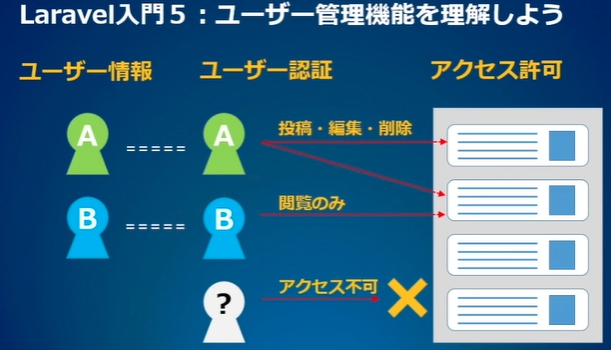
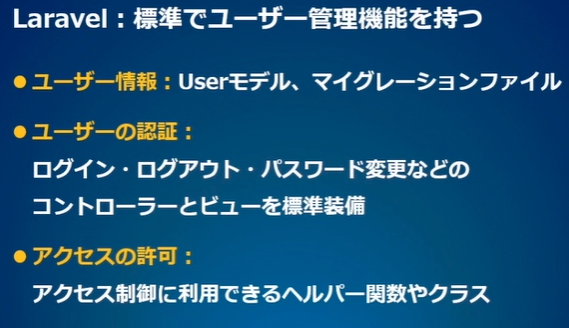
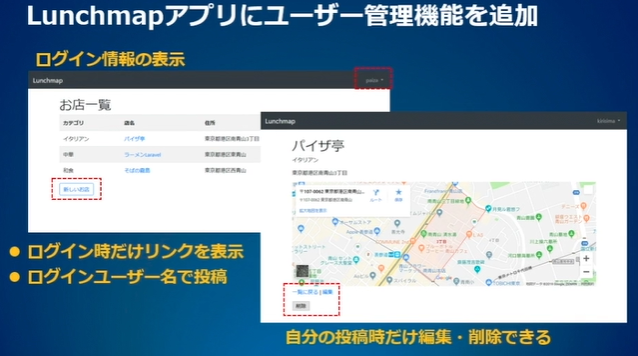
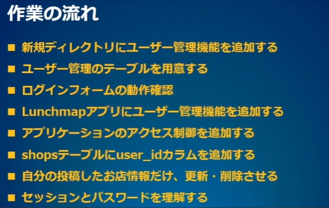
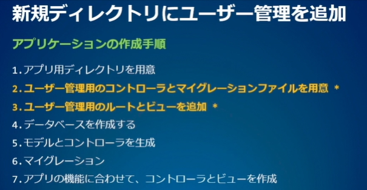
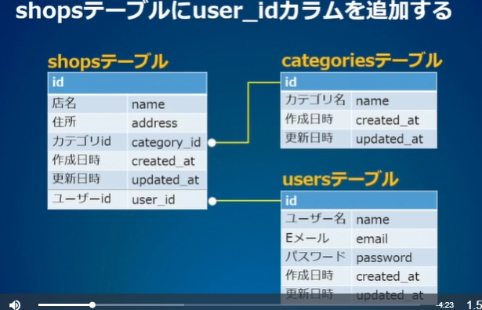
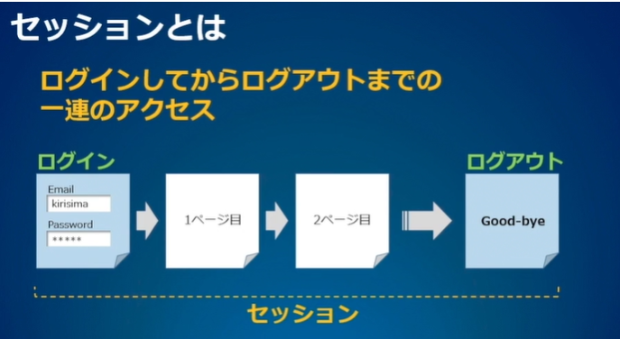
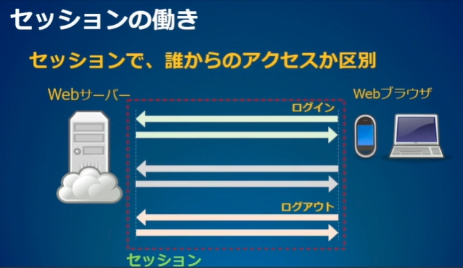
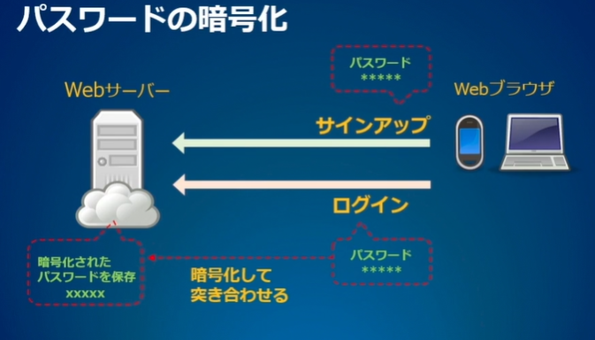

<!-- omit in toc -->
# paiza Lesson 5: Laravelでユーザー管理しよう

https://paiza.jp/works/laravel/primer/beginner-laravel5

<!-- omit in toc -->
[目次]


---


## ＃01:ユーザー管理機能を理解しよう














### 参考になるWebページ
- 認証 5.7 Laravel
  - https://readouble.com/laravel/5.7/ja/authentication.html
- 認可 5.7 Laravel
  - https://readouble.com/laravel/5.7/ja/authorization.html
- Bladeテンプレート 5.7 Laravel
  - https://readouble.com/laravel/5.7/ja/blade.html
- Laravelの標準Authentication(Auth)の動きを調べてみる - Qiita
  - https://qiita.com/zaburo/items/9fcf0f4c771e011a4d35
- Laravel 5.5 の認証機能とそのカスタマイズ - Qiita
  - https://qiita.com/naga3/items/4f3defde59b31a1a797e
- Laravelで爆速API開発シリーズ「認可編」 | WINDII
  - https://windii.jp/laravel/authorization
- Laravel5.7: ログイン機能を追加する - Qiita
  - https://qiita.com/sutara79/items/fdbfbf2a8f86f7d8f7fb
- Laravel5.7: postsとusersを関連させる - Qiita
  - https://qiita.com/sutara79/items/9e57e7af03b65e0d6047


---


## 02:ユーザー管理機能を追加しよう

###  新規のアプリケーションディレクトリを追加する

```bash
$ laravel new test_auth
```

これで、ユーザー管理用のモデル・コントローラ・マイグレーションファイルが用意される

###　ディレクトリ作成を高速化するには
"laravel new"コマンドの実行前に以下のような設定をしておけば、コマンドの実行時間を短くできます。

```bash
$ composer config -g repositories.packagist composer 'https://packagist.jp'
$ composer global require hirak/prestissimo
```


### ユーザー管理機能を自動生成

```bash
$ php artisan make:auth
```

これで、ユーザー管理用のルートとビューを追加する。

登録されているルートを確認するには、次のコマンドを実行する。

```bash
php artisan route:list
```




/test_auth/routes/web.php

```php

//このコードが発生する
Auth::routes();


```


---

## 03:ユーザー管理用のテーブルを用意しよう


### データベース設定 > test_auth/.env

test_auth/.env
```ini
DB_CONNECTION=mysql
DB_HOST=127.0.0.1
DB_PORT=3306
DB_DATABASE=myauth
DB_USERNAME=root
# DB_PASSWORD=secret
```

### マイグレート

```bash
$ cd test_auth
$ php artisan migrate
```


### paiza-cloud用https対応
app/Providers/AppServiceProvider.php
※ Laravelのバージョンによっては、メソッドの並び順が異なる場合があります。

```php
class AppServiceProvider extends ServiceProvider
{
    /**
     * Bootstrap any application services.
     *
     * @return void
     */
    public function boot()
    {
        \URL::forceScheme('https');
    }

    /**
     * Register any application services.
     *
     * @return void
     */
    public function register()
    {
        //
    }
}
```


---

## 04:ログインフォームの動作確認をしよう


### 参考になるWebページ
- 認証 5.7 Laravel
  - https://readouble.com/laravel/5.7/ja/authentication.html
- Laravelの標準Authentication(Auth)の動きを調べてみる - Qiita
  - https://qiita.com/zaburo/items/9fcf0f4c771e011a4d35
- Laravel 5.5 の認証機能とそのカスタマイズ - Qiita
  - https://qiita.com/naga3/items/4f3defde59b31a1a797e


---

## 05:ログイン機能を追加しよう


### ユーザー管理用のルートとビューを追加

```bash
$ php artisan make:auth
```

###  共通テンプレートに、ログイン用のコードを追加する
resources/views/layout.blade.php

```php
<head>
    <meta charset='utf-8'>
    <meta name='viewport' content='width=device-width, initial-scale=1, shrink-to-fit=no'>
    <meta name='csrf-token' content='{{ csrf_token() }}'>
    <link rel='stylesheet' href='https://maxcdn.bootstrapcdn.com/bootstrap/4.0.0/css/bootstrap.min.css' >
    <title>Lunchmap</title>
    <style>body {padding-top: 80px;}</style>
    <script src='{{ asset("js/app.js") }}' defer></script>
</head>


resources/views/layout.blade.php
<nav class='navbar navbar-expand-md navbar-dark bg-dark fixed-top'>
    <a class='navbar-brand' href={{route('shop.list')}}>Lunchmap</a>
    <button class="navbar-toggler" type="button" data-toggle="collapse" data-target="#navbarSupportedContent" aria-controls="navbarSupportedContent" aria-expanded="false" aria-label="{{ __('Toggle navigation') }}">
        <span class="navbar-toggler-icon"></span>
    </button>
    
    <div class="collapse navbar-collapse" id="navbarSupportedContent">
        <!-- Left Side Of Navbar -->
        <ul class="navbar-nav mr-auto">

        </ul>

        <!-- Right Side Of Navbar -->
        <ul class="navbar-nav ml-auto">
            <!-- Authentication Links -->
            @guest
                <li class="nav-item">
                    <a class="nav-link" href="{{ route('login') }}">{{ __('Login') }}</a>
                </li>
                @if (Route::has('register'))
                    <li class="nav-item">
                        <a class="nav-link" href="{{ route('register') }}">{{ __('Register') }}</a>
                    </li>
                @endif
            @else
                <li class="nav-item dropdown">
                    <a id="navbarDropdown" class="nav-link dropdown-toggle" href="#" role="button" data-toggle="dropdown" aria-haspopup="true" aria-expanded="false" v-pre>
                        {{ Auth::user()->name }} <span class="caret"></span>
                    </a>

                    <div class="dropdown-menu dropdown-menu-right" aria-labelledby="navbarDropdown">
                        <a class="dropdown-item" href="{{ route('logout') }}"
                            onclick="event.preventDefault();
                                            document.getElementById('logout-form').submit();">
                            {{ __('Logout') }}
                        </a>

                        <form id="logout-form" action="{{ route('logout') }}" method="POST" style="display: none;">
                            @csrf
                        </form>
                    </div>
                </li>
            @endguest
        </ul>
    </div>
</nav>
```

> [!TIP]
> <script> タグに defer 属性を追加することで、HTML パース完了後、
> DOMContentLoaded イベントの直前に (※WHATWG 仕様) JS ファイルを実行します


### csrf_token()とは？
動画では`resources/views/layout.blade.php`の`headタグ`内に`csrf_token()`という記述をしています。

これは`Cross Site Request Forgery(リクエスト強要)`と呼ばれる攻撃手法に対策するものです。
CSRFはWebアプリケーションへのリクエストを記述した命令を不本意に実行させて、その人の権限でリクエストを実行させるという攻撃です。

例えば本講座ではPOSTメソッドを使ってLunchmapアプリにお店を追加しますが、

  1. お店を追加するPOSTリクエストを記述したボタンのある偽のサイトを用意する
  2. 攻撃対象のユーザーに偽のサイトへアクセスさせる
  3. 攻撃対象のユーザーが(1)のボタンをクリックしてしまう
  4. 攻撃対象のユーザーがLunchmapアプリにログイン中だった場合、クリックしたボタンのPOSTメソッドが受理されてしまい、意図せずお店が追加されてしまう

という流れで攻撃が成立してしまいます。
実際に存在するSNSで、CSRFを利用してユーザーの知らないところで不本意な投稿を大量に繰り返されてしまうという事件がありました。

このことの対策として、一回使い切りの認証情報を作ることで毎回「本当に本人が要求したリクエストなのか？」ということを確認する方法があります。
この認証情報は毎回変わりますので事前に偽のリクエストを作ることが難しくなりますし、最悪認証情報を盗まれてしまったとして使い捨てなのでその時点ではもう使用済みで破棄されているから大丈夫、ということになります。

Laravelではこの「一回使い切りの認証情報」を簡単に利用できるようになっています。一回使い切りの認証情報を自動で作成し、その認証情報が正しいかの照合まで行ってくれるのが「csrf_token()」という機能なのです。


### scriptタグで呼び出しているapp.jsについて
layout.blade.phpのheadタグで、

```php
<script src='{{ asset("js/app.js") }}' defer></script>
```

という記述をしています。

ここでapp.jsを読み込んでいるのですが、読み込まれているapp.jsはpublic/js/app.jsにあります。
しかし、このapp.jsは別のスクリプトをコンパイルしてブラウザで表示するように圧縮されたものであり、その圧縮する前の本体であるスクリプトはresources/js/app.jsとなります。

本体のapp.jsの8行目で同じディレクトリにあるbootstrap.jsが呼び出されていますが、このbootstrap.jsの中に上の項で解説したcsrf_tokenの認証に関わる処理が記述されており(27-39行目)、csrf_tokenを利用するために読み込む必要のあるスクリプトなのです。


ただし、このapp.jsはWebページがすでに読み込まれている前提で動作します。そのためページの読み込みが終わる前にapp.jsが実行されてしまうとエラーが発生してしまうので、deferを使ってページが読み込まれてから遅れて実行されるように制御しています。


---


## 06:アクセス制御を追加しよう


### 登録ユーザーのパスワード

```yaml
kirisima:
- Email: info@paiza.jp
- Password: k1r1s1m@

paiza:
- Email: foo@paiza.jp
- Password: p3a.i1z4a
```


### ログインしていない時、実行しないメソッドを指定する
app/Http/Controllers/ShopController.php

```php

class ShopController extends Controller
{
    //コンストラクタを追記する
    public function __construct()
    {
        //except indexとshowはログインしなくてもアクセスできる（文字通り"除外"）
        $this->middleware('auth')->except(['index', 'show']);
    }
}

```

### お店一覧のリンクを制御
resources/views/index.blade.php

```php
@extends('layout')

@section('content')
    <h1>お店一覧</h1>

    <table class='table table-striped table-hover'>
        <tr>
            <th>カテゴリ</th><th>店名</th><th>住所</th>
        </tr>
        @foreach ($shops as $shop)
            <tr>
                <td>{{ $shop->category->name }}</td>
                <td>
                    <a href={{ route('shop.detail', ['id' =>  $shop->id]) }}>
                        {{ $shop->name }}
                    </a>
                </td>
                <td>{{ $shop->address }}</td>
            </tr>
        @endforeach
    </table>
    {{ *追記箇所* }}
    @auth
        <div>
            <a href='{{ route("shop.new") }}'>新しいお店</a>
        <div>
    @endauth
    {{ *END 追記箇所* }}

@endsection
```


---

## 07:お店情報にユーザー情報を追加しよう


### 登録ユーザーのパスワード
```yaml
kirisima:
- Email: info@paiza.jp
- Password: k1r1s1m@

paiza:
- Email: foo@paiza.jp
- Password: p3a.i1z4a
```

###  カラムを追加するためのマイグレーションファイルを生成





```bash
$ cd lunchmap
$ php artisan make:migration add_user_id_to_shops_table --table=shops
```

### マイグレーションファイルに、user_idカラムを追加
database/migrations/20xx_xx_xx_xxxxxx_add_user_id_to_shops_table

```php
<?php

use Illuminate\Support\Facades\Schema;
use Illuminate\Database\Schema\Blueprint;
use Illuminate\Database\Migrations\Migration;

class AddUserIdToShopsTable extends Migration
{
    /**
     * Run the migrations.
     *
     * @return void
     */
    public function up()
    {
        Schema::table('shops', function (Blueprint $table) {
            $table->integer('user_id');
        });
    }

    /**
     * Reverse the migrations.
     *
     * @return void
     */
    public function down()
    {
        Schema::table('shops', function (Blueprint $table) {
            //
        });
    }
}
```


### マイグレート

```bash
$ php artisan migrate
```

### usersテーブルにuser_idを登録
usersテーブルで、idが２以上のレコードに、user_id=2を登録する。

```sql
UPDATE shops
	SET user_id=2
	WHERE id>=2;
```

なお、Usersモデルに登録されていないユーザーが、Shopsテーブルに登録してあると、お店一覧がエラーになる。

### Shopモデルに、Userへのリレーションを追加
app/Shop.php
```php
<?php

namespace App;

use Illuminate\Database\Eloquent\Model;

class Shop extends Model
{
    public function category()
    {
        return $this->belongsTo('App\Category');
    }

    public function user()
    {
        //TODO belongsToでリレーション組んだ状態で、存在しないuser_idがShopsに登録された場合はエラーになる。空白にはならない。
        return $this->belongsTo('App\User');
    }
}
```


### お店一覧に、ユーザー名を追加する
resources/views/index.blade.php
```php
@extends('layout')

@section('content')
    <h1>お店一覧</h1>

    <table class='table table-striped table-hover'>
        <tr>
            <th>カテゴリ</th><th>店名</th><th>住所</th><th>投稿者</th>
        </tr>
        @foreach ($shops as $shop)
            <tr>
                <td>{{ $shop->category->name }}</td>
                <td>
                    <a href={{ route('shop.detail', ['id' =>  $shop->id]) }}>
                        {{ $shop->name }}
                    </a>
                </td>
                <td>{{ $shop->address }}</td>
                <td>{{ $shop->user->name }}</td>
            </tr>
        @endforeach
    </table>

     @auth
        <div>
            <a href={{ route('shop.new') }} class='btn btn-outline-primary'>新しいお店</a>
        <div>
    @endauth
@endsection
```


---


## 08:自分で投稿したお店情報のみ、更新・削除できるようにしよう


###  登録ユーザーのパスワード
```yaml
kirisima:
- Email: info@paiza.jp
- Password: k1r1s1m@

paiza:
- Email: foo@paiza.jp
- Password: p3a.i1z4a
```


### 新規投稿時に、user_idカラムを保存する
app/Http/Controllers/ShopController.php

```php
/**
    * Store a newly created resource in storage.
    *
    * @param  \Illuminate\Http\Request  $request
    * @return \Illuminate\Http\Response
    */
public function store(Request $request)
{
    $shop = new Shop;
    $user = \Auth::user();     //←　今回の追加

    $shop->name = request('name');
    $shop->address = request('address');
    $shop->category_id = request('category_id');
    $shop->user_id = $user->id;     //←　今回の追加
    $shop->save();
    return redirect()->route('shop.detail', ['id' => $shop->id]);
}
```


###  showメソッドで、ログインユーザー情報を取得してビューに渡す
app/Http/Controllers/ShopController.php

```php
    /**
     * Display the specified resource.
     *
     * @param  \App\Shop  $shop
     * @return \Illuminate\Http\Response
     */
    public function show($id)
    {
        $shop = Shop::find($id);
        $user = \Auth::user();     //←　今回の追加
        if ($user) {
            $login_user_id = $user->id;
        } else {
            $login_user_id = "";
        }

        return view('show', ['shop' => $shop, 'login_user_id' => $login_user_id]);
    }
```


### ログインユーザーの記事だったら、リンクを表示
resources/views/show.blade.php

```php
<div>
    <a href={{ route('shop.list') }}>一覧に戻る</a>
    @auth
        @if ($shop->user_id === $login_user_id)
            | <a href={{ route('shop.edit', ['id' =>  $shop->id]) }}>編集</a>
            <p></p>
            {{ Form::open(['method' => 'delete', 'route' => ['shop.destroy', $shop->id]]) }}
                {{ Form::submit('削除', ['class' => 'btn btn-outline-danger']) }}
            {{ Form::close() }}
        @endif
    @endauth
</div>
```


### アクセス制御について

実際にアプリケーションを公開する際には、これだけではアクセス制御が不十分です。
この講座では要点を簡単に学ぶために「投稿者でなかった場合に編集・削除のリンクを表示させない」という処理を行っていますが、
たとえば`「編集のURLが/diary/edit/{id}であることを知っている人」`にはURLを手打ちで編集ページにアクセスされてしまう可能性があります。

また、`HTTPの規約に則ってPOSTでデータを登録する`ようにアプリケーションを作りましたが、
登録ページを経由せずに直接POSTリクエストを投げられた場合にもデータの登録を許してしまいます。

このように、ページだけでなくアプリケーション側でも「本当に投稿者本人なのか？」を確認する処理が必要ですので、
実際にアプリケーションを公開する際にはご注意ください。

  - Laravel5.7: 認可 (記事の編集はオーナーに限る、などの制限) - Qiita
    - https://qiita.com/sutara79/items/11d8417a6fc91ca1b841
  - 認可 5.7 Laravel
    - https://readouble.com/laravel/5.7/ja/authorization.html


---

## 09:セッションとパスワードを理解しよう





### 登録ユーザーのパスワード
```yaml
kirisima:
- Email: info@paiza.jp
- Password: k1r1s1m@

paiza:
- Email: foo@paiza.jp
- Password: p3a.i1z4a
```


### セッションとは

ログインしてから、ログアウトするまでの一連のアクセスを`「セッション」`と呼びます。

Webサイトへの基本的なアクセスでは、アプリケーション側でそれぞれのアクセスは独立しています。そのために、同じ人が同じサイトに複数回アクセスしても、それぞれのアクセスを区別できません。これでは、アクセスするたびにログインし直す必要があります。

そこで、セッションという仕組みを利用します。セッションは、ログインすると開始して、そのアクセスを区別する「セッション情報」を記録します。そして、ログアウトしたり、ブラウザを閉じて一定時間が経ったりすると終了します。この「セッション情報」おかげで、セッションが有効な間、Webアプリケーションに同じ人がアクセスしていると判断できるようになります。

### セッションを確認する手順
Google Chromeの場合

  1. 「設定」メニューを呼び出す
  2. 「詳細設定」-「コンテンツの設定」-「Coookies」-「すべてのクッキーとサイトデータ」
  3. Webアプリケーションのドメイン名を検索する





### パスワードの暗号化について
Laravelでは、パスワードを「ハッシュ」という暗号に変換して保存しています。

一見適当な記号の羅列に見えますが、

  - 「同じ文字列からは常に同じハッシュが作成される」
  - 「簡単に元の文字列に戻すことができない」

という特徴があります。

このハッシュ同士を比較することで、パスワードの中身を見られることなく正しいパスワードかどうかが比較できます。

また、文字列をハッシュに変換することを「ハッシュ化」といい、ハッシュ化の手法としてSHA-256やMD5などがよく知られています。





###  参考になるWebページ
- [セッション (session)とは｜「分かりそう」で「分からない」でも「分かった」気になれるIT用語辞典]
  - http://wa3.i-3-i.info/word1791.html
- HTTPセッション 5.7 Laravel
  - https://readouble.com/laravel/5.7/ja/session.html
- Laravelでセッションを使ってみる - Qiita
  - https://qiita.com/reflet/items/5638ab18fd7cededed17
- 認可 5.7 Laravel
  - https://readouble.com/laravel/5.7/ja/authorization.html
- Laravelで爆速API開発シリーズ「認可編」 | WINDII
  - https://windii.jp/laravel/authorization


---


【EOF】


[←　README](../README.md) 
