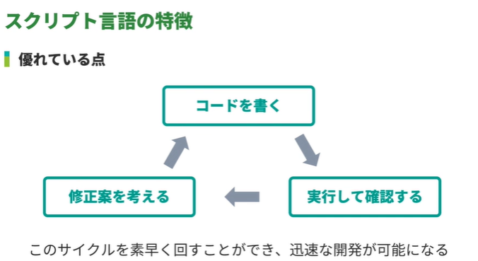
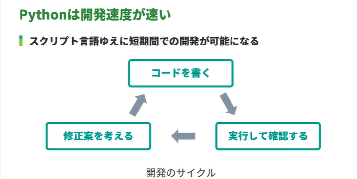
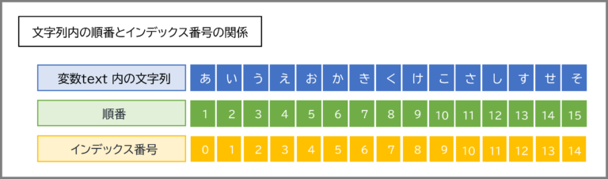

<!-- omit in toc -->
paiza ラーニング　：　新・Python入門編 Lesson 1 ～ 5

<!-- omit in toc -->
# 目次

- [Lesson 1: Python3を学習しよう](#lesson-1-python3を学習しよう)
  - [01:Pythonの特徴](#01pythonの特徴)
    - [Python とは](#python-とは)
    - [Python の特徴](#python-の特徴)
  - [02:スクリプト言語](#02スクリプト言語)
    - [コンパイル方式とインタプリタ方式](#コンパイル方式とインタプリタ方式)
    - [スクリプト言語](#スクリプト言語)
    - [「インタプリタ方式」のスクリプト言語の優れている点](#インタプリタ方式のスクリプト言語の優れている点)
    - [「インタプリタ方式」のスクリプト言語の劣っている点](#インタプリタ方式のスクリプト言語の劣っている点)
  - [03:Pythonの強み](#03pythonの強み)
    - [Python での開発速度が速い理由](#python-での開発速度が速い理由)
    - [開発速度が企業に重視される理由](#開発速度が企業に重視される理由)
- [Lesson 2: 標準出力を学習しよう](#lesson-2-標準出力を学習しよう)
  - [01:print で Hello World](#01print-で-hello-world)
    - [標準出力に出力するとは](#標準出力に出力するとは)
  - [02:print で複数の文字列を出力](#02print-で複数の文字列を出力)
  - [03:print の end= で出力の末尾を指定](#03print-の-end-で出力の末尾を指定)
    - [end= で出力末尾の文字列を指定する](#end-で出力末尾の文字列を指定する)
    - [文字列の長さとはなにか](#文字列の長さとはなにか)
    - [空文字列とはなにか](#空文字列とはなにか)
    - [末尾をカンマにするコード](#末尾をカンマにするコード)
    - [末尾を空文字列にするコード](#末尾を空文字列にするコード)
  - [04:コメント(#)](#04コメント)
    - [コメントとは](#コメントとは)
    - [コメントアウト](#コメントアウト)
- [Lesson 3: 数値とその演算を学習しよう](#lesson-3-数値とその演算を学習しよう)
  - [01:データ型とはなにか](#01データ型とはなにか)
    - [データ型の例](#データ型の例)
  - [02:数値の型](#02数値の型)
    - [浮動小数点数が誤差を含むことがある](#浮動小数点数が誤差を含むことがある)
    - [なぜコンピュータは小数を正確に表現できないことがあるのか](#なぜコンピュータは小数を正確に表現できないことがあるのか)
      - [【 コンピュータは有限桁の数のみ扱える 】](#-コンピュータは有限桁の数のみ扱える-)
      - [【 有限桁に見える数でも、コンピュータで扱おうとすると無限桁の数になることがある 】](#-有限桁に見える数でもコンピュータで扱おうとすると無限桁の数になることがある-)
      - [【 コンピュータ内は 2 進法 】](#-コンピュータ内は-2-進法-)
      - [【【 有限桁の 10 進法の小数を 2 進数に変換すると無限桁になることがある 】](#-有限桁の-10-進法の小数を-2-進数に変換すると無限桁になることがある-)
      - [【 なぜ無限桁の数になってしまうことがあるのか 】](#-なぜ無限桁の数になってしまうことがあるのか-)
      - [【 2 進法で正確に表現できない 10 進法の小数の例 】](#-2-進法で正確に表現できない-10-進法の小数の例-)
    - [【 まとめ 】](#-まとめ-)
    - [【 捕捉 】](#-捕捉-)
  - [03:演算子とはなにか](#03演算子とはなにか)
    - [演算子とは、たとえば、足し算のときの「+」(プラス記号) など、演算をするために用いられる記号](#演算子とはたとえば足し算のときのプラス記号-など演算をするために用いられる記号)
  - [04:足し算](#04足し算)
  - [05:引き算](#05引き算)
  - [06:掛け算](#06掛け算)
  - [07:割り算](#07割り算)
  - [08:余りを求める](#08余りを求める)
  - [09:べき乗を求める](#09べき乗を求める)
    - [べき乗とは](#べき乗とは)
  - [10:数値演算の優先順位](#10数値演算の優先順位)
- [Lesson 4: 変数を学習しよう](#lesson-4-変数を学習しよう)
  - [01:変数とはなにか](#01変数とはなにか)
  - [02:変数への代入](#02変数への代入)
  - [03:変数への再代入](#03変数への再代入)
    - [型の自由性](#型の自由性)
- [Lesson 5: 文字列とその演算を学習しよう](#lesson-5-文字列とその演算を学習しよう)
  - [文字列をコード内で表現する方法](#文字列をコード内で表現する方法)
  - [02:文字列のインデックス i の文字を取得](#02文字列のインデックス-i-の文字を取得)
    - [文字列のインデックス i の文字列を取得する方法](#文字列のインデックス-i-の文字列を取得する方法)
    - [正のインデックス](#正のインデックス)
    - [負のインデックス](#負のインデックス)
    - [文字列の長さとは](#文字列の長さとは)
    - [文字列の長さ以上のインデックス](#文字列の長さ以上のインデックス)
  - [03:文字列のインデックスが i ~ j-1 の部分文字列を取得　(スライス記号)](#03文字列のインデックスが-i--j-1-の部分文字列を取得スライス記号)
    - [文字列のインデックスが i から j-1 までの部分文字列を取得する方法](#文字列のインデックスが-i-から-j-1-までの部分文字列を取得する方法)
    - [「どこから」取得するか指定する数を省略](#どこから取得するか指定する数を省略)
    - [「どこまで」取得するか指定する数を省略](#どこまで取得するか指定する数を省略)
    - [s\[:\] のように指定すると、先頭から末尾までの部分文字列、つまり元と同じ文字列を取得できる](#s-のように指定すると先頭から末尾までの部分文字列つまり元と同じ文字列を取得できる)
    - [※　Copilotからの補足](#copilotからの補足)
      - [Pythonの文字列スライス](#pythonの文字列スライス)
      - [基本的な使い方](#基本的な使い方)
      - [負のインデックスと逆順](#負のインデックスと逆順)
      - [注意点](#注意点)
    - [※　Pythonで文字列を取り出す インデックス と スライス の違い](#pythonで文字列を取り出す-インデックス-と-スライス-の違い)
      - [基本的な使い方](#基本的な使い方-1)
        - [インデックス構文・スライス構文](#インデックス構文スライス構文)
          - [① インデックス構文](#-インデックス構文)
          - [インデックス番号とは？](#インデックス番号とは)
          - [②スライス構文](#スライス構文)
        - [実例①](#実例)
        - [実例②](#実例-1)
  - [04:文字列の長さを取得(len)](#04文字列の長さを取得len)
    - [文字列の長さとは](#文字列の長さとは-1)
    - [文字列の長さを取得する方法](#文字列の長さを取得する方法)
  - [05:文字列の結合(+)](#05文字列の結合)
    - [文字列の結合とは](#文字列の結合とは)
    - [文字列を結合する方法](#文字列を結合する方法)
  - [06:文字列の反復(\*)](#06文字列の反復)
    - [文字列の反復とは](#文字列の反復とは)
    - [文字列を反復する方法](#文字列を反復する方法)
  - [07:f 文字列 (フォーマット)](#07f-文字列-フォーマット)
    - [f 文字列](#f-文字列)
  - [※　文字列フォーマットによるパフォーマンス比較](#文字列フォーマットによるパフォーマンス比較)


---

# Lesson 1: Python3を学習しよう

---

## 01:Pythonの特徴

https://paiza.jp/works/python/new-primer/python-new-primer-1/74000


### Python とは

- 1990 年代初頭に登場したプログラミング言語で、いまでも第一線で使われている人気言語


### Python の特徴


- 「読みやすさ」「分かりやすさ」が重視された言語設計
- 豊富でかつ優れた拡張要素


---


## 02:スクリプト言語


https://paiza.jp/works/python/new-primer/python-new-primer-1/74001


### コンパイル方式とインタプリタ方式

- コンパイル方式 : コードが実行前にコンパイルされる
- インタプリタ方式 : コードの実行時に逐次コンパイルがおこなわれる


### スクリプト言語

- 「コードの理解がしやすい言語」を指す


### 「インタプリタ方式」のスクリプト言語の優れている点

- 事前コンパイルが必要ないため、簡単に実行結果を確認できる





### 「インタプリタ方式」のスクリプト言語の劣っている点

- 一般に実行速度が遅い
  - 実行時に逐次コンパイルするので、実行速度が遅くなる

---


## 03:Pythonの強み

https://paiza.jp/works/python/new-primer/python-new-primer-1/74002

### Python での開発速度が速い理由

- コードが読みやすい
  - 事前コンパイルが不要なため、実行して確認しやすい





### 開発速度が企業に重視される理由

- 必要なときに必要なサービスを迅速に提供できるから


---

# Lesson 2: 標準出力を学習しよう

---


## 01:print で Hello World


### 標準出力に出力するとは

- 標準出力: ディスプレイなどの出力装置に処理結果を出力するために、プログラムがデータを出力する場所


- 関数: 処理をまとめて使いやすくしたもの
- 文字列: ダブルクォーテーションやシングルクォーテーションで囲んで表記する


Hello World を出力するコード:

```python

print("Hello World")

```


---

## 02:print で複数の文字列を出力

print 関数を使うとき、カンマ区切りで複数の文字列を指定すると、それらの文字列が半角スペース区切りで出力される

Hello と World を出力するコード:


```python

print("Hello", "World")

```


Hello と World と paiza を出力するコード:

```python

print("Hello", "World", "paiza")

```


---


## 03:print の end= で出力の末尾を指定


### end= で出力末尾の文字列を指定する

print 関数を使うとデフォルトで末尾に改行が入るが、end= で文字列を指定することで末尾を変更できる

末尾をカンマにするコード:

```python
print("Hello", end=",")
print("World")
```


末尾を空文字列にするコード:

```python
print("Hello", end="")
print("World")
```


### 文字列の長さとはなにか

文字列の長さとは、文字列の文字数のこと


###  空文字列とはなにか

空文字列とは、長さが 0 つまり、文字数が 0 である文字列のこと

###  末尾をカンマにするコード

```python
print("Hello", end=",")
print("World")
```


###  末尾を空文字列にするコード

```python
print("Hello", end="")
print("World")
```


---

## 04:コメント(#)

### コメントとは

- コードの意図を説明したり、メモを残したり、コードを実行処理から除外したりしたいときに使う
- コメントは実行に影響をおよぼさない

コメントがあるコード:

```python
print("Hello World")
print("Hello paiza")  # "Hello paiza" を出力
```

### コメントアウト

コメントのなかで、とくに「コードを実行処理から除外する」目的でコメント化することを「コメントアウトする」という

print("Hello paiza") をコメントアウトしているコード:

```python
# print("Hello World") この行は実行されない
print("Hello paiza")  # "Hello paiza" を出力
```


---


# Lesson 3: 数値とその演算を学習しよう


## 01:データ型とはなにか

- 「データ型」は整数や文字列といったデータを円滑に扱うために用意されるもの
- Python には、整数を扱う int 型や、文字列を扱う str 型などさまざまなデータ型がある


### データ型の例

- int型
  - 整数を扱うために用意される
- str型
  - 文字列を扱うために用意される
- データ型はなぜ必要か
  - データを円滑に取り扱うため


---

## 02:数値の型


###  浮動小数点数が誤差を含むことがある

コンピュータは小数を正確に表現できないことがあるため、浮動小数点数は誤差を含むことがある


###  なぜコンピュータは小数を正確に表現できないことがあるのか

- コンピュータは主に次の 2 つのことから、小数を正確に表現できないことがある
  - コンピュータは有限桁の数のみ扱える
  - コンピュータは数値を 2 進法で扱い、2 進数では 10 進法で有限桁の数でも無限桁の数になることがある


#### 【 コンピュータは有限桁の数のみ扱える 】

- コンピュータでは、一般的には数値をデータのサイズが決まった数値型として扱うため、有限桁の数しか扱えない
- そのため、無限桁の数を正確に表現することはできない
- つまり、たとえば、円周率 (3.14159...) を正確に扱うことはできない


#### 【 有限桁に見える数でも、コンピュータで扱おうとすると無限桁の数になることがある 】

- 【 コンピュータ内は 2 進法 】
  - 私たちが普段使っている数字は 10 進法という記法にしたがったもの
  - しかし、コンピュータ内では、数値は 2 進法(※1)によって表される


- 【 有限桁の 10 進法の小数を 2 進数に変換すると無限桁になることがある 】
  - すべての 10 進数は、2 進数で表現することができる
  - しかし、10 進法で有限桁の数でも 2 進法では無限桁の数になってしまうことがある
  - たとえば、10 進法の 0.1 は 2 進法では循環小数になって無限桁の数になってしまう (これはのちほど確認します)


#### 【 コンピュータ内は 2 進法 】

- 私たちが普段使っている数字は 10 進法という記法にしたがったもの
- しかし、コンピュータ内では、数値は 2 進法(※1)によって表される


#### 【【 有限桁の 10 進法の小数を 2 進数に変換すると無限桁になることがある 】

- すべての 10 進数は、2 進数で表現することができる
- しかし、10 進法で有限桁の数でも 2 進法では無限桁の数になってしまうことがある
- たとえば、10 進法の 0.1 は 2 進法では循環小数になって無限桁の数になってしまう (これはのちほど確認します)


#### 【 なぜ無限桁の数になってしまうことがあるのか 】

- 10 進法の小数を 2 進法に変換する際は、10 進法の小数部をひたすら 2 倍し続けて 1 を作る、という方法がある(図 1)


- この方法からわかるように、有限桁の 2 進数に変換できる 10 進法の小数は、その小数部が、2 をかけ続けると 1 になる小数のみによって分解される数のみ

- つまり、10 進法の小数のうち、その小数部を 0.5, 0.25, 0.125, 0.0625, ... などの数の組み合わせの和によって表現できる数が有限桁の 2 進数に変換できる (2 進法についてご存じの方には「2 i (i < 0) のみの和によって表現できる数」といった方がわかりやすいかもしれません。)

- したがって、上述のように表現できない 10 進法の小数は、たとえ有限桁であっても、2 進法で表現するときに無限桁の数になってしまう


#### 【 2 進法で正確に表現できない 10 進法の小数の例 】

- たとえば、10 進法の 0.1 を有限桁の 2 進数に変換することはできない(図 2)


- この例では、繰り返しが起こることから、10 進法の 0.1 は 2 進法では循環小数になる、つまり無限桁の数になることがわかる


### 【 まとめ 】

- 以上のことを 2 つのポイントにまとめると、以下のようになる
  - コンピュータは有限桁の数のみ扱える
  - コンピュータは数値を 2 進法で扱い、2 進数では 10 進法で有限桁の数でも無限桁の数になることがある
- この 2 つのポイントから、コンピュータは小数を正確に表現できないことがある


### 【 捕捉 】

- 【 ※1: 2 進法とは 】

  - 2 進法とは、0 と 1 によって数を表記する方法のこと
    - たとえば、10 進法での 2 は 2 進法では 10 と表される
    - 2 進法は 0 と 1 で数字を表現するため、0 から整数を数え上げると、0, 1, 10, 11, 100, 101, ... となる

  - 10 進法では、9 が 1 桁で表すことのできる数の最大値だが、2 進法ではそれが 1 なため、下 1 桁が 1 の場合、1 足すと繰り上がりが発生する

  - 桁ごとの数を並べることによって自然数を表すとき、10 進法では 1 の位、10 の位、100 の位 ... だが、2 進法では 1 の位、2 の位、4 の位 ... になる。一般に 2 進法の n 番目の桁の位は 2(n-1) の位になる
    - たとえば、2 進数 101 は 10 進法では、4 × 1 + 2 × 0 + 1 × 1 = 5 になる
    - また、2 進法で小数を表すときは、小数第 1 位は 10 進法の 1/2、第 2 位は 1/4、第 3 位は 1/8 ... の位になる。一般に小数第 n 位は (1/2)n の位になる
    - たとえば、2 進数 0.101 は 10 進法では、(1/2) × 1 + (1/4) × 0 + (1/8) × 1 = 5/8 (= 0.625) になる


---

## 03:演算子とはなにか


### 演算子とは、たとえば、足し算のときの「+」(プラス記号) など、演算をするために用いられる記号

- Python の演算子がある
  - 算術演算子
  - 代入演算子
  - ブール演算子
  - 比較演算子


---


## 04:足し算

- 「+」 演算子を使うと、足し算をすることができる

```python
print(6 + 2)  # 整数 + 整数
print(3.14 + 2.71)  # 小数 + 小数
print(8 + 3.13)  # 整数 + 小数 (=11.129999999999999)
```

- コンピュータが小数を正確に表現できないことによる誤差に注意


---


## 05:引き算

- 「-」 演算子を使うと、引き算をすることができる

```python
# 整数 - 整数
print(6 - 2)
print(2 - 6)

# 小数 - 小数
print(3.8 - 1.3)
print(1.5 - 3.3)  # = -1.7999999999999998

# 整数 - 小数, 小数 - 整数
print(8 - 3.13)   # 
print(3.19 - 8)   # = -4.8100000000000005
```

---


## 06:掛け算

- 「*」 演算子を使うと、掛け算をすることができる

```python
print(6 * 2)  # 整数 * 整数
print(0.1 * 0.1)  # 小数 * 小数 = 0.010000000000000002
print(19 * 0.27)  # 整数 * 小数 = 5.130000000000001
```

- コンピュータが小数を正確に表現できないことによる誤差に注意


---


## 07:割り算

- 「/」 演算子か 「//」 演算子を使うと、割り算をすることができる
- 「//」 演算子は、演算結果が小数のとき、その数を小さい方の整数を解として得ることができる

```python
print(6 // 2)  # 整数 // 整数 (= 3)
print(6 / 2)  # 整数 / 整数 (= 3.0)

print(3.14 // 2.71)  # 小数 // 小数 (= 1.0)
print(3.14 / 2.71)  # 小数 / 小数 (= 1.1586715867158672)

print(8 // 3.13)  # 整数 // 小数 (= 2.0)
print(8 / 3.13)  # 整数 / 小数 (= 2.5559105431309903)

print(-13 / 4)   # 整数 / 整数 (= -3.25)  演算結果が小数のとき、その数を小さい方の整数を解として得ることができる
print(-13 // 4)  # 整数 / 整数 (= -4)     同上


```

- コンピュータが小数を正確に表現できないことによる誤差に注意


---


## 08:余りを求める

-  割り算をしたときの余りを求める
   - 「%」 演算子を使うと、割り算をしたときの余りを求めることができる

```python
print(5 % 2) # (= 1)
```


---


## 09:べき乗を求める

### べき乗とは

- べき乗演算とは 2 の 3 乗のような演算のこと 
  - (この 2 の 3 乗は 2 を 3 回掛ける演算なので、2 × 2 × 2 = 8 が演算結果になります)
- このように同じ数を何度も掛けていく演算をべき乗演算という


「**」演算子を使うと、べき乗を求めることができる：

```python
print(5 ** 2)  # (= 25)
```

---


## 10:数値演算の優先順位


- 数値演算の優先順位は普段私たちが普段計算する際の優先順位と同じ

足し算と掛け算の優先順位を確かめるコード:

```python
print(1 + 2 * 3)
```


余りを求める演算の優先順位を確かめるコード:

```python
print(6 * 7 % 9 // 3)
```


括弧の優先順位を確かめるコード:

```python
print(12 // 3 + 8 * (1 - 3))  # (= -12)  + よりも　*、//が優先される
```


べき乗の優先順位を確かめるコード:

```python
print(12 * 8 ** 3) # (= 6144)  * よりも　**が優先される
```

---


# Lesson 4: 変数を学習しよう

## 01:変数とはなにか

- 変数とは値につけるニックネームのようなもの
- 明示的な値の代わりに変数を使うことができる

## 02:変数への代入


- 値にニックネームをつけることが代入
- 変数に代入したあとは、その変数を通してその値を扱うことができる
- 代入は「= (代入演算子) 」を使う

変数に代入するコード:

```python
num = 5
s = "paiza"

print(num)
print(s)
```


演算結果を代入するコード:
```python
num = 5 * 3
print(num)
```


変数の値を使って代入するコード:
```python
num = 5
num_2 = num
print(num_2)

num_3 = num + 1
print(num_3)
```


---


## 03:変数への再代入


- 再代入
  - 一度代入した変数に再度値を代入することを再代入という

再代入するコード:

```python
num = 1
print(num)

num = 2
print(num)
```


演算して再代入するコード:

```python
num = 1
print(num)

num = num + 2
print(num)
```


再代入をおこなう演算子を用いたコード (累算代入演算子):

```python
num = 1
num += 2  # num = num + 2 と同じ意味
print(num)   # (= 3)

num = 1
num -= 1  # num = num - 1 と同じ意味
print(num)  # (= 0)

num = 2
num *= 12  # num = num * 12 と同じ意味
print(num)  # (= 24)

num = 2
num /= 2  # num = num / 2 と同じ意味
print(num)  # (= 1.0)

num = 2
num //= 2  # num = num // 2 と同じ意味
print(num)  # (= 1)

num = 7
num %= 5  # num = num % 5 と同じ意味
print(num)  # (= 2)

num = 5
num **= 2  # num = num ** 2 と同じ意味
print(num)  # (= 25)

```

### 型の自由性

Python は再代入する際に型を変更することができる

```python
a = "paiza"
print(a)

a = 813
print(a)
```

>[!CAUTION]
> ただし、型を横断する再代入を繰り返すコードは、コードのデバッグ時にトラブルの原因になりうるので望ましいとはいえない

---


# Lesson 5: 文字列とその演算を学習しよう


---


##  文字列をコード内で表現する方法

シングルクォーテーションで囲む

コード:
```python
s = 'Hello, World!'
print(s)
```


ダブルクォーテーションで囲む

コード:
```python
s = "Hello, World!"
print(s)
```


---


## 02:文字列のインデックス i の文字を取得

### 文字列のインデックス i の文字列を取得する方法

- s[i] のように書くと、i の値に応じて文字列 s のなかの文字列を取得することができる
- インデックスは 0 から振られる

### 正のインデックス

- s[i] の i が正の数のとき、文字列 s のインデックス i の文字列を取得できる

コード:
```python
s = "Hello, World!"
print(s[0])
```

### 負のインデックス

- s[i] の i が負の数のとき、インデックスが 文字列 s の文字数 + i である文字列を取得できる

コード:

```python
s = "Hello, World!"
print(s[-1])  # 文字列 s の末尾の文字列が出力される
print(s[-2])  # 文字列 s の末尾から 2 番目の文字列が出力される
```

### 文字列の長さとは

- 「文字列の長さ」とは「文字列の文字数のこと」


### 文字列の長さ以上のインデックス

- s[i] の i が文字列 s の文字数以上の数であるとき、エラーが発生する

コード:
```python
s = "Hello, World!"
print(s[13])  # エラーが発生する
```

---


## 03:文字列のインデックスが i ~ j-1 の部分文字列を取得　(スライス記号)


### 文字列のインデックスが i から j-1 までの部分文字列を取得する方法

- s[i:j] のように書くと、文字列 s のインデックスが i から j-1 までの部分文字列を取得することができる

コード:
```python
s = "Hello, World!"
print(s[1:4]) # (= "ell")
```


### 「どこから」取得するか指定する数を省略

- s[:j] のように指定すると、先頭の文字列からインデックスが j-1 の文字列までの部分文字列を取得できる

コード:
```python
s = "Hello, World!"
print(s[:5])  # (="Hello")
```


### 「どこまで」取得するか指定する数を省略

- s[i:] のように指定すると、インデックスが i の文字列から末尾の文字列までの部分文字列を取得できる

コード:
```python
s = "Hello, World!"
print(s[7:])  # (="World!")
```

### s[:] のように指定すると、先頭から末尾までの部分文字列、つまり元と同じ文字列を取得できる

コード:
```python
s = "Hello, World!"
print(s[:])  # (="Hello, World!")
```

###  ※　Copilotからの補足

#### Pythonの文字列スライス

- Pythonでは、スライスを使用して文字列の一部を簡単に取得できます。スライスは [開始:終了:ステップ] の形式で指定します。


```python
text = "Python"
print(text[1:4]) # "yth"（インデックス1から3まで）
print(text[:3]) # "Pyt"（先頭からインデックス2まで）
print(text[3:]) # "hon"（インデックス3から末尾まで）
print(text[::-1]) # "nohtyP"（逆順）
```


#### 基本的な使い方

- 開始インデックス: スライスの開始位置を指定します（省略すると先頭から）。
- 終了インデックス: スライスの終了位置を指定します（指定した位置は含まれません）。
- ステップ: 何文字ごとに取得するかを指定します（省略時は1）。

```python
text = "abcdefg"
print(text[2:5]) # "cde"（インデックス2から4まで）
print(text[::2]) # "aceg"（2文字ごとに取得）
print(text[1:6:2]) # "bdf"（インデックス1から5まで2文字ごと）
```


#### 負のインデックスと逆順

- 負の値を使用すると、末尾から数えた位置を指定できます。また、ステップに負の値を設定すると逆順で取得できます。

```python
text = "Python"
print(text[-3:]) # "hon"（末尾から3文字目以降）
print(text[:-3]) # "Pyt"（末尾から3文字目より前）
print(text[::-1]) # "nohtyP"（逆順）
```


#### 注意点

- 終了インデックスが範囲外でもエラーにならないため、柔軟に扱えます。
- 文字列はイミュータブルなので、スライスで取得した部分文字列を直接変更することはできません。
  - スライスはリストやタプルでも同様に使用可能です。効率的に部分文字列を操作する際に非常に便利です。

```python
text = "Python"
# text[0] = 'J' # エラー: 'str' object does not support item assignment
```


### ※　Pythonで文字列を取り出す インデックス と スライス の違い

- https://python-beginner.blog/indexslice/


#### 基本的な使い方

##### インデックス構文・スライス構文

まずは基本的な構文としての使い方です。

文字列に対し、 [ ] カッコ内に指定したインデックス番号の位置にある文字列 を取り出すことができます。

###### ① インデックス構文
インデックス構文は、1文字を取り出すことができます。
準備として、変数 text を用意し「あいうえおかきくけこさしすせそ」という文字列を代入します。


```python
text = 'あいうえおかきくけこさしすせそ'
```

このとき、変数 text 内の「左から4番目」の文字「え」を取り出したい場合、そのインデックス番号は「3」になるので、

```python
print(text[3])
```

と記述することで、「え」を出力することができます


```python
# 【実行結果】
え
```

「左から 4 番目なのにインデックス番号は 3 になるのはなぜ？」と思う方は、次の説明「POINT：インデックス番号とは？」を見てください。

理解されている方は次の「②スライス構文」をご覧ください。


###### インデックス番号とは？
プログラミング言語全般に言えることですが、文字列内の文字の番号は、先頭を 0 として以降 1 ずつ増えます。




※ ちなみに、C言語 や Java ではインデックスのことを「添え字」と呼びます。

つまり、上の例で「え」は「左から 4 番目」なので「インデックスは3」ということです。


難しくはありませんが、初心者の方は少し混乱するかもしれませんね。
インデックス番号は、負数で指定する場合もあるので、そのパターンもご紹介します。


最後尾を -1 として、前の方にマイナスが増えていきます
※負数のインデックスを使った方法は、次の②スライス構文で実際に使い方をご紹介します。


###### ②スライス構文

次に、スライス構文を使ってみましょう。
スライス構文では、2 文字以上の文字を取り出すことができます。

> [!TIP]
> スライス構文 <br>
> 文字列やリストの中から、部分的に取り出すことができる <br><br>
> 
> 使用例<br>
> print(変数名[開始位置:終了位置:ステップ])


> [!TIP]
> 
> 【スライスの基本文法】<br>
>text[start:end]<br>
> または<br>
>text[start:end:step]<br>
> 先ほどの①インデックス構文と同じように、変数 text を用意しておきます。<br><br>
>
> text = 'あいうえおかきくけこさしすせそ'<br><br>
> 今回は「かきくけこ」を取り出したいと思いますので、インデックス番号は「5 ～ 9」となりますね。<br>
> このとき、インデックス番号を指定するときの注意点があります。<br><br>
> 
> 「後ろのインデックス番号」を指定するときは、該当の位置＋１として指定します。<br>
> つまり、インデックス番号は「5 ～ 9」ではなく「5 ～ 10」を指定する必要があります。<br>


スライスの場合、「～（から）」の意味を「：（コロン）」で指定します。

この場合、「5 ～ 10」は「5 : 10」と指定します。

```python
print(text[5:10])
```

結果は「かきくけこ」が出力されます。

```python
# 【実行結果】
かきくけこ
```

なお、スライスには他にもたくさんのパターンがあります。
最初からすべて覚えるのは難しいですが、一通りご紹介します。

最初からすべて覚えるのは難しいですが、一通りご紹介します。


##### 実例①


必要な部分のみを抜き出す処理について。

次のように、ファイル名が変数に入っているとします。

```python
file1 = 'index.html'
file2 = 'layout.html'
file3 = 'form.html'
```

このとき、「ファイル名＋拡張子」の中から「ファイル名」だけを取り出したいとします。

拡張子は「 ．（ドット）」を含めて5文字あるので、下の様にスライスを使います。

```python
print(file1[0:-5])
print(file2[0:-5])
print(file3[0:-5])
```

すると、それぞれ「 .html 」を除いたファイル名のみを取り出すことができるのです。

```python
# 【実行結果】
index
layout
form
```


「 .html 」は 5 文字なので、「後ろから 5 文字を除いて先頭から取り出す」という処理が必要です。

つまり、インデックス番号の指定を[ 0 : – 5 ]とすることで、「先頭の 0 番から -5 の位置まで」を指定することになるのです。

##### 実例②

次に、置換のような使い方をご紹介します。

変数 text には、「 – h – e – l – l – o – 」という文字が入っているとします。

この中から、「 -（ハイフン）」だけを除いた文字を抜き出します。

```python
text = '-h-e-l-l-o-'

print(text[1::2])
```

ここでは、開始位置「1」として終了位置は「空欄」のため省略 ＝ 最後までとし、ステップは「2」としています。

よって、「インデックス番号 1 から最後まで 2 文字ずつ取り出す」という処理になるのです。


---

## 04:文字列の長さを取得(len)

### 文字列の長さとは

「文字列の長さ」とは、「文字列の文字数」のこと

### 文字列の長さを取得する方法

len(s) のように len 関数を使うと、文字列 s の長さを取得できる

コード:
```python
s = "Hello, World!"
print(len(s))
```


---

## 05:文字列の結合(+)

### 文字列の結合とは

2 つの文字列をつなげること

たとえば、"abc" と "def" を結合すると、"abcdef" となる

### 文字列を結合する方法

s + t のように + 演算子を使うと、文字列 s と文字列 t が結合された新たな文字列を取得することができる

コード:

```python
s = "Hello "
t = "World!"
print(s + t)
```

s += t のように += 演算子を使うと、文字列 s と文字列 t が結合された新たな文字列が、変数 s に再代入される

コード:
```python
s = "Hello "
t = "World!"
s += t
print(s)
```


---

## 06:文字列の反復(*)

### 文字列の反復とは

同じ文字列を何度も繰り返すこと

たとえば、"abc" を 2 回反復すると、"abcabc" になる


### 文字列を反復する方法

s * n のように * 演算子を使うと、文字列 s が n 回反復された新たな文字列を取得することができる

コード:
```python
s = "abc"
n = 2
print(s * n)
```

s *= n のように *= 演算子を使うと、文字列 s が n 回反復された新たな文字列が、変数 s に再代入される

コード:
```python
s = "abc"
n = 2
s *= n
print(s)
```


s *= n のように *= 演算子を使うと、文字列 s が n 回反復された新たな文字列が、変数 s に再代入される

コード:
```python
s = "abc"
n = 2
s *= n
print(s)
```


---

## 07:f 文字列 (フォーマット)

### f 文字列

`f'変数 x が示す値は {x} だ'` のように f 文字列を使うと、文字列内の波括弧の箇所が変数 x の値で置換される

コード:
```python
time = "10"
place = "会議室 A"
print(f"{time}時から{place}で会議がおこなわれる。")
```


変数 x が示す値は文字列に限らない

```python
time = 10  # time に代入する値を整数値の 10 に変更
place = "会議室 A"
print(f"{time}時から{place}で会議がおこなわれる。")
```

> [!CAUTION]
> TODO <br>
> pythonって文字列連結やフォーマットでパフォーマンスに左右されることはありますか？<br>
> PHPでは`sprintf`は遅くなるのは有名な話。

## ※　文字列フォーマットによるパフォーマンス比較

- f-string vs format vs %：Python の文字列フォーマット比較
  - https://qiita.com/zhao-xy/items/beb8a618080d695f8a4a


---

【EOF】
