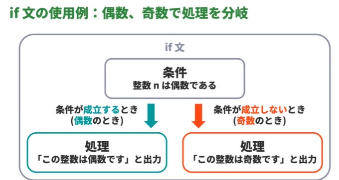
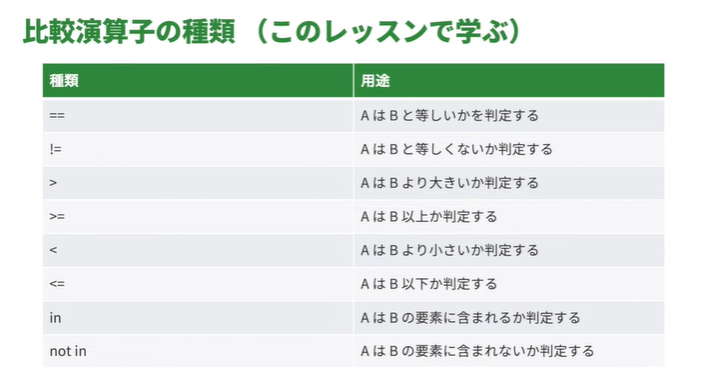
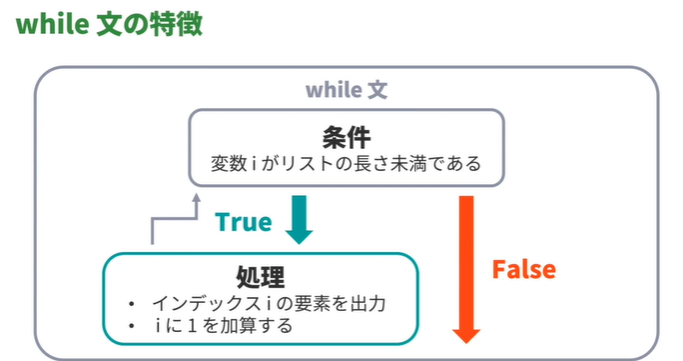

<!-- omit in toc -->
# paiza ラーニング　：　新・Python入門編 Lesson 10 ～ 15

<!-- omit in toc -->
# 目次
- [Lesson 10: 条件分岐を学習しよう](#lesson-10-条件分岐を学習しよう)
  - [01:if 文とはなにか](#01if-文とはなにか)
  - [02:if 文のルール](#02if-文のルール)
    - [if 文の書き方](#if-文の書き方)
    - [if 文を書くときの注意点](#if-文を書くときの注意点)
      - [インデントとは](#インデントとは)
  - [03:はじめての if 文](#03はじめての-if-文)
    - [if 文の書き順](#if-文の書き順)
      - [if と書く:](#if-と書く)
      - [半角スペースを空けて、条件式を書く:](#半角スペースを空けて条件式を書く)
      - [コロンを書いて改行:](#コロンを書いて改行)
      - [インデントを確認して、条件式が成立したときの処理を書く:](#インデントを確認して条件式が成立したときの処理を書く)
  - [04:else 節](#04else-節)
    - [else 節の書き方](#else-節の書き方)
  - [05:elif 節](#05elif-節)
    - [elif 節とは](#elif-節とは)
    - [elif の書き方](#elif-の書き方)
      - [elif と書く:](#elif-と書く)
      - [半角スペースを空けて、条件式を書く:](#半角スペースを空けて条件式を書く-1)
      - [コロンを書いて改行する:](#コロンを書いて改行する)
      - [インデントを確認して、処理を書く:](#インデントを確認して処理を書く)
      - [else 節の処理を修正する:](#else-節の処理を修正する)
  - [06:pass 文](#06pass-文)
    - [pass 文](#pass-文)
  - [07:if 文の正しくないインデント](#07if-文の正しくないインデント)
    - [インデントにタブと半角スペースが混在するコード](#インデントにタブと半角スペースが混在するコード)
    - [インデントに全角スペースを使っているコード](#インデントに全角スペースを使っているコード)
- [Lesson 11: ブール型を学習しよう](#lesson-11-ブール型を学習しよう)
  - [01:ブール型と条件式](#01ブール型と条件式)
    - [if 文の「条件式」のところに書くもの](#if-文の条件式のところに書くもの)
    - [ブール型とは](#ブール型とは)
    - [比較演算子とブール演算子](#比較演算子とブール演算子)
  - [02:比較演算子](#02比較演算子)
    - [比較演算子とはなにか](#比較演算子とはなにか)
  - [03:A は B と等しいかどうか(==)](#03a-は-b-と等しいかどうか)
    - [== 演算子](#-演算子)
  - [04:A は B と等しくないかどうか(!=)](#04a-は-b-と等しくないかどうか)
    - [!= 演算子](#-演算子-1)
  - [05:A は B より大きいかどうか(\>)](#05a-は-b-より大きいかどうか)
    - [「\>」 演算子](#-演算子-2)
  - [06:A は B 以上かどうか(\>=)](#06a-は-b-以上かどうか)
    - [\>= 演算子](#-演算子-3)
  - [07:A は B より小さいかどうか(\<)](#07a-は-b-より小さいかどうか)
  - [08:A は B 以下かどうか(\<=)](#08a-は-b-以下かどうか)
    - [\<= 演算子](#-演算子-4)
  - [09:A は B の要素として含まれるかどうか(in)](#09a-は-b-の要素として含まれるかどうかin)
    - [in 演算子](#in-演算子)
  - [10:A は B の要素として含まれないかどうか(not in)](#10a-は-b-の要素として含まれないかどうかnot-in)
    - [not in 演算子](#not-in-演算子)
  - [11:ブール演算子](#11ブール演算子)
    - [ブール演算子](#ブール演算子)
  - [12:A かつ B を演算(and)](#12a-かつ-b-を演算and)
    - [「かつ」とは](#かつとは)
    - [and 演算子](#and-演算子)
  - [13:A または B を演算(or)](#13a-または-b-を演算or)
    - [「または」とは](#またはとは)
    - [or 演算子](#or-演算子)
  - [14:A の否定を演算(not)](#14a-の否定を演算not)
    - [否定」とは](#否定とは)
    - [not 演算子](#not-演算子)
    - [not in 演算子との使い分け](#not-in-演算子との使い分け)
  - [15:ブール演算の優先順位](#15ブール演算の優先順位)
- [Lesson 12: while文を学習しよう](#lesson-12-while文を学習しよう)
  - [01:while 文とはなにか](#01while-文とはなにか)
  - [02:while 文の書き方](#02while-文の書き方)
  - [03:はじめての while 文](#03はじめての-while-文)
    - [while 文の書き順](#while-文の書き順)
  - [04:無限ループ](#04無限ループ)
    - [無限ループ](#無限ループ)
  - [05:ループを脱出(break)](#05ループを脱出break)
    - [ループを脱出](#ループを脱出)
    - [if 文との併用](#if-文との併用)
  - [06:処理をスキップ(continue)](#06処理をスキップcontinue)
    - [処理をスキップ](#処理をスキップ)
  - [07:while 文のなかに while 文](#07while-文のなかに-while-文)
    - [while 文のなかに while 文](#while-文のなかに-while-文)
- [Lesson 13: for文を学習しよう](#lesson-13-for文を学習しよう)
  - [01:for 文とはなにか](#01for-文とはなにか)
    - [for 文とはなにか](#for-文とはなにか)
    - [イテラブルとはなにか](#イテラブルとはなにか)
  - [02:for 文のルール](#02for-文のルール)
    - [リストを使った for 文の書き方](#リストを使った-for-文の書き方)
    - [for 文を書くときの注意点](#for-文を書くときの注意点)
  - [03:はじめての for 文](#03はじめての-for-文)
    - [for 文の書き順](#for-文の書き順)
  - [04:ループを脱出(break)](#04ループを脱出break)
    - [ループを脱出](#ループを脱出-1)
    - [f 文との併用](#f-文との併用)
  - [05:処理をスキップ(continue)](#05処理をスキップcontinue)
    - [処理をスキップ](#処理をスキップ-1)
    - [if 文との併用](#if-文との併用-1)
  - [06:for 文の中に for 文](#06for-文の中に-for-文)
    - [for 文のなかに for 文](#for-文のなかに-for-文)
    - [多重ループでの break 文や continue 文の注意点](#多重ループでの-break-文や-continue-文の注意点)
  - [07:公差 1 の等差数列を生成(range)](#07公差-1-の等差数列を生成range)
    - [range 関数](#range-関数)
    - [数列の先頭が 0 のとき](#数列の先頭が-0-のとき)
  - [08:公差 a の等差数列を生成(range)](#08公差-a-の等差数列を生成range)
    - [公差 n の等差数列](#公差-n-の等差数列)
    - [負の公差](#負の公差)
  - [09:リストやタプルのインデックスと要素の組を取得(enumerate)](#09リストやタプルのインデックスと要素の組を取得enumerate)
    - [インデックスと要素の組を取得](#インデックスと要素の組を取得)
    - [for 文とアンパック](#for-文とアンパック)
    - [※ Pythonのenumerate関数とは？使い方をわかりやすくご紹介](#-pythonのenumerate関数とは使い方をわかりやすくご紹介)
      - [enumerateを使用するメリット](#enumerateを使用するメリット)
  - [10:while 文と for 文の比較](#10while-文と-for-文の比較)
    - [while 文と for 文の比較](#while-文と-for-文の比較)
    - [while 文の特徴](#while-文の特徴)
    - [for 文の特徴](#for-文の特徴)


<br>

---

<br>


# Lesson 10: 条件分岐を学習しよう 

##  01:if 文とはなにか

if 文とは、処理を条件によって分岐させるコードのこと




## 02:if 文のルール


### if 文の書き方

if 文の書き方:

```python
if 条件式:   # 条件式は「条件」を式にしたもの
    処理 A   # 条件式が成立したときに実行される処理
else:        # ここから先は必要ない場合は書かなくて良い
    処理 B   # 条件式が成立しなかったときに実行される処理
```


### if 文を書くときの注意点

- if と条件式の間に半角スペースを空ける
- 条件式のうしろにコロンを書く
- 処理を記述する行はインデントを 1 つ多くする
- 処理のまとまりごとにインデントを揃える


#### インデントとは

- インデントとは行頭の字下げのこと
- インデントには一般的に以下の 2 つが使われる
  - タブ 1 つ
  - 半角スペース 4 つ (推奨)

> [!WARNING]
> インデントにタブと半角スペースを混在させたり、全角スペースを使ったりするとエラーの原因になる


## 03:はじめての if 文

### if 文の書き順

#### if と書く:
```python
a = 0
if
```


#### 半角スペースを空けて、条件式を書く:
```python
a = 0
if a < 10
```

a < 10 は「a が 10 未満かどうか」という条件の式


#### コロンを書いて改行:
```python
a = 0
if a < 10:
```


#### インデントを確認して、条件式が成立したときの処理を書く:
```python
a = 0
if a < 10:
    print("a は 1 桁の数です。")
```


## 04:else 節

### else 節の書き方

else と書く:
```python
a = 10
if a < 10:
    print("a は 1 桁の数です。")
else
```


コロンを書いて改行する:
```python
a = 10
if a < 10:
    print("a は 1 桁の数です。")
else:
```


インデントを確認して、すべての条件式が成立しなかったときの処理を書く:
```python
a = 10
if a < 10:
    print("a は 1 桁の数です。")
else:
    print("a は 2 桁以上の数です。")
```


なぜ「すべての」条件式なのかというと、if と else の間に複数の条件式を差し込むことができるから (次チャプターで学習する内容)

## 05:elif 節

### elif 節とは

- if 文に追加して、確かめる条件式を増やすもの
  - 自分より上に書かれている条件式がすべて成立しなかったときに、自分の条件式が成立するか確かめられる
  - つまり、ある elif 節の条件式が成立するか確かめられるときは、if 節とその elif 節より上のすべての elif 節の条件式が成立しなかったとき
- elif 節は複数個書くことができる


### elif の書き方

#### elif と書く:
```python
a = 0
if a < 10:
    print("a は 1 桁の数です。")
elif
else:
    print("a は 2 桁以上の数です。")
```


#### 半角スペースを空けて、条件式を書く:
```python
a = 0
if a < 10:
    print("a は 1 桁の数です。")
elif a < 100
else:
    print("a は 2 桁以上の数です。")
```


a < 100 は「a が 100 未満のとき」という条件の式

この elif 節の条件式は、a < 10 が成立しなかったときに成立するか確かめられる


#### コロンを書いて改行する:
```python
a = 0
if a < 10:
    print("a は 1 桁の数です。")
elif a < 100:

else:
    print("a は 2 桁以上の数です。")
```


#### インデントを確認して、処理を書く:
```python
a = 0
if a < 10:
    print("a は 1 桁の数です。")
elif a < 100:
    print("a は 2 桁の数です。")
else:
    print("a は 2 桁以上の数です。")
```


#### else 節の処理を修正する:
```python
a = 0
if a < 10:
    print("a は 1 桁の数です。")
elif a < 100:
    print("a は 2 桁の数です。")
else:
    print("a は 3 桁以上の数です。")
```


この else 節は if 文のすべての条件式が成立しなかったときに実行される

今回の場合は、a < 10 と a < 100 が成立しなかったとき


## 06:pass 文

### pass 文

pass 文は「なにもしない」ことを表す文

その節でなにも処理をしないときに書く (if 文の節の処理になにも書かないとエラーになる)

エラーになるコード:
```python
a = -10
if a < 0:  # この if 節になにも処理を書いていないためエラーになる
elif a < 10:
    print("a は 1 桁の数です。")
elif a < 100:
    print("a は 2 桁の数です。")
elif a < 1000:
    print("a は 3 桁の数です。")
else:
    print("a は 4 桁以上の数です。")
```


pass 文を用いたエラーにならないコード:
```python
a = -10
if a < 0:
    pass  # pass 文を書くことでエラーにならない
elif a < 10:
    print("a は 1 桁の数です。")
elif a < 100:
    print("a は 2 桁の数です。")
elif a < 1000:
    print("a は 3 桁の数です。")
else:
    print("a は 4 桁以上の数です。")
```


## 07:if 文の正しくないインデント

### インデントにタブと半角スペースが混在するコード

インデントにタブと半角スペースが混在しているコード

```python
# インデントにタブと半角スペースが混在するコード
# 各節の「処理中...」と出力する行のインデントにタブを使っています

a = 1
if a < 10:
    print("START: 処理 A")
	print("処理中...")
    print("END: 処理 A")
else:
    print("START: 処理 B")
	print("処理中...")
    print("END: 処理 B")
```

### インデントに全角スペースを使っているコード

```python
# インデントに全角スペースを使ったコード
# すべてのインデントが全角スペースです
a = 1
if a < 10:
　　print("START: 処理 A")
　　print("処理中...")
　　print("END: 処理 A")
else:
　　print("START: 処理 B")
　　print("処理中...")
　　print("END: 処理 B")
```


<br>

---

<br>

# Lesson 11: ブール型を学習しよう


## 01:ブール型と条件式

### if 文の「条件式」のところに書くもの

- if 文の条件式のところには、よく以下の 2 つのうちどちらかが書かれる
  - ブール型の値を得る式
  - ブール型の値が代入された変数


### ブール型とは

- ブール型とは、値が True と False の 2 つからなる型のこと
- それぞれの値は条件式において次のような意味をもつ
  - True: 条件式が成立した
  - False: 条件式が成立しなかった


### 比較演算子とブール演算子

ブール型の値を得る式を作るには、次の 2 つの演算子を使う

- 比較演算子
- ブール演算子


##  02:比較演算子

###  比較演算子とはなにか

比較演算子とは、「A は B と同じ値か」といったような比較をおこなう演算子





## 03:A は B と等しいかどうか(==)

### == 演算子

== 演算子は A == B のように使って、「A は B と等しいかどうか」を判定する演算子

整数を比較するコード:

```python
a, b, c = 9, 3, 3

print(a == b)
print(a == c)

print(a + b == c)
print(a == b * c)
print(a - b == b + c)
```


文字列を比較するコード:
```python
s, t, u = "paiza", "learning", "paiza learning"

print(s == t)
print(s + t == u)
```


## 04:A は B と等しくないかどうか(!=)

### != 演算子

!= 演算子は A != B のように使って、「A は B と違う値かどうか」を判定する演算子

整数を比較するコード:

```python
a, b, c = 5, 2, 2

print(a != b)
print(b != c)

print(a + b != c)
print(a != b * c)
print(a % b != b // c)
```


文字列を比較するコード:
```python
s, t, u = "paiza", "learning", "paiza io"

print(s != t)
print(s + t != u)
```

## 05:A は B より大きいかどうか(>)


### 「>」 演算子

「>」  演算子は `A > B` のように使って、「A は B より大きいかどうか」を判定する演算子

整数を比較するコード:
```python
a, b, c, d = 1, 2, 1, 0

print(a > b)
print(a > c)
print(a > d)

print(a * c > b * d)
```


文字列を比較するコード:
```python
print("abc" > "abd")
```
> [!TIP]
> 「辞書順に並べたときに "abc" は "abd" より大きいか、つまり辞書にしたとき "abc" は "abd" よりうしろに載るか」を判定している


## 06:A は B 以上かどうか(>=)

### >= 演算子

「>=」 演算子は A >= B のように使って、「A は B 以上かどうか」を判定する演算子

整数を比較するコード:

```python
a, b, c, d = 0, 2, 0, -1

print(a >= b)
print(a >= c)
print(a >= d)

print(a * b >= c * d)
```


## 07:A は B より小さいかどうか(<)


「<」 演算子

「<」 演算子は A < B のように使って、「A は B より小さいかどうか」を判定する演算子

整数を比較するコード:
```python
a, b, c, d = 3, 8, -9, 3

print(a < b)
print(a < c)
print(a < d)

print(a // d < b + c)
```


文字列を比較するコード:

```python
print("ijk" < "ikk")
```

> [!TIP]
> 「辞書順に並べたときに "ijk" は "ikk" より小さいか、つまり辞書にしたとき "ijk" は "ikk" より前に載るか」を判定している


## 08:A は B 以下かどうか(<=)


### <= 演算子

「<=」 演算子は A <= B のように使って、「A は B 以下かどうか」を判定する演算子

整数を比較するコード:
```python
a, b, c, d = -8, -8, -5, -9

print(a <= b)
print(a <= c)
print(a <= d)

print(a % b <= c // d)
```


文字列を比較するコード:

```python
print("stu" <= "stu")
```

> [!TIP]
> 「辞書順に並べたときに "stu" は "stu" 以下か、つまり辞書にしたとき "stu" は "stu" 以前に載るか」を判定している


## 09:A は B の要素として含まれるかどうか(in)


### in 演算子

in 演算子は A in B のように使って、「A は B の要素として含まれるかどうか」を判定する演算子

文字列について比較するコード:
```python
s = "abc"
print("a" in s)
print("p" in s)
```


リストについて比較するコード:
```python
li = [1, 2, 3]
print(1 in li)

```

## 10:A は B の要素として含まれないかどうか(not in)

### not in 演算子

not in 演算子は `A not in B` のように使って、「A は B の要素として含まれないかどうか」を判定する演算子

文字列について比較するコード:
```python
s = "abc"
print("d" not in s)
print("a" not in s)
```


リストについて比較するコード:
```python
li = [1, 2, 3]
print(1 not in li)
```

## 11:ブール演算子

### ブール演算子

- ブール演算子とは、ブール値の演算をおこなう演算子
  - 条件式の判定結果として得られるブール値について演算をおこなうことで、条件式どうしを「かつ」や「または」で結んだり、条件式の「否定」をとったりすることができる
  - ブール値の演算の結果はブール値で得ることができる

「かつ」や「または」「否定」についてはこれからのチャプターで学習する


ブール演算子の種類

| 種類 | 用途 |    
| ---- | ---- |    
| and | Aかつ Bを演算する |
| or | AまたはBを演算する |
| not | Aの否定を演算する |


## 12:A かつ B を演算(and)


### 「かつ」とは

「かつ」とは `A と B がともに True` だったときにのみ True になり、それ以外の場合は False になる演算

### and 演算子

and 演算子は「A かつ B」を演算する演算子

```python
a = 1 == 1
b = 1 >= 0
print(a and b)

c = 10 < 10
print(a and b and c)

```


## 13:A または B を演算(or)

### 「または」とは

「または」とは `A と B がともに False だったときにのみ False` になり、それ以外の場合は True になる演算


### or 演算子

or 演算子は「A または B」を演算する演算子

```python
a = 1 < 0
b = 1 >= 1
print(a or b)

c = 1 == 0
print(a or b or c)
```

> [!TIP]
> 論理がわからない時はベン図を使おう


## 14:A の否定を演算(not)

### 否定」とは

「否定」とは A が True のとき False になり、False のときは True になる演算

### not 演算子

not 演算子は「A の否定」を演算する演算子
```python
a = 0 == 0
print(a)
print(not a)
```

### not in 演算子との使い分け

not in 演算子がおこなう演算と同等の演算を、not 演算子と in 演算子を使ってもおこなうことはできる

つまり、A not in B でおこなわれる演算は not A in B でおこなわれる演算と同等

しかし、not in 演算子を使うことが推奨されている

コード:
```python
li = [1, 2, 3]
print(not 1 in li)  # 非推奨
print(1 not in li)  # 推奨
```

## 15:ブール演算の優先順位

括弧を使うことで、演算の順番を変えることができる

```python
a, b, c = 1, 2, 3
print(not a == 1 and b == 3 or c == 2)     # (=False)
print(not(a == 1 and (b == 3 or c == 2)))  # (=True)
```

<br>

---

<br>


# Lesson 12: while文を学習しよう


## 01:while 文とはなにか

  - whlie 文とは繰り返し処理をするコードの 1 つ
  - 繰り返し処理とは、同様の処理を何度もおこなう処理のこと (繰り返し処理はループ処理とも呼ばれる)
  - while 文は、条件式を使って、条件が満たされている間だけ処理を繰り返す





## 02:while 文の書き方

while 文の書き方:
```python
while 条件式:
    処理 A  # 条件式が成立する間、この処理が繰り返される
```

while 文を書くときの注意点:

  - 処理を記述する行はインデントを 1 つ多くする
  - インデントは半角スペース 4 つが推奨されている
  - 処理のまとまりごとにインデントを揃える


## 03:はじめての while 文


### while 文の書き順

while と書く:
```python
li, i = [1, 2, 3], 0
while
```

ここではリスト li のすべての要素を 1 つずつ出力する while 文を書いていく


半角スペースを 1 つ空けて、条件式を書く:
```python
li, i = [1, 2, 3], 0
while i < len(li)
```

この条件式は「変数 i の示す値がリスト li の長さ 未満 かどうか」という条件を意味している

なぜ 未満 かというと、長さ n のリストの要素のインデックスとしてあり得る整数 i は `0 <= i <= n-1` だから

また、i < 0 の場合については、変数 i を i = 0 で用意しているため、このコードにおいては考えなくてよい


コロンを書いて改行する:
```python
li, i = [1, 2, 3], 0
while i < len(li):
```

インデントに気をつけて、繰り返したい処理を書く:
```python
li, i = [1, 2, 3], 0
while i < len(li):
    print(li[i]) 
    i += 1
```

ループ処理の各周回でリスト li のインデックス i の要素を出力して、i の値を 1 大きくすることで、リスト li の要素が先頭から末尾まで 1 つずつ順に出力される


## 04:無限ループ

### 無限ループ

ループ処理が無限に続くことを「無限ループ」という

while 文では、条件式が成立する限り処理が繰り返されるため、条件式を間違えると、無限ループに陥ることがある

無限ループになるコード:
```python
a, b = 1, 1
while a > 0:
    b += a
    a += 1

print(b)
```


このコードでは、while 文の条件式 a > 0 がずっと成立するため、無限ループになる

ただし、paiza ラーニングでは、実行時間に制限が設けられているため、無限ループになる処理は途中でエラーになって終了する

## 05:ループを脱出(break)

### ループを脱出

break 文を使うと、while 文のループ処理を脱出することができる
```python
i = 1
while i < 5:
    print(f"{i} 回目")
    break
    i += 1
    print("hello")
```

### if 文との併用

break 文はよく if 文と一緒に使われる

なぜかというと、「この条件が成立したときにループ処理を終了する」といった使い方ができるから

コード:
```python
i = 1
while i < 5:
    print(f"{i} 回目")
    if i >= 2:
        break
    i += 1

print(f"i = {i} のときにループ処理が終わりました。")
```

## 06:処理をスキップ(continue)

### 処理をスキップ

continue 文を使うと、while 文によるループ処理を 1 周スキップできる
```python
i = 0
while i < 5:
    i += 1
    continue
    print(f"{i} 回目")

print(i)
```

## 07:while 文のなかに while 文


### while 文のなかに while 文

while 文のなかに while 文を書くことで、ループ処理を 2 重、3 重 ... と多重ループにすることができる
```python
i = 1
while i < 3:
    print(f"{i} 回目")

    j = 1
    while j < 3:
        print(f"{i}-{j}")
        j += 1
    
    i += 1
```


外側のループ処理の 1 周につき、内側のループ処理がすべておこなわれる


多重ループでの break 文や continue 文の注意点

break 文や、continue 文は内側のループ処理にしか影響を及ぼさない

つまり、内側のループ処理で break 文が実行されても外側のループ処理を脱出することはなく、continue 文が実行されても外側のループ処理をスキップすることはない

break 文について確認するコード:
```python
i = 1
while i < 3:
    print(f"{i} 回目")

    j = 1
    while j < 3:
        print(f"{i}-{j}")
        j += 1

        if j >= 2:
            break
    
    i += 1
```

<br>

---

<br>


# Lesson 13: for文を学習しよう

## 01:for 文とはなにか

### for 文とはなにか

  - for 文とは繰り返し処理をするコードの 1 つ
  - for 文は、イテラブルを用いて、その要素に対して処理を繰り返す

###  イテラブルとはなにか

  - リストやタプルなどの複数の値を管理できる型の値のこと


## 02:for 文のルール


### リストを使った for 文の書き方

リストを使った for 文の書き方:

```python
for 変数 in リスト:
    処理 A  # この処理が繰り返される
```

### for 文を書くときの注意点

  - 処理を記述する行はインデントを 1 つ多くする
  - インデントは半角スペース 4 つが推奨されている
  - 処理のまとまりごとにインデントを揃える


## 03:はじめての for 文


###  for 文の書き順

for と書く:
```python
li = [1, 2, 3]
for
```


リスト li のすべての要素を 1 つずつ出力する for 文を書いていく


半角スペースを 1 つ空けて、変数を書く:
```python
li = [1, 2, 3]
for a
```


半角スペースを 1 つ空けて、in を書く:
```python
li = [1, 2, 3]
for a in
```


半角スペースを 1 つ空けて、リスト、またはリストが代入された変数を書く:
```python
li = [1, 2, 3]
for a in li
```


ここに書くリストの要素が先頭から順に変数に代入される


コロンを書いて、改行する:
```python
li = [1, 2, 3]
for a in li:
```


インデントに気をつけて、繰り返したい処理を書く:
```python
li = [1, 2, 3]
for a in li:
    print(a)
```


## 04:ループを脱出(break)

### ループを脱出

break 文を使うと、for 文のループ処理を脱出することができる
```python
li = [1, 2, 3]
for a in li:
    print(a)
    break
```


### f 文との併用

break 文はよく if 文と一緒に使われる

なぜかというと、「この条件が成立したときにループ処理を終了する」といった使い方ができるから

コード:
```python
li = [1, 2, 3]
for a in li:
    if a == 2:
        break

    print(a)
```

この for 文の繰り返し処理は、変数 a の示す値が 2 であるとき終了される

## 05:処理をスキップ(continue)


### 処理をスキップ

continue 文を使うと、for 文によるループ処理を 1 周スキップできる
```python
li = [1, 2, 3]
for a in li:
    print(a)
    continue
    print("スキップされる")
```

###  if 文との併用

continue 文は if 文と一緒によく使われる

なぜかというと、「この条件が成立したときに処理をスキップする」といった使い方ができるから

コード:
```python
li = [1, 2, 3]
for a in li:
    if a % 2 == 1:
        continue

    print(a)
```


この for 文の繰り返し処理は、変数 a の示す値が偶数のとき、途中でスキップされ、print(a) が実行されず、それ以外のとき、つまり変数 a の示す値が奇数のときは print(a) が実行される


## 06:for 文の中に for 文

### for 文のなかに for 文

for 文のなかに for 文を書くことで、ループ処理を 2 重、3 重 ... と多重ループにすることができる
```python
li_1, li_2 = [1, 2, 3], ["a", "b", "c"]
for i in li_1:
    print(f"{i} 回目")
    for j in li_2:
        print(f"{i}-{j}")
```


外側のループ処理の 1 周につき、内側のループ処理がすべておこなわれる

### 多重ループでの break 文や continue 文の注意点

break 文や、continue 文は最も近いループ処理にしか影響を及ぼさない

つまり、内側のループ処理で break 文が実行されても外側のループ処理を脱出することはなく、continue 文が実行されても外側のループ処理をスキップすることはない

break 文について確認するコード:
```python
a, b = [1, 2, 3], ["a", "b", "c"]
for i in a:
    print(f"{i} 回目")
    for j in b:
        if j == "b":
            break

        print(f"{i}-{j}")
```


## 07:公差 1 の等差数列を生成(range)


### range 関数

range(1, 6) のように range 関数を使うと、1 から 5 まで、公差 1 の等差数列を簡単に扱うことができる

range 関数によって得られる数列はイテラブルなため、for 文に使うことができる

コード:
```python
r = range(1, 6)
for i in r:
    print(i)
```

### 数列の先頭が 0 のとき

数列の先頭が 0 のとき、range 関数で 1 番目に指定する数を省略できる

たとえば、数列 0, 1, 2 を得たいとき、range(3) で取得できる

コード:
```python
r = range(3)
for i in r:
    print(i)
```


## 08:公差 a の等差数列を生成(range)

### 公差 n の等差数列

`range(1, 7, 2)` のように range 関数を使うと、等差数列の公差を 2 に変更することができる
```python
for i in range(1, 7, 2):
    print(i)
```


指定された範囲 (今回は `1 <= i <= 7`) を超えないように数列が作られる

### 負の公差

負の数も公差に指定することができる (下のコードは公差を -2 にしている)
```python
for i in range(7, 1, -2):
    print(i)
```


## 09:リストやタプルのインデックスと要素の組を取得(enumerate)


### インデックスと要素の組を取得

enumerate(li) のように enumerate 関数を使うと、リスト li のインデックスと、そのインデックスに対応する要素の組を取得できる

enumerate 関数は、リストのインデックスと要素の組だけでなく、タプルなどイテラブル全般のインデックスと要素の組を取得できる

取得できる値は、(インデックス, 要素) の組を表すタプルを、イテラブルの長さ分もった値

コード:
```python
li = ["apple", "banana", "melon"]
e = enumerate(li)
for t in e:
    print(t)
```


### for 文とアンパック

for 文において、リストなど、イテラブルの各要素を変数に代入するとき、アンパックすることができる
```python
for i, a in enumerate(li):
    print(i, a)
```


演習の回答 : 

```python
li = ["paiza", "kirishima", "python"]

# ここから下の行を足してください
e = enumerate(li)

for i, t in e:
    print(f"{i} {t}")    
```


### ※ Pythonのenumerate関数とは？使い方をわかりやすくご紹介

https://www.rstone-jp.com/column/144703/

Pythonのenumerate関数は、リストやタプルなどの反復可能なオブジェクトの要素に、連番（インデックス）を付与して取得できる便利な関数です。

配列の要素を処理する際に、要素の値だけでなくインデックス番号も同時に必要になることがあります。enumerate関数を使用すると、インデックス番号と要素を1つの処理でまとめて取得できます。

例えば以下のようなコードで利用できます。
```python
fruits = [‘りんご’, ‘みかん’, ‘白桃’]

for index, fruit in enumerate(fruits):

    print(f’{index}番目: {fruit}‘)  # インデックスと要素を同時に出力
```


#### enumerateを使用するメリット

enumerate関数には3つのメリットがあります。

- 1つ目は、コードがシンプルになることです。通常、インデックスを管理する変数を別途用意する必要がありますが、enumerateを使えば、1行でインデックスと要素を取得できます。

- 2つ目は、バグの防止です。手動でインデックスを管理すると、初期化忘れやカウントアップのミスが発生する可能性もありますが、enumerateを使えばミスを防げます。

- 3つ目は、可読性の向上です。enumerate関数を使うと、「インデックス付きで要素を処理している」プログラムの意図が明確になり、コードの保守性も高まります。


## 10:while 文と for 文の比較


### while 文と for 文の比較

- while 文と for 文は以下のように使い分けると良い
  - while 文: 繰り返す回数を柔軟に決めたいとき
  - for 文: 繰り返す回数が明確に決まっているとき


### while 文の特徴

ループの冒頭に条件式によって「繰り返し処理を続けるかどうか」判定をおこなうため、「`繰り返す回数はわからないが、繰り返し処理を終了する条件はわかっている`」ときに有用

たとえば、`1 + 2 + 3 + ...` と順に整数を足していったとき、何回目ではじめて 10000 を超えるか、を調べたいときなど

```python

i = 1
sum = 0

while sum < 10001:
    sum += i
    print(i, sum)
    i += 1

```


###  for 文の特徴

- break 文などの例外もあるが、for 文は in (イン) のうしろに書かれる値によってあらかじめ繰り返す回数が決められる
- また、リストなどの要素を先頭から順に取得することが簡単にできる
- これらのことから、`繰り返す回数が明確に決まっている`ときに for 文は有用
- たとえば、リストのすべての要素を出力したり、range 関数を使って 100 回同じことをしたいときなど


<br>

---

<br>


【EOF】


[←　README](../README.md)


