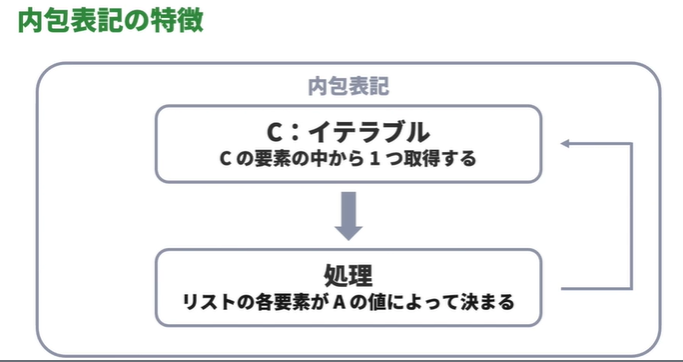
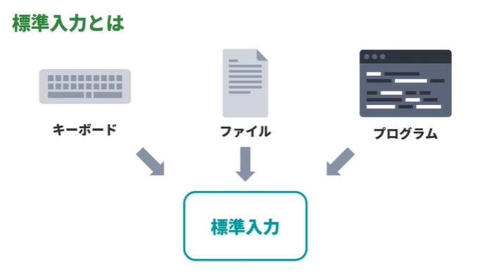
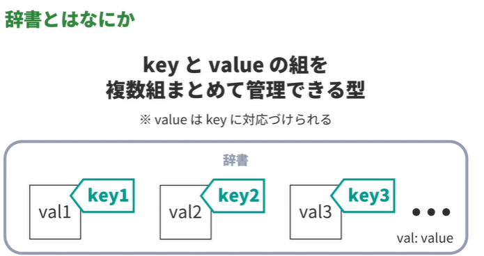
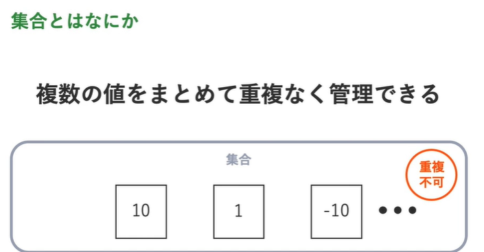
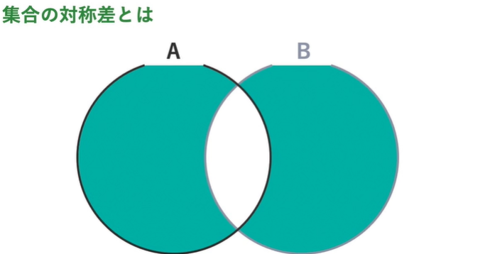
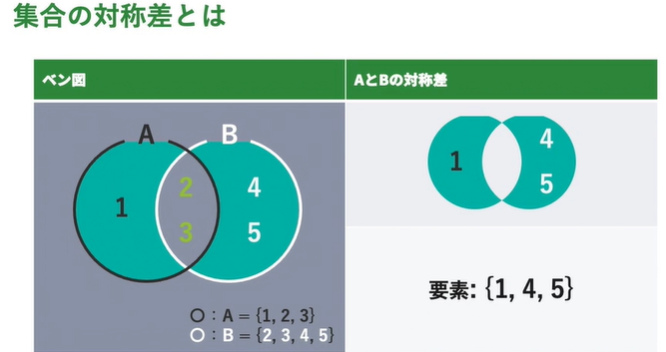

<!-- omit in toc -->
# paiza ラーニング　：　新・Python入門編 Lesson 14 ～ 17

<!-- omit in toc -->
# 目次
- [Lesson 14: リスト内包表記を学習しよう](#lesson-14-リスト内包表記を学習しよう)
  - [01:内包表記とはなにか](#01内包表記とはなにか)
  - [02:内包表記のルール](#02内包表記のルール)
    - [内包表記のルール](#内包表記のルール)
  - [03:内包表記でリストを生成](#03内包表記でリストを生成)
    - [内包表記でリストを生成するときの書き順](#内包表記でリストを生成するときの書き順)
  - [04:演算が用いられた内包表記](#04演算が用いられた内包表記)
    - [演算式と内包表記](#演算式と内包表記)
      - [演習の答え](#演習の答え)
  - [05:if が組み合わせられた内包表記](#05if-が組み合わせられた内包表記)
    - [演習の答え](#演習の答え-1)
- [Lesson 15: 標準入力を理解しよう](#lesson-15-標準入力を理解しよう)
  - [01:標準入力とは](#01標準入力とは)
    - [標準入力とはなにか](#標準入力とはなにか)
    - [なぜ標準入力が必要か](#なぜ標準入力が必要か)
  - [02:input で入力値を受け取る](#02input-で入力値を受け取る)
    - [input 関数](#input-関数)
  - [03:入力値を整数値に変換](#03入力値を整数値に変換)
    - [入力値を整数として扱う](#入力値を整数として扱う)
  - [04:複数列の入力値をリストに変換](#04複数列の入力値をリストに変換)
    - [入力値をリストに変換](#入力値をリストに変換)
    - [演習の答え](#演習の答え-2)
  - [05:複数列の入力値から整数のリストを生成](#05複数列の入力値から整数のリストを生成)
    - [入力値を整数値のリストに変換](#入力値を整数値のリストに変換)
      - [演習の答え](#演習の答え-3)
  - [06:複数列の入力値から内包表記で整数のリストを生成](#06複数列の入力値から内包表記で整数のリストを生成)
    - [内包表記を用いて入力値を、各要素が整数値のリストに変換する](#内包表記を用いて入力値を各要素が整数値のリストに変換する)
      - [演習の答え](#演習の答え-4)
  - [07:複数列の入力値を map 関数でそれぞれ整数値に変換](#07複数列の入力値を-map-関数でそれぞれ整数値に変換)
    - [map 関数 + list 関数](#map-関数--list-関数)
  - [08:複数行の入力値から整数のリストを生成](#08複数行の入力値から整数のリストを生成)
    - [複数行の入力をリストで受ける](#複数行の入力をリストで受ける)
    - [※ Python シーケンスまとめ①](#-python-シーケンスまとめ)
      - [演習](#演習)
  - [09:複数行の入力値から内包表記で整数のリストを生成](#09複数行の入力値から内包表記で整数のリストを生成)
    - [変数 \_](#変数-_)
      - [演習](#演習-1)
  - [10:複数行、複数列の入力値を受け取る](#10複数行複数列の入力値を受け取る)
    - [複数行、複数列の入力値を受け取る](#複数行複数列の入力値を受け取る)
      - [演習](#演習-2)
  - [11:複数行、複数列の入力値を内包表記で受け取る](#11複数行複数列の入力値を内包表記で受け取る)
    - [演習](#演習-3)
- [Lesson 16: 辞書を学習しよう](#lesson-16-辞書を学習しよう)
  - [01:辞書とはなにか](#01辞書とはなにか)
    - [辞書とはなにか](#辞書とはなにか)
  - [02:辞書を生成](#02辞書を生成)
    - [辞書を生成する方法](#辞書を生成する方法)
  - [03:key を指定して value を取得](#03key-を指定して-value-を取得)
    - [key を指定して、value を取得する方法](#key-を指定してvalue-を取得する方法)
      - [演習](#演習-4)
  - [04:辞書の key にできる型](#04辞書の-key-にできる型)
    - [辞書の key にできる値には制限がある](#辞書の-key-にできる値には制限がある)
    - [生成後に値が変わるか、変わらないか](#生成後に値が変わるか変わらないか)
    - [タプルとリストを引数にした場合](#タプルとリストを引数にした場合)
  - [05:辞書の長さを取得(len)](#05辞書の長さを取得len)
    - [辞書の長さとは](#辞書の長さとは)
    - [辞書の長さを取得する方法](#辞書の長さを取得する方法)
  - [06:辞書での要素の追加・更新](#06辞書での要素の追加更新)
    - [辞書に要素を追加](#辞書に要素を追加)
    - [辞書の要素を更新](#辞書の要素を更新)
      - [演習](#演習-5)
  - [07:辞書の要素を削除(del)](#07辞書の要素を削除del)
    - [辞書の要素を削除](#辞書の要素を削除)
  - [08:辞書の key をすべて取得(key)](#08辞書の-key-をすべて取得key)
    - [辞書の key をすべて取得](#辞書の-key-をすべて取得)
      - [演習](#演習-6)
  - [09:辞書の value をすべて取得(values)](#09辞書の-value-をすべて取得values)
    - [辞書の value すべてを取得](#辞書の-value-すべてを取得)
    - [演習](#演習-7)
  - [10:辞書の key と value の組をすべて取得(items)](#10辞書の-key-と-value-の組をすべて取得items)
    - [辞書の key と value の組をすべて取得](#辞書の-key-と-value-の組をすべて取得)
      - [演習](#演習-8)
  - [11:辞書の key として含まれるか(in)](#11辞書の-key-として含まれるかin)
    - [辞書の key として含まれるか](#辞書の-key-として含まれるか)
      - [課題](#課題)
  - [12:辞書の key をソート(sorted)](#12辞書の-key-をソートsorted)
    - [辞書の key をソート](#辞書の-key-をソート)
      - [演習](#演習-9)
  - [13:内包表記で辞書を生成](#13内包表記で辞書を生成)
    - [辞書を内包表記で生成](#辞書を内包表記で生成)
      - [演習](#演習-10)
- [Lesson 17: 集合を学習しよう](#lesson-17-集合を学習しよう)
  - [集合とはなにか](#集合とはなにか)
  - [02:集合を生成](#02集合を生成)
    - [集合を生成](#集合を生成)
    - [set() のように set 関数を使うことで、空の集合を生成することができる](#set-のように-set-関数を使うことで空の集合を生成することができる)
    - [Pythonのset(集合)の表示順序について](#pythonのset集合の表示順序について)
  - [03:集合の要素にできる型](#03集合の要素にできる型)
    - [集合の要素にできる値には制限がある](#集合の要素にできる値には制限がある)
  - [04:集合の長さを取得(len)](#04集合の長さを取得len)
    - [集合の長さとは](#集合の長さとは)
  - [05:集合に要素を追加(add)](#05集合に要素を追加add)
    - [集合に要素を追加](#集合に要素を追加)
  - [06:集合の要素を削除(remove)](#06集合の要素を削除remove)
    - [辞書の要素を削除](#辞書の要素を削除-1)
  - [07:集合の要素として含まれるか(in)](#07集合の要素として含まれるかin)
    - [集合の要素として含まれるか](#集合の要素として含まれるか)
  - [08:集合の和(|)](#08集合の和)
    - [| 演算子](#-演算子)
  - [09:集合の積(\&)](#09集合の積)
    - [集合の積とは](#集合の積とは)
    - [\& 演算子](#-演算子-1)
  - [10:集合の差(-)](#10集合の差-)
    - [集合の差とは](#集合の差とは)
    - [演算子](#演算子)
  - [11:集合の対称差(^)](#11集合の対称差)
    - [集合の対称差とは](#集合の対称差とは)
    - [^ 演算子](#-演算子-2)
    - [^= 演算子](#-演算子-3)
  - [12:A と B は一致するかどうか(==)](#12a-と-b-は一致するかどうか)
    - [集合 A と集合 B が一致するとは](#集合-a-と集合-b-が一致するとは)
    - [== 演算子](#-演算子-4)
    - [!= 演算子](#-演算子-5)
  - [13:A は B に含まれるかどうか(\<=)](#13a-は-b-に含まれるかどうか)
    - [集合 A が集合 B に含まれるとは](#集合-a-が集合-b-に含まれるとは)
    - [\<= 演算子](#-演算子-6)
    - [\< 演算子](#-演算子-7)
  - [14:A は B を含むかどうか(\>=)](#14a-は-b-を含むかどうか)
    - [集合 A が集合 B を含むとは](#集合-a-が集合-b-を含むとは)
    - [\>= 演算子](#-演算子-8)
    - [\> 演算子](#-演算子-9)
  - [15:内包表記で集合を生成](#15内包表記で集合を生成)
    - [集合を内包表記で生成する書き方](#集合を内包表記で生成する書き方)


<br>

---

<br>


# Lesson 14: リスト内包表記を学習しよう

## 01:内包表記とはなにか

- 内包表記とは、リストなどを生成するときの書き方
- 内包表記を使うと、リストの角括弧のなかなどに for を埋め込んで要素を指定することができる

たとえば、内包表記を使うと、0 から 99 までの整数を要素にもつリストを簡潔に生成することができる

内包表記を使わない例:
```python
li = [0] * 100
for i in range(100):
    li[i] = i
```


内包表記を使う例:
```python
li = [i for i in range(100)]
```


## 02:内包表記のルール

### 内包表記のルール

リストを内包表記によって生成するコード:

```python
li = [A for B in C]
```

  - A:値…リストの要素になる
  - B:変数…Cの各要素を受ける
  - C:イテラブル(リスト、タプルなど)





## 03:内包表記でリストを生成


### 内包表記でリストを生成するときの書き順

普段リストを生成するときと同じように角括弧を書く:
```python
# a = [0] * 100
# for i in range(100):
#     a[i] = i

# リスト a と同等のリスト b を作る
b = []
```

リスト b の各要素になる値を書く:
```python
# a = [0] * 100
# for i in range(100):
#     a[i] = i

# リスト a と同等のリスト b を作る
b = [x]
```


for を埋め込む:
```python
# a = [0] * 100
# for i in range(100):
#     a[i] = i

# リスト a と同等のリスト b を作る
b = [x for x in range(100)]
```


## 04:演算が用いられた内包表記


### 演算式と内包表記

内包表記では、リストの要素が決まるところに、演算式を書くことができる
```python
a = [x * 3 for x in range(5)]
print(a)
```

#### 演習の答え

```python
a = [0, 30, 7, 813, 43]

# 以下のコードを修正してください
b = [x*4 for x in a]

print(b)


a = [0, 30, 7, 813, 43]

# 以下のコードを修正してください
b = [str(x) for x in a]

print(b)


```


## 05:if が組み合わせられた内包表記

if が組み合わせられた内包表記

内包表記では、if を組み合わせることで、リストの各要素が満たしているべき条件を指定することができる

```python
# 1 ~ 100 の整数のうち、11 の倍数のみを要素にもつリストを生成
b = [x for x in range(1, 101) if x % 11 == 0]  
print(b)
```


### 演習の答え
```python

a = [x for x in range(100) if x % 13 == 0]

print(a)

```


<br>

---

<br>

# Lesson 15: 標準入力を理解しよう

## 01:標準入力とは



###  標準入力とはなにか

  - 標準入力とは、プログラムに外部からデータを渡す際に使われる場所
  - 標準入力に渡されたデータはプログラム側で適切なコードを記述することで、プログラム内で値として使うことができる


### なぜ標準入力が必要か

- 標準入力のおかげで、プログラムを実装する人が実装作業に集中できたり、プログラムの汎用性が高まったりするから
- 外部からデータを渡す際にはさまざまなケースが考えられる
  - キーボードからの入力
  - ファイルを渡す
  - 他のプログラムの出力 など...


- プログラム側が、それぞれのケースに対して入力の仕組みを設けることは大変
- そこで、次のような仕組みが作られた
  - データを渡す側: ケースによらず、「標準入力」と呼ばれる共通の場所にデータを渡す
  - データを受け取る側のプログラムは、「標準入力」だけからデータを取り出す
- このように「標準入力」を間に挟むことで、プログラム側での入力方法を一本化してシンプルにすることができる


## 02:input で入力値を受け取る


### input 関数

- Python では、input 関数を使うことで、標準入力から入力を受け取ることができる
- この際、次のように受け取る
  - 文字列型の値として受け取る
  - 受け取る単位は、標準入力 1 行分

コード:
```python
s = input()
print(s)
```


## 03:入力値を整数値に変換

### 入力値を整数として扱う

`int(input())` のようにして、`input 関数`と `int 関数`と併用することで、入力値を整数値として扱うことができる

```python
n = int(input())
print(n)
```


たとえば、2 つの入力値を整数に変換して、その和を求めるコードは次のように書く
```python

n = int(input())
m = int(input())

print(f"n + m = {n + m}")
```


## 04:複数列の入力値をリストに変換


### 入力値をリストに変換

入力値をリストに変換する方法として、次の 2 つの方法が挙げられる
  - list 関数を使う
  - split メソッドを使う


【 list 関数を使う 】

コード:
```python
a = list(input())   # input = "paiza"  => output = ['p', 'a', 'i', 'z', 'a']
print(a)
```


このようなコードを書くと、受け取った文字列の各文字が要素になっているリストを得ることができる


【 split メソッドを使う 】

コード:
```python
b = input().split(",")   # input = "dog,cat,fish"  => output = ['dog', 'cat', 'fish']
print(b)
```


このようなコードを書くと、受け取った文字列を、任意の文字列で区切って、各文字列を要素にしたリストを得ることができる


### 演習の答え

```python 
li = input().split(' ')

print(li)

```

## 05:複数列の入力値から整数のリストを生成


### 入力値を整数値のリストに変換

input 関数と int 関数と for 文を使うことで、半角スペース区切りで複数の数字がある文字列を整数値のリストに変換できる

```python 
li = []  # このリストに切り出した整数を追加していく
a = input().split()  # 入力値を空白文字で区切って、リストを生成する

for x in a:
    li.append(int(x))  # 各文字列を整数に変換して、リスト li に追加する

print(li)

# 結果：   input = 1 12 123, output = [1, 12, 123]

```


#### 演習の答え

```python
li = []
a = input().split()

# ここから下の行を足してください
for x in a:
    li.append(float(x))

print(li)
```


## 06:複数列の入力値から内包表記で整数のリストを生成


### 内包表記を用いて入力値を、各要素が整数値のリストに変換する

次のコードを内包表記のものに書き換えることができる
```python
li = []
for x in input().split():
    li.append(int(x))

print(li)   # input: 1 12 123 => output: [1, 12, 123]
```


内包表記に書き換えたコード:

```python
li = [int(x) for x in input().split()]
print(li)   # input: 1 12 123 => output: [1, 12, 123]
```

#### 演習の答え
```python
li = [float(x) for x in input().split()]

print(li)
```


## 07:複数列の入力値を map 関数でそれぞれ整数値に変換

map 関数を使うと、指定した関数をイテラブルの各要素に使ったときに得られる値を要素にもつ map 型の値を取得できる
```python
a = map(int, ["1", "2", "3"])
print(a)
```


### map 関数 + list 関数

map 関数を使ったときに得られる map 型の値に list 関数を使うと、リスト型に変換した値を取得できる
```python
a = list(map(int, ["1", "2", "3"]))
print(a)
```


次のコードのように書くことで、1 2 3 のような入力値を整数値のリストとして扱うことができる
```python
a = list(map(int, input().split()))
print(a)

#   input: 1 12 123 => output: [1, 12, 123]

```

備考
  1. `input().split()`: 入力値を空白文字で区切ってリストを生成する
  2. `map(int, ...)`: 1. で生成されたリストの各要素に int 関数を使ったときに得られる整数値を要素にもつ map 型の値を生成する
  3. `list(...)`: 2. で生成された map 型の値をリストに変換したときの値を生成する

```python

li = list(map(float, input().split())) 

print(li)

```

## 08:複数行の入力値から整数のリストを生成

### 複数行の入力をリストで受ける

何行の入力があるかがわかるとき、for 文を使うと、入力を簡単に受けることができる

たとえば、入力が次のような形式にしたがっているとする

```bash
3     # 1 行目で、2 行目以降に何行の入力があるかが入力される (今回は 3 行)
1     # 2 行目から 1 行目に受け取った値の行数分だけ入力される
12    # ...
123   # ...

# 結果：[1, 12, 123]
```


このとき、2 行目から先の行の入力値をリストで受けるコードとしては、次のようなコードがある

```python
n = int(input())  # これよりうしろに n 行の入力がある
li = [0] * n  # このリストで入力を受ける
for i in range(n):
    li[i] = int(input())

print(li)
```

今回想定した形式にしたがっている入力なら、100 行でも 1000 行でも受けることができる


### ※ Python シーケンスまとめ①

- https://qiita.com/Integral-07/items/89eb41d22b3f1f9ed128


> [!IMPORTANT]
> シーケンスの初期化<br><br>
> 空リストは `[ ]` で表し, `n個`の要素数を確保したければ `[0]*n` とすると0がn個入ったリストが得られる。<br>
> この場合要素は`0`だが, 具体的な値の入っていないリストを作るには `None` を用いる。<br>
> 例えば、 `[None]*n`とすると`0`が`n`個入ったリストが得られる.


#### 演習

```python
n = int(input())
li = [0]*n

for x in range(n):
    li[x] = int(input()) 

print(li)

```


## 09:複数行の入力値から内包表記で整数のリストを生成

複数行の入力を内包表記を使って受ける

内包表記を使うことで、次のような入力を簡潔に受けることができる

```bash
3        # 1 行目で、2 行目以降に何行の入力があるかが入力される (今回は 3 行)
1        # 2 行目から 1 行目に受け取った値の行数分だけ入力される
12       # ...
123      # ...
```


上記のような入力を内包表記を使って受けるコード:
```python
n = int(input())
li = [int(input()) for _ in range(n)]
print(li)
```

また、変数 n を受け取る処理も内包表記の処理に含めることで、次のようにも書くことができる
```python
li = [int(input()) for _ in range(int(input()))]
print(li)    # [1, 12, 123]
```

内包表記の処理の際、最初に `int(input())` が `1 度`だけ処理されることに注意


###  変数 _

  - `「文法上必要だが、使わない」`変数の名前
  - 決まり事ではなく慣習
  - アンダーバーは「`使わない`」ことを意味するため、`_ = 1` のように代入して使うことなどは`推奨されていない`


#### 演習

```python
n = int(input())
li = [int(input()) for _ in range(n)]
print(li)
```


## 10:複数行、複数列の入力値を受け取る


### 複数行、複数列の入力値を受け取る

for 文を使うと、複数行、複数列の入力を簡単に受けることができる

たとえば、入力が次のような形式にしたがっているとする
```bash
3              # 1 行目: 2 行目以降に入力が何行あるか
1 2 3 4        # 2 行目以降: 列の数が同じ値が、1 行目に受け取った値の行数分だけ入力される
5 6 7 8        # ...
9 10 11 12     # ... 
```


このような入力を for 文を用いて受けるコードとして、次のコードが挙げられる
```python
n = int(input())
li = [0] * n
for i in range(n):
    a = []
    for x in input().split():
        a.append(int(x))

    li[i] = a

print(li)
```

今回例示した形式にしたがっている入力なら、100 行でも 1000 行でも上のコードで受けることができる


#### 演習

```python

n = int(input())
li = [0]*n

for i in range(n):
    a = []
    for x in input().split():
        a.append(x)

    li[i] = a

print(li)

```

## 11:複数行、複数列の入力値を内包表記で受け取る


```python


# BEFORE
n = int(input())
li = [0]*n

for i in range(n):
    a = []
    for x in input().split():
        a.append(x)

    li[i] = a

print(li)


# AFTER
n = int(input())
li = [0]*n
li = [[int(x) for x in input().split()] for _ in range(n) ]
print(li)

```

### 演習

```python
n = int(input())
li = [0] * n

li = [[str(x) for x in input().split()] for _ in range(n)]

print(li)

```

<br>

---

<br>

# Lesson 16: 辞書を学習しよう

## 01:辞書とはなにか

### 辞書とはなにか

- 辞書とは、2 つの値の組を複数組まとめて管理できる型
- 2 つの値は次の通り
  - key
  - key に対応づけられた value
- 辞書と key を指定することで、key と組になっている value を特定できる
- key で value を検索するため、キーを重複させることはできない
- 辞書で管理する key と value の組のことを「辞書の要素」という
- 辞書で管理できる要素の数は可変で、好きなだけ要素を追加できる





## 02:辞書を生成

### 辞書を生成する方法

`{"apple": 150, "banana": 150, "melon": 2000}` のように書くことで、辞書を生成することができる

```python
dc = {"apple": 150, "banana": 150, "melon": 2000}
print(dc)
```


`{}` のように書くと、空の辞書が生成される
```python
empty = {}
print(empty)
```

> [!WARNING]
> 辞書の要素の順序 <br>
>     Python のバージョンが 3.7.0 未満の場合は、辞書の要素の順序が保証されない


## 03:key を指定して value を取得

### key を指定して、value を取得する方法

dc[k] のように書くと、辞書 dc で、key k に対応づけられている value を取得できる
```python
dc = {"apple": 150, "banana": 150, "melon": 2000}
print(dc["apple"])
```


辞書 dc の key に k がないとき、エラーが発生する
```python
dc = {"apple": 150, "banana": 150, "melon": 2000}
print(dc["orange"])
```

#### 演習
```python
i = str(input())
character = {"name": "kirishima", "age": 18, "pc": "margaret"}
print(character[i])
```


## 04:辞書の key にできる型

### 辞書の key にできる値には制限がある

- 辞書の key にできる型の例
  - 文字列
  - タプル
  - 整数
  - 浮動小数点数
  - 数列

- 辞書の key にできない型の例
  - リスト
  - 辞書


### 生成後に値が変わるか、変わらないか

- リストは、生成したあとに値を変えることができる

```python
li = [1, 2, 3]
li.append(4)
print(li)
```


- 文字列を生成したあとに、その値を変えることができない

```python
s, t = "abc", "def"
u = s + t
print(s, t, u)
```

### タプルとリストを引数にした場合

```python

print({(1,2): "ab", (3,4): "cd"})    # OK 
print({[1,2]: "ab", [3,4]: "cd"})    # NG

```


詳しくは、[イミュータブルとイミュータブルについて](./paiza_lesson23-25.md)のレッスンで学習する


## 05:辞書の長さを取得(len)

### 辞書の長さとは

「辞書の長さ」とは、「辞書の要素数」のこと


### 辞書の長さを取得する方法

`len(dc)` のように `len 関数`を使うと、辞書 `dc` の長さを取得できる
```python
dc = {"apple": 150, "banana": 150, "melon": 2000}
print(len(dc))
```


## 06:辞書での要素の追加・更新


### 辞書に要素を追加

`dc[k] = v` のように書くと、辞書 `dc` の `key` が `k` の `value` として `v` を追加することができる

```python
dc = {"apple": 150, "banana": 150, "melon": 2000}
dc["orange"] = 130
print(dc)
```

###  辞書の要素を更新

`dc[k] = v` のように書くと、辞書 `dc` の `key` が `k` の `value` を `v` に更新することができる

```python
dc = {"apple": 150, "banana": 150, "melon": 2000}
dc["apple"] = 200
print(dc)
```

#### 演習

```python
character = {"name": "kirishima", "age": 18, "pc": "margaret"}
k, v = input().split()

character[k] = v

print(character)
```


## 07:辞書の要素を削除(del)


###  辞書の要素を削除

`del dc[k]` のように `del` 文を使うと、辞書 `dc` の `key` が `k` である要素を削除することができる

```python
dc = {"apple": 150, "banana": 150, "melon": 2000}
del dc["apple"]
print(dc)
```

## 08:辞書の key をすべて取得(key)

### 辞書の key をすべて取得

`dc.keys()` のように辞書の `keys` メソッドを使うと、辞書 `dc` のすべての `key` を取得できる

```python
dc = {"alice": 162, "bob": 178, "carol": 155}
for key in dc.keys():
    print(key, dc[key])
```

#### 演習

```python
character = {"name": "kirishima", "age": 18, "pc": "margaret"}

dict_keys = character.keys()


print(dict_keys) # output: dict_keys(['name', 'age', 'pc'])

```


## 09:辞書の value をすべて取得(values)

###  辞書の value すべてを取得

`dc.values()` のように辞書の `values メソッド`を使うと、辞書 `dc` のすべての `value` を取得できる

```python
dc = {"alice": 162, "bob": 178, "carol": 155}
for value in dc.values():
    print(value)
```

### 演習

```python
character = {"name": "kirishima", "age": 18, "pc": "margaret"}
print(character.values())   # output: dict_values(['kirishima', 18, 'margaret'])
```


## 10:辞書の key と value の組をすべて取得(items)


### 辞書の key と value の組をすべて取得

`dc.items()` のように辞書の `items メソッド`を使うと、辞書 `dc` のすべての `key` と `value` の組を取得できる
```python
dc = {"alice": 162, "bob": 178, "carol": 155}
for key, value in dc.items():
    print(key, value)
```

#### 演習

```python
character = {"name": "kirishima", "age": 18, "pc": "margaret"}
print(character.items())

# dict_items([('name', 'kirishima'), ('age', 18), ('pc', 'margaret')])

```


## 11:辞書の key として含まれるか(in)

### 辞書の key として含まれるか
`s in dc` のように `in 演算子`を使うと、値`s`が辞書`dc`の`key`として含まれるか判定することができる

```python
dc = {"alice": 162, "bob": 178, "carol": 155}
print("bob" in dc)      # output: True
print("dave" in dc)     # output: False
```


#### 課題

```python

character = {"name": "kirishima", "age": 18, "pc": "margaret"}
k = input()

print(k in character)   # output: True

```

## 12:辞書の key をソート(sorted)

### 辞書の key をソート

`sorted(dc)`のように`sorted`関数を使うと、辞書`dc`の`key`をソートすることができる

```python
dc = {"orange": 130, "banana": 150, "apple": 150, "melon": 2000}
print(sorted(dc))    # output: ['apple', 'banana', 'melon', 'orange']
```


#### 演習

```python
character = {"name": "kirishima", "age": 18, "pc": "margaret"}
print(sorted(character))   # output: ['age', 'name', 'pc']

```


## 13:内包表記で辞書を生成

### 辞書を内包表記で生成

- 辞書を内包表記によって生成するコード:

```python
dc = {K: V for X in Y}
# K: 0 などの明示的な値や変数、または式 ･･･ 辞書 dc の key になる
# V: 0 などの明示的な値や変数、または式 ･･･ K で指定する key に対応する value になる
# X: 変数 ･･･ C の各要素を受ける
# Y: イテラブル (リストやタプルなど)
```


- 次のコードの辞書 a と辞書 b は同等

```python
a = {}
for i in range(10):
    a[i] = i * 2

print(a)

b = {x: x*2 for x in range(10)}
print(b)
```


#### 演習

```python
n = int(input())
d = {x: x*3 for x in range(n) }
print(d)   # output: {0: 0, 1: 3, 2: 6, 3: 9, 4: 12,...}
```


<br>

---

<br>


# Lesson 17: 集合を学習しよう

##  集合とはなにか

  - Python の集合とは、複数の値をまとめて重複なく管理できる型のこと
  - 数学の集合を表現したもの
  - 集合で管理する値のことを「集合の要素」という
  - 集合で管理できる要素の数は可変で、好きなだけ要素を追加できる





## 02:集合を生成


### 集合を生成

`st = {1, 2, 3}` のように書くと、集合を生成することができる

```python
st = {1, 2, 3}
print(st)       # {1, 2, 3}
```


集合生成時に値を重複させていた場合、重複は除去される
```python
print({1, 2, 2, 3, 1})    # {1, 2, 3}


fruits = {"apple", "banana", "orange"}
print(fruits)  # 

```


### set() のように set 関数を使うことで、空の集合を生成することができる
```python
print(set())
```
`{}` では空の辞書が生成される


### Pythonのset(集合)の表示順序について

- [Sack Overflow:Pythonのset(集合)の表示順序について](https://ja.stackoverflow.com/questions/55986/python%E3%81%AEset%E9%9B%86%E5%90%88%E3%81%AE%E8%A1%A8%E7%A4%BA%E9%A0%86%E5%BA%8F%E3%81%AB%E3%81%A4%E3%81%84%E3%81%A6)


## 03:集合の要素にできる型

### 集合の要素にできる値には制限がある

- 集合の要素にできる型の例
  - 文字列
  - タプル
  - 整数
  - 浮動小数点数
  - 数列
- 集合の要素にできない型の例
  - リスト
  - 辞書
  - 集合


## 04:集合の長さを取得(len)


###  集合の長さとは

- 「集合の長さ」とは、「集合の要素数」のこと

- 集合の長さを取得する方法
  - len(st) のように len 関数を使うと、集合 st の長さを取得できる
```python
st = {1, 2, 3}
print(len(st))
```


## 05:集合に要素を追加(add)


### 集合に要素を追加

- st.add(e) のように集合の add メソッドを使うと、集合 st に要素 e を追加することができる

```python
st = {1, 2, 3}
st.add(4)
print(st)  # output: {1, 2, 3, 4}
```


また、すでに要素として追加されている値を追加しようとしても集合に変化は起こらない
```python
st = {1, 2, 3}
st.add(1)
print(st)  # output: {1, 2, 3}
```

## 06:集合の要素を削除(remove)


### 辞書の要素を削除

`st.remove(e)` のように集合の `remove` メソッドを使うと、集合 `st` の要素 `e` を削除することができる
```python
st = {1, 2, 3}
st.remove(2)
print(st)
```


## 07:集合の要素として含まれるか(in)


### 集合の要素として含まれるか

`s in st` のように `in 演算子`を使うと、「値`s`が集合`st`の要素として含まれるかどうか」を判定することができる

```python
st = {"apple", "banana", "melon"}
print("orange" in st)     # False
print("apple" in st)      # True
```


## 08:集合の和(|)


### | 演算子

- `a | b`のように `| 演算子`を使うと、集合`a`と集合`b`の和を求めることができる

```python
a = {1, 2, 3}
b = {2, 3, 4, 5}
print(a | b)    # {1, 2, 3, 4, 5}
```


`| 演算子`を使うと、和の集合が新しい集合として生成される

```python
a = {1, 2, 3}
b = {2, 3, 4, 5}
print(a | b)      # {1, 2, 3, 4, 5}
print(a, b)       # {1, 2, 3} {2, 3, 4, 5}
```


## 09:集合の積(&)

### 集合の積とは

- 「集合の積」とは 2 つの集合の共通部分をとったときにできる集合のこと
- たとえば、集合 A `{1, 2, 3}`と集合 B `{2, 3, 4, 5}` の積は、集合 `{2, 3}`


### & 演算子

`a & b` のように `&` 演算子を使うと、集合 `a` と集合 `b` の積を求めることができる

```python
a = {1, 2, 3}
b = {2, 3, 4, 5}
print(a & b)   # {2, 3}
```


& 演算子を使うと、積の集合が新しい集合として生成される
```python
a = {1, 2, 3}
b = {2, 3, 4, 5}
print(a & b)  # {2, 3}
print(a, b)   # {1, 2, 3} {2, 3, 4, 5}
```


## 10:集合の差(-)

###  集合の差とは

  - 「集合の差」とは片方の集合から、もう片方の集合の要素を除いたときにできる集合のこと
  - たとえば、集合 A `{1, 2, 3}`と集合 B `{2, 3, 4, 5}` の差は、集合 `{1}`

###  演算子

  - `a - b` のように - 演算子を使うと、集合`a`と集合`b`の差を求めることができる

```python
a = {1, 2, 3}
b = {2, 3, 4, 5}
print(a - b)   # {1}
```


  - 演算子を使うと、差の集合が新しい集合として生成される
```python
a = {1, 2, 3}
b = {2, 3, 4, 5}
print(a - b)   # {1}
print(a, b)    # {1, 2, 3} {2, 3, 4, 5}
```


## 11:集合の対称差(^)

### 集合の対称差とは

- 「`集合の対称差`」とは 2 つの集合のどちらか片方のみに属している要素を集めたときにできる集合のこと
- たとえば、集合 A `{1, 2, 3}`と集合 B `{2, 3, 4, 5}` の対称差は、集合 `{1, 4, 5}`





###  ^ 演算子

- `a ^ b` のように `^` 演算子を使うと、集合 a と集合 b の対称差を求めることができる

```python
a = {1, 2, 3}
b = {2, 3, 4, 5}
print(a ^ b)       # {1, 4, 5}
```


- `^` 演算子を使うと、対称差の集合が新しい集合として生成される

```python
a = {1, 2, 3}
b = {2, 3, 4, 5}
print(a ^ b)      # {1, 4, 5}
print(a, b)       # {1, 2, 3} {2, 3, 4, 5}
```


### ^= 演算子

`^=` 演算子は集合の対称差を求めて、再代入をおこなう

```python
a = {1, 2, 3}
b = {2, 3, 4, 5}

a ^= b
print(a)     # {1, 4, 5}
```





## 12:A と B は一致するかどうか(==)

### 集合 A と集合 B が一致するとは

集合 `A` と 集合 `B` が一致するとは、集合 `A` と集合 `B` が完全に重なる、つまり、集合 `A, B` の要素が完全に同じであることをいう


### == 演算子

`a == b` のように `== 演算子`を使うと、「集合`a`と集合`b`が一致するかどうか」を判定することができる

```python
a = {1, 2, 3}
b = {3, 2, 1}
c = {1, 3, 5}

print(a == b)    # True
print(a == c)    # False
```

###  != 演算子

`a != b` のように `!= 演算子`を使うと、「集合`a`と集合`b`が一致しないかどうか」を判定することができる

```python
a = {1, 2, 3}
b = {3, 2, 1}
c = {1, 3, 5}

print(a != b)   # False
print(a != c)   # True
```


## 13:A は B に含まれるかどうか(<=)

### 集合 A が集合 B に含まれるとは

集合`A`が集合`B`に含まれるとは、集合`A`が完全に集合`B`のなかに入るときのことをいう

つまり、集合`A`のすべての要素が集合`B`にも属していることをいう

たとえば、集合 `A {1, 3}` は集合 `B {1, 3, 5, 7}` に含まれる


### <= 演算子

`a <= b`のように `<= 演算子`を使うと、「集合`a`が集合`b`に含まれるかどうか」を判定することができる

```python
a = {1, 3}
b = {1, 3, 5, 7}
c = {0, 1, 2}

print(a <= b)     # True
print(a <= c)     # False
```


2 つの集合が一致するときは True と判定される
```python
a = {1, 3}
d = {3, 1}

print(a <= d)     # True
print(d <= a)     # True
```

### < 演算子

`a < b` のように `< 演算子`を書くと、「集合`a`と集合`b`が一致する場合を除いて、集合`a`が集合`b`に含まれるかどうか」を判定することができる

```python
a = {1, 3}
b = {1, 3, 5, 7}
c = {0, 1, 2}
d = {3, 1}

print(a < b)    # True
print(a < c)    # False
print(a < d)    # False
print(d < a)    # False
```


## 14:A は B を含むかどうか(>=)

### 集合 A が集合 B を含むとは

  - 集合 `A` が集合 `B` を含むとは、集合 `A` が完全に集合 `B` を覆うときのことをいう
  - つまり、集合 `B` のすべての要素が集合 `A` にも属していることをいう
  - たとえば、集合 A `{2, 4, 6, 8}` は集合 B `{2, 6}` を含む


### >= 演算子

`a >= b` のように `>= 演算子`を使うと、「集合`a`が集合`b`を含むかどうか」を判定することができる

```python
a = {2, 4, 6, 8}
b = {2, 6}
c = {0, 1, 2}

print(a >= b)     # True
print(a >= c)     # False
```

### > 演算子

`a > b` のように `> 演算子`を書くと、「集合`a`と集合`b`が一致する場合を除いて、集合`a`が集合`b`に含むかどうか」を判定することができる

```python
a = {2, 4, 6, 8}
b = {2, 6}
c = {0, 1, 2}
d = {6, 8, 2, 4}

print(a > b)   # True
print(a > c)   # False
print(a > d)   # False
print(d > a)   # False
```


## 15:内包表記で集合を生成

```python
a = set()
for i in range(10):
    a.add(i)

print(a)    # {0, 1, 2, 3, 4, 5, 6, 7, 8, 9}
```


### 集合を内包表記で生成する書き方

```python
st = {A for B in C}
```
   - A:値…集合の要素になる
   - B: 変数…Cの各要素を受ける
   - C:イテラブル…リストやタプルなど

```python
b = {x for x in range(10)}
print(b)     # {0, 1, 2, 3, 4, 5, 6, 7, 8, 9}
```


<br>

---

<br>


【EOF】


[←　README](../README.md)