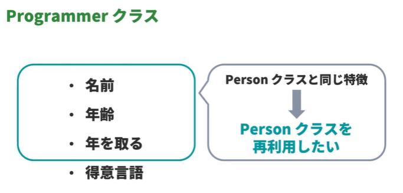

<!-- omit in toc -->
# paiza ラーニング　：　新・Python入門編 Lesson 21 ～ 22

<!-- omit in toc -->
# 目次
- [Lesson 21: クラスを学習しよう](#lesson-21-クラスを学習しよう)
  - [01:クラスとはなにか](#01クラスとはなにか)
    - [クラス、オブジェクト、インスタンスとはなにか](#クラスオブジェクトインスタンスとはなにか)
    - [クラス、オブジェクト、インスタンスのイメージ](#クラスオブジェクトインスタンスのイメージ)
  - [02:クラスの書き方](#02クラスの書き方)
  - [03:クラスを定義](#03クラスを定義)
    - [インスタンスを生成する方法](#インスタンスを生成する方法)
  - [04:メンバ変数の示す値を取得](#04メンバ変数の示す値を取得)
  - [05:メンバ変数の示す値を変更](#05メンバ変数の示す値を変更)
    - [メンバ変数の示す値を変更](#メンバ変数の示す値を変更)
  - [06:クラスにメソッド(関数)を実装](#06クラスにメソッド関数を実装)
  - [07:インスタンスのメソッドを実行](#07インスタンスのメソッドを実行)
    - [インスタンスのメソッドを呼び出す](#インスタンスのメソッドを呼び出す)
  - [08:コンストラクタ](#08コンストラクタ)
    - [コンストラクタとはなにか](#コンストラクタとはなにか)
  - [09:メンバ変数の変数名](#09メンバ変数の変数名)
    - [メンバ変数の変数名の自由度](#メンバ変数の変数名の自由度)
  - [10:メソッドの名前](#10メソッドの名前)
    - [メソッドの名前の自由度](#メソッドの名前の自由度)
  - [11:self の意味](#11self-の意味)
    - [self はインスタンスを示す](#self-はインスタンスを示す)
    - [仮引数 self に明示的に値を渡そうとすると、エラーが発生する](#仮引数-self-に明示的に値を渡そうとするとエラーが発生する)
  - [12:メソッドから他のメソッドの呼び出し](#12メソッドから他のメソッドの呼び出し)
    - [メソッドから、同一クラスの他メソッドの呼び出し](#メソッドから同一クラスの他メソッドの呼び出し)
  - [13:クラス変数](#13クラス変数)
    - [クラス変数とはなにか](#クラス変数とはなにか)
    - [クラス変数を用意する方法](#クラス変数を用意する方法)
  - [クラス変数の使い方](#クラス変数の使い方)
  - [14:クラス変数とメンバ変数の優先度](#14クラス変数とメンバ変数の優先度)
    - [クラス変数とメンバ変数の優先度](#クラス変数とメンバ変数の優先度)
  - [15:インスタンスをリストの要素にする](#15インスタンスをリストの要素にする)
    - [インスタンスをリストの要素にする](#インスタンスをリストの要素にする)
  - [16:インスタンス変数のアクセス制限](#16インスタンス変数のアクセス制限)
    - [プライベート変数とはなにか](#プライベート変数とはなにか)
    - [プライベート変数のような変数](#プライベート変数のような変数)
    - [プライベート変数のような変数の仕組み](#プライベート変数のような変数の仕組み)
- [Lesson 22: クラスの継承を学習しよう](#lesson-22-クラスの継承を学習しよう)
  - [01:継承とはなにか](#01継承とはなにか)
  - [02:継承の方法](#02継承の方法)
  - [03:サブクラスを定義](#03サブクラスを定義)
    - [サブクラスを定義する手順](#サブクラスを定義する手順)
    - [スーパークラスのコンストラクタ](#スーパークラスのコンストラクタ)
  - [04:スーパークラスのメンバ変数を利用](#04スーパークラスのメンバ変数を利用)
  - [05:スーパークラスのメソッドを利用](#05スーパークラスのメソッドを利用)
  - [06:サブクラスのコンストラクタを定義(オーバーライド)](#06サブクラスのコンストラクタを定義オーバーライド)
    - [オーバーライドとはなにか](#オーバーライドとはなにか)
    - [オーバーライド例](#オーバーライド例)
    - [super 関数](#super-関数)
    - [※ Pythonでsuper()を使う場面　メモ](#-pythonでsuperを使う場面メモ)
  - [07:サブクラスで新たなメソッドを定義](#07サブクラスで新たなメソッドを定義)
  - [08:サブクラスをさらに継承](#08サブクラスをさらに継承)
    - [サブクラスのサブクラス](#サブクラスのサブクラス)
  - [09:クラスの継承関係を調べる (__mro__)](#09クラスの継承関係を調べる-mro)
    - [__mro__ で取得できる値に現われるすべてのクラスが、自身より右側のクラスをすべて継承しているとは限らない](#mro-で取得できる値に現われるすべてのクラスが自身より右側のクラスをすべて継承しているとは限らない)
    - [__mro__ で取得できる値が示しているもの](#mro-で取得できる値が示しているもの)


---

# Lesson 21: クラスを学習しよう


## 01:クラスとはなにか

### クラス、オブジェクト、インスタンスとはなにか

- クラス:

```
「クラス」とは、共通の特徴をもったデータの分類のこと
型と呼ばれることもある
例: int, str, list など...
```


- オブジェクト:
```
「オブジェクト」とは、「クラス」に属する個々の実体のこと
「クラス」にしたがって生成される
例: 1, "abc", [1, 2, 3] など...
```


- インスタンス:
```
「インスタンス」とは、「クラス」に属する個々の実体のこと
「クラス」にしたがって生成される
例: 1, "abc", [1, 2, 3] など...
```


- 「オブジェクト」と「インスタンス」の使い分け
```
オブジェクト: 広く「クラス」から生成された実体を指すときに、よく使われる
インスタンス: 実体が、どの「クラス」から生成されたか、を強調したいときに、よく使われる
```


### クラス、オブジェクト、インスタンスのイメージ

私たち人間でたとえると次のようにたとえられる


- クラス: 人間という種
- オブジェクト、インスタンス: 私たち個人個人


人間の特徴である、「名前」「年齢」「年を取る」などを「人間クラス」は特徴としてもっていて、この特徴を個々にもった実体である私たち「人間クラスのインスタンス」がいる


## 02:クラスの書き方


クラスの書き方:

```python
class クラス名:
    処理
```

インデントに関する注意点:
  - 処理を記述する行はインデントを 1 つ多くする
  - インデントは半角スペース 4 つが推奨されている
  - 処理のまとまりごとにインデントを揃える


## 03:クラスを定義


- クラスの書き順
  - class と書く
```python
class
```


- 半角スペースを空けて、クラス名を書く
```python
class Person
```


- コロンを書いて、改行する:
```python
class Person:
```

- インデントに気をつけて、処理を書く:

```python
class Person:
    def __init__(self, name, age):
        self.name = name
        self.age = age
```


`__init__` 関数については、あとのチャプターで学習する


### インスタンスを生成する方法

- インスタンスは クラス名(実引数1, ..., 実引数n) のかたちで生成する
```python
class Person:
    def __init__(self, name, age):
        self.name = name
        self.age = age

kirishima = Person("Kirishima", 15)
```

仮引数 name の値が "Kirishima" で、仮引数 age の値が 15 のインスタンスを生成して、変数 kirishima に代入している

詳しくはあとのチャプターで学習する


## 04:メンバ変数の示す値を取得


- メンバ変数の示す値は インスタンス.メンバ変数名 のかたちで取得することができる

```python
class Person:
    def __init__(self, name, age):
        self.name = name
        self.age = age

kirishima = Person("Kirishima", 15)
print(kirishima.name, kirishima.age)
```


## 05:メンバ変数の示す値を変更

###  メンバ変数の示す値を変更

メンバ変数の示す値を変更したいときは、インスタンス.メンバ変数名 = 新しい値 のかたちで変更できる
```python
class Person:
    def __init__(self, name, age):
        self.name = name
        self.age = age

kirishima = Person("Kirishima", 15)
print(f"名前: {kirishima.name}, 年齢: {kirishima.age}")

kirishima.age = 26
print(kirishima.age)
```


## 06:クラスにメソッド(関数)を実装


- クラスに定義する関数はよくメソッドと呼ばれる
- メソッドを定義するときは、仮引数のうちの第 1 引数に self と書くこと以外は通常の関数定義とおなじように定義する

```python
class Person:
    def __init__(self, name, age):
        self.name = name
        self.age = age

    def add_age(self, year):
        self.age += year
```


`add_age`: 仮引数`year`の分だけメンバ変数`age`の値を大きくするメソッド

仮引数`self`については、あとのチャプターで学習する


## 07:インスタンスのメソッドを実行


### インスタンスのメソッドを呼び出す

- インスタンスのメソッドを呼び出したいときは、`インスタンス.メソッド名(実引数1, ..., 実引数n)` のかたちで呼び出す

```python
class Person:
    def __init__(self, name, age):
        self.name = name
        self.age = age

    def add_age(self, year):
       self.age += year


kirishima = Person("Kirishima", 15)
print(f"名前: {kirishima.name}, 年齢: {kirishima.age}")

kirishima.add_age(2)
print(kirishima.age)
```

インスタンスのメソッドを呼び出したとき、仮引数 self より後ろの仮引数に実引数が渡される

詳しくはあとのチャプターで学習する


## 08:コンストラクタ


### コンストラクタとはなにか

  - クラスを定義するときに定義する `__init__` 関数をコンストラクタと呼ぶ
  - コンストラクタとは、インスタンスが生成されるときに呼び出されるメソッドのこと
  - インスタンスが生成されるときに、1 度だけ呼び出される
  - コンストラクタの役割は主にメンバ変数を用意すること
  - Python でコンストラクタの名前は `__init__` と決まっている
  - コンストラクタの仮引数のうち、第 2 引数以降の仮引数には、インスタンスを生成するときに指定した実引数が渡される


## 09:メンバ変数の変数名

### メンバ変数の変数名の自由度

- メンバ変数の名前はクラスの外の変数などの名前に関係なく自由に決めることができる
```python
class Person:
    def __init__(self, name, age):
        self.name = name
        self.age = age

    def add_age(self, year):
        self.age += year

kirishima = Person("Kirishima", 15)
name = "paiza"
print(name, kirishima.name)
```


## 10:メソッドの名前

### メソッドの名前の自由度

- メソッドの名前もクラスの外の関数などの名前に関係なく自由に決めることができる

```python
class Person:
    def __init__(self, name, age):
        self.name = name
        self.age = age

    def add_age(self, year):
        self.age += year

def add_age(year):
    print("Person クラスの外の関数です。")

kirishima = Person("Kirishima", 15)

kirishima.add_age(3)
print(f"{kirishima.age} 歳")

add_age(10)
print(f"{kirishima.age} 歳")
```

- ただし、クラスのメソッド名とクラスの外の関数名を同じにすると、コードがわかりづらくなることがあるため注意が必要


## 11:self の意味


### self はインスタンスを示す

たとえば kirishima.add_age(4) というコードが実行されると、add_age メソッドの仮引数 self には、インスタンス kirishima が代入される

```python
class Person:
    def __init__(self, name, age):
        self.name = name
        self.age = age

    def add_age(self, year):
        self.age += year

kirishima = Person("Kirishima", 15)
kirishima.add_age(4)
```

- add_age メソッドの仮引数 self にはインスタンス kirishima が代入される
- add_age メソッドの仮引数 year には整数 4 が代入される
- add_age メソッドの処理の self.age ... は、「インスタンス kirishima のメンバ変数 age の値を...」といったコードだとわかる

### 仮引数 self に明示的に値を渡そうとすると、エラーが発生する
```python
class Person:
    def __init__(self, name, age):
        self.name = name
        self.age = age

    def add_age(self, year):
        self.age += year

kirishima = Person("Kirishima", 15)
kirishima.add_age(kirishima, 4)
```


## 12:メソッドから他のメソッドの呼び出し

### メソッドから、同一クラスの他メソッドの呼び出し

- インスタンスを指定して、メソッド内から同一クラスの他のメソッドを呼び出すことができる
```python
class Person:
    def __init__(self, name, age):
        self.name = name
        self.age = age

    def add_age(self, year):
        self.age += year

    def add_and_print_age(self, year):
        self.add_age(year)
        print(self.age)

kirishima = Person("Kirishima", 15)
kirishima.add_and_print_age(4)
```


## 13:クラス変数

### クラス変数とはなにか

  - クラス変数とは、そのクラスから生成されるすべてのインスタンスで共通して使うことができる変数のこと

### クラス変数を用意する方法

  - クラス変数を用意するためには、メソッドを定義するときと同じインデントの深さで次のようなコードを書く

```python
class Person:
    binomen = "homo sapiens"

    def __init__(self, name, age):
        self.name = name
        self.age = age

    def add_age(self, year):
        self.age += year

    def add_and_print_age(self, year):
        self.add_age(year)
        print(self.age)
```

- 2 行目で用意している変数 binomen がクラス変数になる

## クラス変数の使い方

- クラス変数を使うには次の 2 通りのコードの書き方がある
  - クラス名.クラス変数名
  - インスタンス.クラス変数名


```python
class Person:
    binomen = "homo sapiens"

    def __init__(self, name, age):
        self.name = name
        self.age = age

    def add_age(self, year):
        self.age += year

    def add_and_print_age(self, year):
        self.add_age(year)
        print(self.age)

print(Person.binomen)

kirishima = Person("Kirishima", 15)
print(kirishima.binomen)
```


## 14:クラス変数とメンバ変数の優先度


###  クラス変数とメンバ変数の優先度

- クラス変数とメンバ変数の変数名が重複した場合は、メンバ変数が優先される
```python
class Person:
    age = 1000

    def __init__(self, name, age):
        self.name = name
        self.age = age

    def add_age(self, year):
        self.age += year

    def add_and_print_age(self, year):
        self.add_age(year)
        print(self.age)

kirishima = Person("Kirishima", 15)
print(kirishima.age)
```

メンバ変数 age の値である 15 が出力される


ただし、クラス名.クラス変数名 のように指定した場合はクラス変数の値を取得できる

```python
class Person:
    age = 1000

    def __init__(self, name, age):
        self.name = name
        self.age = age

    def add_age(self, year):
        self.age += year

    def add_and_print_age(self, year):
        self.add_age(year)
        print(self.age)


kirishima = Person("Kirishima", 15)
print(kirishima.age)
print(Person.age)

```


## 15:インスタンスをリストの要素にする

### インスタンスをリストの要素にする

- 自作クラスのインスタンスもリストやタプルの要素にできる

```python
class Person:
    def __init__(self, name, age):
        self.name = name
        self.age = age

    def add_age(self, year):
        self.age += year

    def add_and_print_age(self, year):
        self.add_age(year)
        print(self.age)

people = [Person("Kirishima", 15), Person("Rokumura", 16), Person("Midorikawa", 15)]
for person in people:
    print(person.name, person.age)
```


## 16:インスタンス変数のアクセス制限

### プライベート変数とはなにか

- プライベート変数とは、アクセス制限がかかった変数で、クラスの外側からメンバ変数を自由に使うことができない変数のこと

> [!WARNNING]
> 他のプログラミング言語では用意できるものが多いが、Python において`完全なプライベート変数を用意することはできない`


###  プライベート変数のような変数

完全ではないが、プライベート変数の`ような`変数を用意することはできる

```python
class Person:
    def __init__(self, name, age):
        self.name = name
        self.__age = age


kirishima = Person("Kirishima", 15)
kirishima.__age += 1000
print(kirishima.__age)
```

この Person クラスで、変数 __age はプライベート変数のような変数

実際、25 行目でエラーが発生する


### プライベート変数のような変数の仕組み

- Python では、名前の先頭にアンダーバーが 2 つ付いている属性は、`その名前の先頭に _クラス名 が付いたものに自動で変換される`
- そのため、kirishima._Person__age のように指定すれば、プライベート変数のような変数をクラスの外で使うことができる

```python
class Person:
    def __init__(self, name, age):
        self.name = name
        self.__age = age


kirishima = Person("Kirishima", 15)
kirishima._Person__age += 1000
print(kirishima._Person__age)


ただし、クラスのなかでは変換前の変数名で使うことができる

class Person:
    def __init__(self, name, age):
        self.name = name
        self.__age = age

    def print_profile(self):
        print(f"名前: {self.name}, 年齢: {self.__age}")


kirishima = Person("Kirishima", 15)
kirishima._Person__age += 1000
print(kirishima._Person__age)

kirishima.print_profile()

```


---


# Lesson 22: クラスの継承を学習しよう


## 01:継承とはなにか


- 継承とは、すでに定義したクラスからさらに細かい分類のクラスを作ること
- 継承されるクラスを
  - スーパークラス
  - 親クラス
- 対して、継承したクラスを
  - サブクラス
  - 子クラス
- サブクラスでは、スーパークラスのメンバ変数やメソッドを使える





- 継承を使うと…
  - コード量を減らすことができる
  - コードの修正が楽になる
- Personクラスを書き換えてしまうと…
  - いままでのPerson クラスのインスタンスを生成できなくなる
  - すでに Person クラスを利用していた箇所でエラーが発生しうる


## 02:継承の方法


- サブクラス名のうしろの括弧のなかでスーパークラスにしたいクラスの名前を書く

```python
class サブクラス名(クラス名1, ..., クラス名2):
    処理
```


  - 「処理」のところは、普段クラスを定義するときと同様に、メソッドなどを書く
  - サブクラスで定義するメソッドの名前は、スーパークラスで定義してあるメソッドの名前と同じでもよい<br>（詳しくはあとのチャプターで学習）


## 03:サブクラスを定義

### サブクラスを定義する手順


  - class と書く
```python
class
```

  - 半角スペースを空けて、サブクラスの名前を書く
```python
class Programmer
```

  - 括弧のなかに、サブクラスが継承するクラス名を書く
```python
class Programmer(Person)
```

  - コロンを書いて改行する
```python
class Programmer(Person):
```


- インデントに気をつけて処理を書く
```python
class Programmer(Person):
    pass
```

### スーパークラスのコンストラクタ

  - サブクラスのインスタンス生成時には、デフォルトでスーパークラスのコンストラクタが呼び出される
  - サブクラスは、スーパークラスのコンストラクタを含むすべてのメソッドを使うことができる

```python
class Person:
    def __init__(self, name, age):
        self.name = name
        self.age = age

    def add_age(self, year):
        self.age += year

class Programmer(Person):
    pass

## ↑　特に処理を追加する必要がなければ　pass　を入れて逃がさないとエラーになる


kirishima = Programmer("Kirishima", 15)
```


## 04:スーパークラスのメンバ変数を利用


- サブクラスでは、スーパークラスのメンバ変数を使うことができる

```python
class Person:
    def __init__(self, name, age):
        self.name = name
        self.age = age

    def add_age(self, year):
        self.age += year


class Programmer(Person):
    pass

kirishima = Programmer("Kirishima", 15)
print(kirishima.name, kirishima.age)
```


## 05:スーパークラスのメソッドを利用

  - サブクラスでは、スーパークラスのメソッドを使うことができる

```python
class Person:
    def __init__(self, name, age):
        self.name = name
        self.age = age

    def add_age(self, year):
        self.age += year


class Programmer(Person):
    pass

kirishima = Programmer("Kirishima", 15)
print(kirishima.age)    # output: 15
kirishima.add_age(5)
print(kirishima.age)    # output :20

```

## 06:サブクラスのコンストラクタを定義(オーバーライド)


### オーバーライドとはなにか

  - 「オーバーライド」とは、サブクラスでスーパークラスに定義されているメソッドと同じ名前のメソッドを定義すること
  - メソッドをオーバーライドすると、サブクラスにおいてはオーバーライドしたメソッドが、スーパークラスから引き継いだメソッドより優先的に呼びされるようになる

> [!TIP]
> オーバーライドしてもスーパークラスのメソッドは上書きされない

### オーバーライド例

  - スーパークラスのコンストラクタをオーバーライドする
  - 
```python
class Person:
    def __init__(self, name, age):
        self.name = name
        self.age = age

    def add_age(self, year):
        self.age += year

class Programmer(Person):
    def __init__(self, name, age, language):
        self.name = name
        self.age = age
        self.language = language
        self.languages = {language}
```

  - Programmer クラスのインスタンスを生成すると、Programmer クラスで定義したコンストラクタが呼び出されることがわかる

```python
class Person:
    def __init__(self, name, age):
        self.name = name
        self.age = age

    def add_age(self, year):
        self.age += year

class Programmer(Person):
    def __init__(self, name, age, language):
        self.name = name
        self.age = age
        self.language = language
        self.languages = {language}

kirishima = Programmer("Kirishima", 15, "Ruby")
print(kirishima.name)
print(kirishima.language)
```

### super 関数

  - super 関数を使うと、明示的にスーパークラスのメソッドを呼び出すことができる
  - メソッドをオーバーライドしたが、スーパークラスのメソッドを利用したいときなどに活用できる
    - たとえば、サブクラスのコンストラクタを定義したが、スーパークラスのコンストラクタも使ってメンバ変数を用意したいときに活用できる

```python
class Person:
    def __init__(self, name, age):
        self.name = name
        self.age = age

    def add_age(self, year):
        self.age += year

class Programmer(Person):
    def __init__(self, name, age, language):
        super().__init__(name, age)
        self.language = language
        self.languages = {language}

kirishima = Programmer("Kirishima", 15, "Ruby")
print(kirishima.name)
print(kirishima.language)

```

### ※ Pythonでsuper()を使う場面　メモ

  - https://note.com/shirotabistudy/n/nd49463d6f8ba

  - 派生クラスから基本クラスのメソッド（ここではコンストラクタ）を呼び出す必要がある場合にsuper()とつかう
  - メソッドは`__init__`に限らない


## 07:サブクラスで新たなメソッドを定義


  - サブクラスでメソッドを定義するとき、普段メソッドを定義するときと同様に定義できる

```python
class Person:
    def __init__(self, name, age):
        self.name = name
        self.age = age

    def add_age(self, year):
        self.age += year

class Programmer(Person):
    def __init__(self, name, age, language):
        super().__init__(name, age)
        self.language = language
        self.languages = {language}

    def learn(self, language):
        self.languages.add(language)
        print(f"{language} を学習しました!")

kirishima = Programmer("Kirishima", 15, "Ruby")
kirishima.learn("Python3")
print(kirishima.languages)

```


## 08:サブクラスをさらに継承


### サブクラスのサブクラス

  - サブクラスを継承させて、サブクラスのサブクラスを定義することができる

```python
class Person:
    def __init__(self, name, age):
        self.name = name
        self.age = age

    def add_age(self, year):
        self.age += year

class Programmer(Person):
    def __init__(self, name, age, language):
        super().__init__(name, age)
        self.language = language
        self.languages = {language}

    def learn(self, language):
        self.languages.add(language)
        print(f"{language} を学習しました!")

class StudentProgrammer(Programmer):
    pass
```

-   StudentProgrammer クラスは、祖先のクラスであるスーパークラスの Programmer クラスとスーパークラスのスーパークラスの Person クラスの属性をすべて引き継ぐ

```python
class Person:
    def __init__(self, name, age):
        self.name = name
        self.age = age

    def add_age(self, year):
        self.age += year

class Programmer(Person):
    def __init__(self, name, age, language):
        super().__init__(name, age)
        self.language = language
        self.languages = {language}

    def learn(self, language):
        self.languages.add(language)
        print(f"{language} を学習しました!")

class StudentProgrammer(Programmer):
    pass

kirishima = StudentProgrammer("Kirishima", 15, "Ruby")
print(kirishima.name)
print(kirishima.language)
```

- StudentProgrammer クラスのスーパークラスのメンバ変数 language とスーパークラスのスーパークラスのメンバ変数 name を使うことができる


## 09:クラスの継承関係を調べる (__mro__)


### __mro__ で取得できる値に現われるすべてのクラスが、自身より右側のクラスをすべて継承しているとは限らない

`__mro__`で取得できる値に現われるすべてのクラスが、自身より右側のクラスをすべて継承しているとは限らない

```python
class Sample1:
    pass

class Sample2(Sample1):
    pass

class Sample3(Sample1):
    pass

class Sample4(Sample2, Sample3):
    pass

print(Sample4.__mro__)

# output: (<class '__main__.Sample4'>, <class '__main__.Sample2'>, <class '__main__.Sample3'>, <class '__main__.Sample1'>, <class 'object'>)

```


### __mro__ で取得できる値が示しているもの

  - `__mro__`は `Method Resolution Order` の略称

  - これは、あるメソッドが呼び出されたときに、どの順番でメソッドを探すか、という順番を示している
    - つまり、上のTipsのコードを例にとると、
      - Sample4 クラスのインスタンスが生成されて、test というメソッドが呼び出されたとする
      - Sample4 クラスに test メソッドがあるか確認する (あれば探索終了)
      - Sample2 クラスに test メソッドがあるか確認する (あれば探索終了)
      - Sample3 クラスに test メソッドがあるか確認する (あれば探索終了)
      - Sample1 クラスに test メソッドがあるか確認する (あれば探索終了)
      - object クラスに test メソッドがあるか確認する (あれば探索終了)
      - test という名前のメソッドはなかったためエラーを発する
  - という流れでメソッドの探索がおこなわれる


---


【EOF】


[←　README](../README.md)


